# FynnEdge Advisory (OPC) Pvt Ltd
# Admin Panel — User Guide

**Website:** FynnEdge (`fynnedge.com`)
**Document:** How to Use the Admin Panel
**Version:** 1.0
**Date:** 12 September 2026
**Audience:** FynnEdge administrators, marketing team, SEO team

---

## Table of Contents

1. [Introduction](#1-introduction)
2. [Logging In](#2-logging-in)
3. [The Dashboard](#3-the-dashboard)
4. [Getting Around: The Sidebar](#4-getting-around-the-sidebar)
5. [How Every List Screen Works](#5-how-every-list-screen-works)
6. [Catalog — Loan Business Modules](#6-catalog--loan-business-modules)
   - 6.1 [Funnel Analytics](#61-funnel-analytics)
   - 6.2 [Eligibility Tester](#62-eligibility-tester)
   - 6.3 [Loan Applications](#63-loan-applications)
   - 6.4 [Credit Score Checks](#64-credit-score-checks)
   - 6.5 [Customers](#65-customers)
   - 6.6 [Document Requirements](#66-document-requirements)
   - 6.7 [Document Types](#67-document-types)
   - 6.8 [Eligibility Rules](#68-eligibility-rules)
   - 6.9 [Employers](#69-employers)
   - 6.10 [Journeys](#610-journeys)
   - 6.11 [Applications (Journey Sessions)](#611-applications-journey-sessions)
   - 6.12 [Lender Offers](#612-lender-offers)
   - 6.13 [Lenders](#613-lenders)
   - 6.14 [Loan Products](#614-loan-products)
   - 6.15 [Testimonials](#615-testimonials)
7. [Content — Website Content Modules](#7-content--website-content-modules)
8. [Marketing — Newsletter Modules](#8-marketing--newsletter-modules)
9. [Website Settings](#9-website-settings)
10. [Access Control](#10-access-control)
11. [User Roles & Permissions](#11-user-roles--permissions)
12. [Complete Business Workflow](#12-complete-business-workflow)
13. [Reports](#13-reports)
14. [Import / Export](#14-import--export)
15. [Notifications, Confirmations & Error Messages](#15-notifications-confirmations--error-messages)
16. [Common Problems / Troubleshooting](#16-common-problems--troubleshooting)
17. [Best Practices](#17-best-practices)
18. [Logging Out](#18-logging-out)
19. [Appendix A — Status Reference](#appendix-a--status-reference)
20. [Appendix B — Screenshot Index](#appendix-b--screenshot-index)
21. [Appendix C — Coverage & Verification Notes](#appendix-c--coverage--verification-notes)

---

## 1. Introduction

### 1.1 What this admin panel is

The FynnEdge admin panel is the private control room behind the public FynnEdge website. Everything a visitor sees on the website — the loan products, the lenders you are matched with, the homepage banner, the articles, the FAQs, the contact details in the footer — is stored and edited here.

It also collects everything the website produces: enquiries from contact forms, applications started by visitors, credit score checks, and newsletter signups.

### 1.2 Who should use it

| Who | What they normally do here |
| --- | --- |
| **Administrator** | Everything — lenders, eligibility rules, users, website settings |
| **Marketing team member** | Website content, banners, articles, testimonials, newsletter campaigns |
| **SEO team member** | Page titles, meta descriptions, social share settings, redirects |

What you can actually see and click depends on the role your account has been given. If a menu item described in this guide is not in your sidebar, your role does not include it — that is normal, not a fault. See [Section 11](#11-user-roles--permissions).

### 1.3 What you can do here

- **Run the loan business** — maintain the lender panel, the loan products offered, the eligibility rules that decide who qualifies, and the documents each lender needs.
- **Work the leads** — see every enquiry and every application the website produces, and track each one through to a decision.
- **Run the website** — write and publish pages, articles, FAQs, banners, testimonials and marketing sections.
- **Run SEO** — control page titles, descriptions, social previews, structured data, redirects and analytics tags.
- **Run the newsletter** — manage subscribers, build campaigns and send them.
- **Control access** — create user accounts, assign roles, and review a full history of who changed what.

### 1.4 A note on terminology

Two menu items use similar names. They are different things:

> **⚠️ Important**
> - **Applications** (Catalog) = an application *journey* a visitor started on the website — the step-by-step form, what they answered, and how far they got.
> - **Loan Applications** (Catalog) = a formal application to a *specific lender*, created after the visitor picked a lender. This is the one that carries documents and a sanction/disbursal status.

---

## 2. Logging In

### 2.1 How to reach the admin panel

Open a web browser and go to your website address followed by `/admin`.

Example: `https://fynnedge.com/admin`

If you are not signed in, you are automatically taken to the sign-in screen.

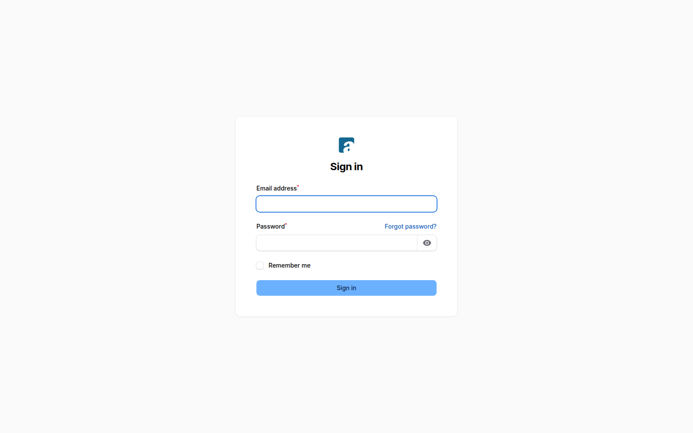
*Screenshot 1 — Sign-in screen*

### 2.2 The sign-in fields

| Field | Required? | What to Enter | Description |
| --- | --- | --- | --- |
| Email address | Yes | Your work email | The email your administrator registered for you, e.g. `name@fynnedge.com` |
| Password | Yes | Your password | Case-sensitive. Use the eye icon to check what you typed |
| Remember me | No | Tick or leave blank | Keeps you signed in on this device/browser for longer |

### 2.3 Buttons and links

- **Sign in** — submits the form.
- **Forgot your password?** — opens the password-reset screen. Enter your email address and a reset link is emailed to you. The link is time-limited; request a new one if it expires.

### 2.4 What happens after a successful sign-in

You land on the **Dashboard**, and the sidebar appears on the left showing only the sections your role allows.

### 2.5 What happens if the sign-in fails

- **Wrong email or password** — the screen reloads with a message under the fields telling you the credentials do not match. Nothing is revealed about whether the email exists.
- **Too many attempts** — repeated failed attempts are throttled and you are asked to wait before trying again.
- **Account without panel access** — if an administrator has switched off *"Can log into the admin panel"* on your account, sign-in is refused even with the correct password. Ask an administrator to re-enable it.

### 2.6 Two-factor authentication (optional)

The panel supports authenticator-app two-factor sign-in (Google Authenticator, Authy, 1Password and similar).

> **📝 Note**
> Two-factor is **available but not forced**. Nobody is required to set it up. If you switch it on for your own account, you will be asked for a 6-digit code after your password from then on.

To turn it on: click your **avatar (top-right) → Profile**

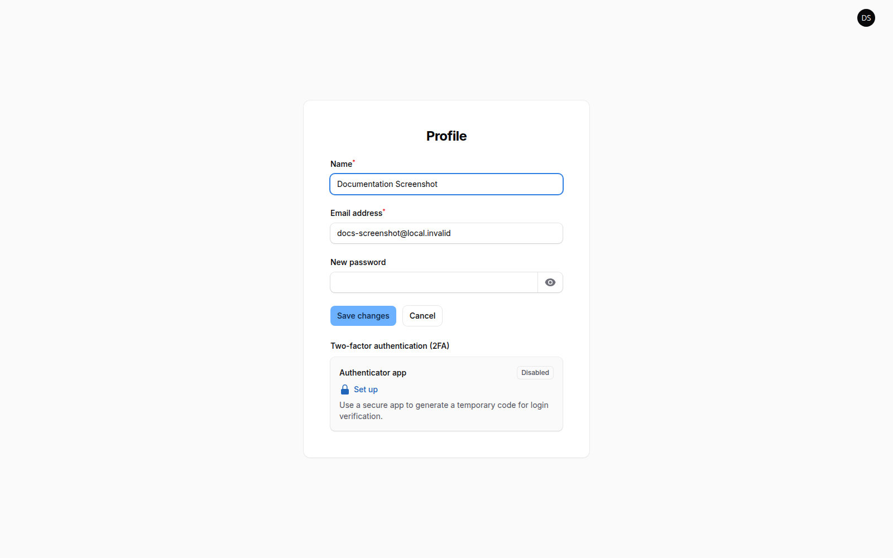
*Screenshot 48 — Profile screen, where you set up two-factor authentication*, and follow the authenticator-app setup. You are given **recovery codes** — store them somewhere safe; they are the only way back in if you lose your phone.

### 2.7 Session behaviour

Your sign-in is tied to the browser you used. Signing out in one browser does not sign you out elsewhere. If you leave the panel idle for a long time you may be returned to the sign-in screen — simply sign in again; nothing is lost except an unsaved form.

---

## 3. The Dashboard

Open it any time by clicking **Dashboard** at the very top of the sidebar, or the FynnEdge logo.

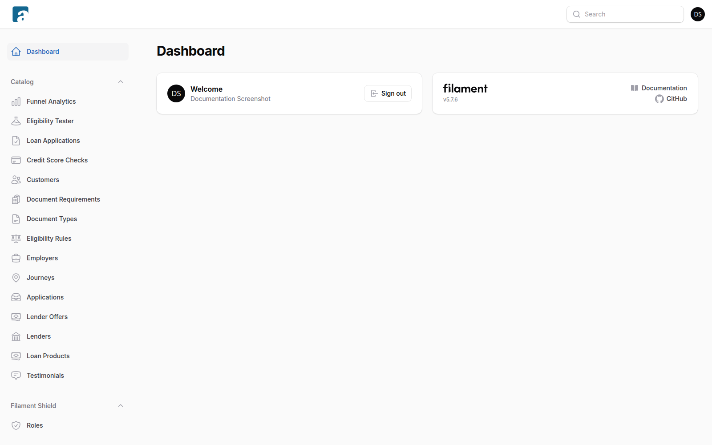
*Screenshot 2 — Dashboard*

The dashboard is deliberately minimal. It contains exactly two cards:

| Card | What it shows | What you do with it |
| --- | --- | --- |
| **Welcome** | Your initials, your name, and a **Sign out** button | Confirms which account you are signed in as. Useful when several people share a machine |
| **Filament** | The software version powering the panel, with **Documentation** and **GitHub** links | For technical reference only — day-to-day users can ignore it |

> **📝 Note**
> There are **no statistics tiles, charts, date pickers or filters on this Dashboard**. Reporting lives on its own dedicated pages instead:
> - Loan funnel numbers → **Catalog → Funnel Analytics** ([Section 6.1](#61-funnel-analytics))
> - Newsletter numbers → **Marketing → Newsletter** ([Section 8.1](#81-newsletter-dashboard))
> - Who changed what → **Access Control → Activity** ([Section 10.1](#101-activity))

---

## 4. Getting Around: The Sidebar

The sidebar lists every section you have access to, organised into groups. Click a group heading to collapse or expand it.

### 4.1 Complete menu map

| Group | Menu item | Purpose | Typically used by |
| --- | --- | --- | --- |
| *(top)* | **Dashboard** | Landing screen after sign-in | Everyone |
| **Catalog** | Funnel Analytics | How many visitors get through each stage of an application | Admin |
| | Eligibility Tester | Try a made-up applicant against the live rules | Admin |
| | Loan Applications | Formal applications sent to a chosen lender | Admin |
| | Credit Score Checks | Credit score checks visitors ran on the website | Admin |
| | Customers | People who identified themselves on the website | Admin |
| | Document Requirements | Which documents each lender wants for each product | Admin |
| | Document Types | The master list of document kinds (PAN card, payslip…) | Admin |
| | Eligibility Rules | The rule sets that decide who qualifies with each lender | Admin |
| | Employers | Employer list and how each lender grades them | Admin |
| | Journeys | The step-by-step forms visitors fill in | Admin |
| | Applications | Journeys visitors actually started, and their answers | Admin |
| | Lender Offers | One lender's terms for one loan product | Admin |
| | Lenders | The banks and NBFCs on your panel | Admin |
| | Loan Products | The loan types you offer, and their calculators | Admin |
| | Testimonials | Customer quotes shown on the website | Admin, Marketing |
| **Filament Shield** | Roles | Create roles and tick exactly what each may do | Admin |
| **Content** | Media Library | Every uploaded file, and whether it is still used | Admin |
| | Achievements | The numbers strip on the homepage | Admin, Marketing |
| | Articles | Blog / resources articles | Admin, Marketing, SEO |
| | Banners | The sliding homepage banner | Admin, Marketing |
| | Calculator Pages | Explanatory text under the standalone calculators | Admin, Marketing |
| | Life at FynnEdge Photos | Company photo gallery | Admin, Marketing |
| | General FAQs | FAQs not tied to any particular page | Admin, Marketing |
| | Grievance Redressal Matrix | The complaints-escalation contact table | Admin, Marketing |
| | How It Works Steps | The numbered "how it works" steps | Admin, Marketing |
| | Job Openings | Roles listed on the Careers page | Admin, Marketing |
| | Loan Landing Page Content | Marketing text on landing pages (restricted view) | Marketing |
| | Loan Landing Page SEO | SEO fields on landing pages (restricted view) | SEO |
| | Loan Landing Pages | Full landing-page editor | Admin |
| | Loan Product Content | Marketing text on loan products (restricted view) | Marketing |
| | Loan Product SEO | SEO fields on loan products (restricted view) | SEO |
| | Marketing Sections | Editable call-to-action blocks in fixed slots | Admin, Marketing |
| | Navigation Links | Footer "Quick Links" | Admin, Marketing |
| | Page FAQs | FAQs pinned to whole pages | Admin, Marketing |
| | Pages | Static pages (About, Privacy Policy, Terms…) | Admin, SEO |
| | Schema Templates | Reusable structured-data blueprints | Admin |
| | Contact Enquiries | Every enquiry the website's forms produced | Admin |
| **Access Control** | Activity | Full history of every admin change | Admin |
| | Users | Admin accounts and their roles | Admin |
| **Marketing** | Newsletter | Newsletter overview and numbers | Admin, Marketing |
| | Subscribers | Everyone who signed up | Admin, Marketing |
| | Campaigns | Compose, schedule and send emails | Admin, Marketing |
| | Templates | Reusable email bodies | Admin, Marketing |
| | Segments | Saved audience filters | Admin, Marketing |
| | Newsletter Settings | Sender identity and opt-in rules | Admin |
| **Website Settings** | SEO & Tracking | Meta defaults, analytics tags, cookie banner | Admin, SEO |
| | Settings | Branding, contact details, colours and fonts | Admin |
| | Structured Data | How the site describes itself to Google/AI | Admin |
| | Redirects | Send an old URL to a new one | Admin, SEO |

### 4.2 The top bar

- **Search box (top-centre/right)** — a *global* search. It only covers **Campaigns, Segments, Subscribers, Templates, Redirects, Schema Templates and Roles**. For everything else, use the search box on that section's own list screen.
- **Avatar (far right)** — a menu with **Profile** (change your name, email, password, and set up two-factor) and **Sign out**.

---

## 5. How Every List Screen Works

Almost every menu item opens a **list screen** — a table of records. They all behave the same way, so learn this once and it applies everywhere.

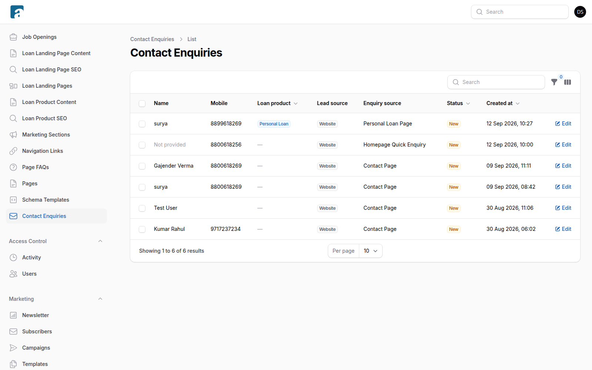
*Screenshot 22 — A typical list screen (Contact Enquiries), showing search, filters, column toggle, row actions and pagination*

| Element | Where it is | What it does |
| --- | --- | --- |
| **Search box** | Top-right of the table | Types as you go and narrows the table. Only searches the columns marked searchable for that section — each module section below lists them |
| **Active filters bar** | Above the table, once a search or filter is on | Shows one chip per active search/filter. Click the **×** on a chip to drop just that one, or the **×** at the right-hand end to clear them all |
| **Filter icon (funnel)** | Right of the search box | Opens the filter panel. The small number on the icon is how many filters are currently active. Use **Reset filters** to clear them |
| **Column icon (three bars)** | Next to the filter icon | Show or hide optional columns. Some columns start hidden to keep the table readable |
| **Column heading** | Table header | Click a heading with a small arrow to sort by it. Click again to reverse |
| **Tick boxes** | Far-left column | Select rows for a bulk action. The header tick box selects everything on the page |
| **Row actions** | Far-right of each row | Usually **Edit** or **View**. Some sections add extra buttons (Publish, Send, Verify…) |
| **New / Create button** | Top-right of the page | Only appears in sections where records may be created by hand |
| **Showing X to Y of Z** | Bottom-left | How many records match your current search and filters |
| **Per page** | Bottom-right | 10 by default. Change to 5, 25, 50 or All |

### 5.1 Reordering

A few sections let you drag rows into the order they appear on the website (Achievements, Banners, Testimonials, FAQs, How It Works Steps, Job Openings, Navigation Links, Marketing Sections, Grievance levels, Employer categories, Journey steps, Eligibility rules). Where drag-reorder is available, a drag handle appears at the left of each row. You can also type a number into the **Order** / **Sort order** field on the record itself — lower numbers show first.

### 5.2 Trash and restore (soft delete)

Some sections keep deleted records in a recoverable "trash" rather than destroying them:

**Sections with trash:** Lenders, Loan Products, Loan Landing Pages, Articles, Pages, Testimonials, Marketing Sections — and Schema Templates, with the caveat in the warning below.

On those list screens the filter panel contains a **Trashed** filter with three settings:

| Setting | Shows |
| --- | --- |
| *(default)* | Only live records |
| **With trashed** | Live and deleted records together |
| **Only trashed** | Just the deleted records |

Once you can see a deleted record you get two extra actions on it:

- **Restore** — brings it back exactly as it was.
- **Force delete** — destroys it permanently. **This cannot be undone.**

> **⚠️ Warning — Schema Templates are the exception**
> A deleted schema template *is* kept recoverably, but its list screen has **no Trashed filter**, so once deleted it disappears from the list with no way to find it again from within the panel. Treat deleting a schema template as permanent, and use **Active = Off** to retire one instead.
> Marketing Sections work the other way round: you can find and restore a deleted one from the list using the Trashed filter and the bulk **Restore** action, but there is no Restore button on the record's own edit screen.

> **⚠️ Warning**
> Every other section deletes **immediately and permanently**. There is no trash for Contact Enquiries, Employers, Lender Offers, Document Types, Document Requirements, Redirects, Navigation Links, FAQs, Banners, Achievements, Job Openings, Photos, Grievance levels, Calculator Pages, Users, Newsletter records or Eligibility Rule Sets. You are always asked to confirm first — read the confirmation box before clicking through.

### 5.3 Editing and saving

1. Click **Edit** on the row you want.
2. Change the fields.
3. Click **Save changes** at the bottom (or the **Save** button at the top on settings screens). **Cancel**, beside it, discards your changes and returns you to the list.
4. A green **Saved** message appears in the top-right corner.

If a required field is empty or a value is invalid, the field turns red with an explanation underneath and nothing is saved until you fix it. Sections that are collapsed will open automatically to show you where the problem is.

> **📝 Note**
> After you create or edit a record, the panel returns you to the **list screen** rather than staying on the form. This is deliberate, so you can immediately see your record in context.

### 5.4 The History tab

Many records have a **History** tab under the form showing every change ever made to that record: what action it was (created / updated / deleted), who did it, exactly which fields changed from what to what, and when.

**Sections with History:** Loan Applications, Lenders, Loan Products, Loan Product Content, Loan Landing Pages, Loan Landing Page Content, Eligibility Rules, Articles, Pages, General FAQs, Page FAQs, Testimonials, Banners, Life at FynnEdge Photos, Marketing Sections, Achievements.

On **content** records (Articles, FAQs, Page FAQs, Testimonials, Banners, Photos, Marketing Sections, Achievements) each "updated" row also carries a **Restore this version** button, which puts every field in that row back to its earlier value and saves. That restore is itself recorded as a new History entry, so nothing is ever lost.

> **📝 Note**
> Restore is deliberately **not** offered on Loan Products, Lenders, Lender Offers, Loan Applications or Eligibility Rules. Putting a single number back without going through the normal form checks could leave a calculator or an eligibility rule in an inconsistent state.

---

## 6. Catalog — Loan Business Modules

### 6.1 Funnel Analytics

#### A. Purpose
Shows how many visitors reach each stage of the loan application process, so you can see exactly where people drop off.

#### B. How to open it
Sidebar → **Catalog → Funnel Analytics**

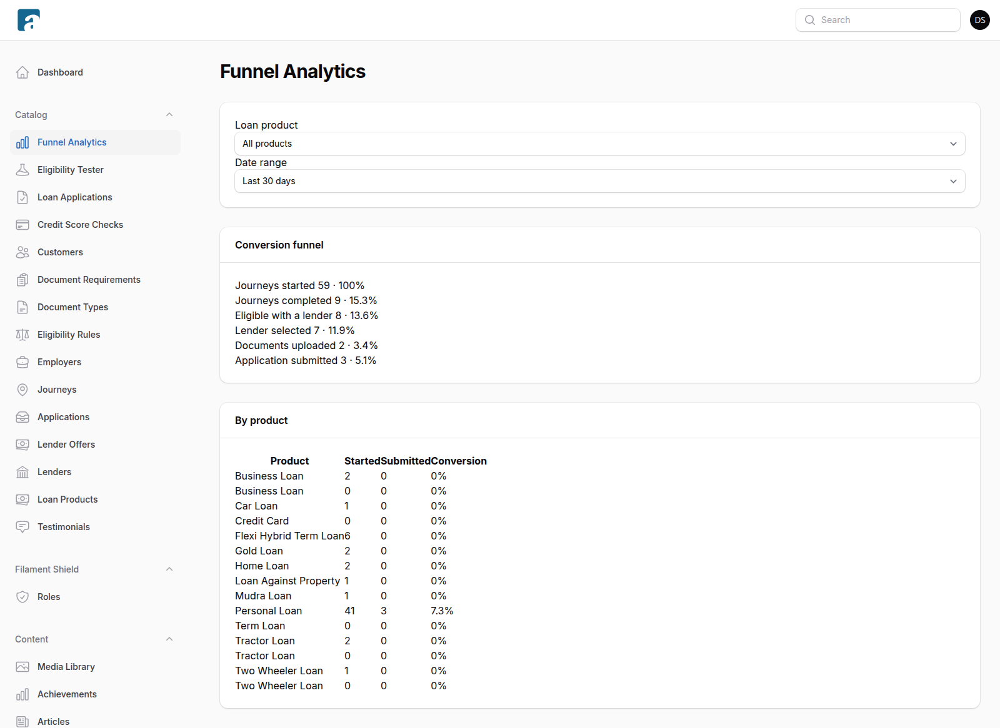
*Screenshot 9 — Funnel Analytics*

#### C. Filters at the top

| Filter | Options | Effect |
| --- | --- | --- |
| Loan product | *All products*, or any one loan product | Restricts every number on the page to that product |
| Range | Last 7 days, Last 30 days *(default)*, Last 90 days, All time | Restricts every number to that period |

#### D. The funnel table

Six fixed stages, in order. Each row shows a **count of visitors** and a **conversion %**.

| Stage | Counts visitors who… |
| --- | --- |
| Journeys started | Began the application form |
| Journeys completed | Finished every step of the form |
| Eligible with a lender | Were found eligible (or conditionally eligible) with at least one lender |
| Lender selected | Chose a specific lender to proceed with |
| Documents uploaded | Uploaded at least one document |
| Application submitted | Completed and submitted the application |

> **📝 How to read the percentage**
> Every percentage is measured against **"Journeys started"** — not against the row above it. So "Documents uploaded 22%" means 22% of everyone who *started* got that far. This lets you see total drop-off without doing any arithmetic.

#### E. Products breakdown
A table of every loan product with **Started**, **Submitted** and **Conversion %**. Use it to spot a product that pulls lots of traffic but converts poorly.

#### F. Step breakdown
Appears **only when you have selected a single loan product** in the filter (step names are not comparable across different products). It lists each step of that product's live journey and how many visitors completed it — this is where you find the exact question people abandon on.

#### G. What you cannot do here
This is a read-only report. There is nothing to create, edit or delete, and no download button.

---

### 6.2 Eligibility Tester

#### A. Purpose
Lets you type in a hypothetical applicant and instantly see which lenders would accept them and why — **without creating a real application or contacting anyone**. Use it to sanity-check a rule change before it affects live visitors.

#### B. How to open it
Sidebar → **Catalog → Eligibility Tester**

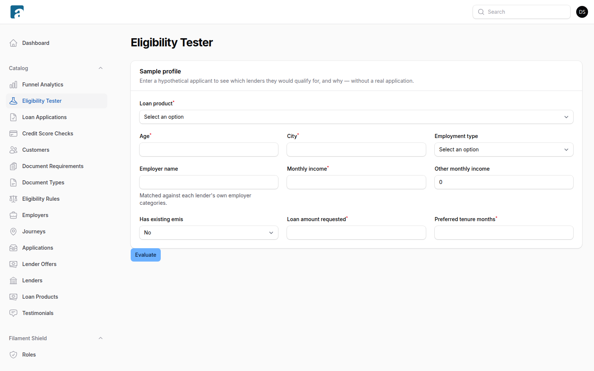
*Screenshot 10 — Eligibility Tester*

#### C. The "Sample profile" form

| Field | Required? | What to Enter | Description |
| --- | --- | --- | --- |
| Loan product | Yes | Pick from the list | Only *published* loan products are listed. Every active lender for this product is tested |
| Age | Yes | A number, e.g. `32` | Applicant's age in years |
| City | Yes | e.g. `Delhi` | Matched against any city rules a lender has |
| Employment type | No | Salaried / Self-employed | |
| Employer name | No | e.g. `Infosys` | Matched against each lender's own employer grading. Leave blank if unknown |
| Monthly income | Yes | e.g. `85000` | Take-home monthly income in ₹ |
| Other monthly income | No | e.g. `10000` | Rent, freelance and so on. Defaults to `0` |
| Has existing EMIs | No | Yes / No | Defaults to **No** |
| Existing EMI amount | Conditional | e.g. `12000` | **Appears only when "Has existing EMIs" is set to Yes** |
| Loan amount requested | Yes | e.g. `500000` | In ₹ |
| Preferred tenure (months) | Yes | e.g. `48` | In months |

#### D. Running the test
Click **Evaluate**. Results appear below the form.

#### E. Reading the results
One block per active lender for that product:

- **Lender name**
- **Status** — *Eligible* or *Not eligible*
- **FOIR** — the calculated Fixed Obligation to Income Ratio, as a percentage (see box below)
- **Reasons** — every rule that was checked, whether it passed or failed, its priority, and the customer-facing message attached to it

> **💡 What FOIR means, in plain language**
> FOIR is the share of the applicant's monthly income that would go to loan repayments. The panel works out the EMI for the requested amount using **that specific lender's own starting interest rate and tenure**, adds any existing EMIs, and divides by total monthly income.
> Example: existing EMIs ₹12,000 + new EMI ₹13,000 = ₹25,000 against income ₹85,000 → FOIR **29.41%**.
> Because each lender quotes a different rate, the same applicant will show a different FOIR for each lender. That is correct, not a bug.

> **📝 Note**
> If a lender has **no published (Active) rule set**, that lender is reported as *Not eligible* with no reasons listed. That means "no rules configured", not "the applicant was rejected".

---

### 6.3 Loan Applications

#### A. Purpose
A formal application to one specific lender. It is created automatically by the website when a visitor picks a lender from their eligibility results. It carries the customer's uploaded documents and tracks the application through to disbursal.

#### B. How to open it
Sidebar → **Catalog → Loan Applications**

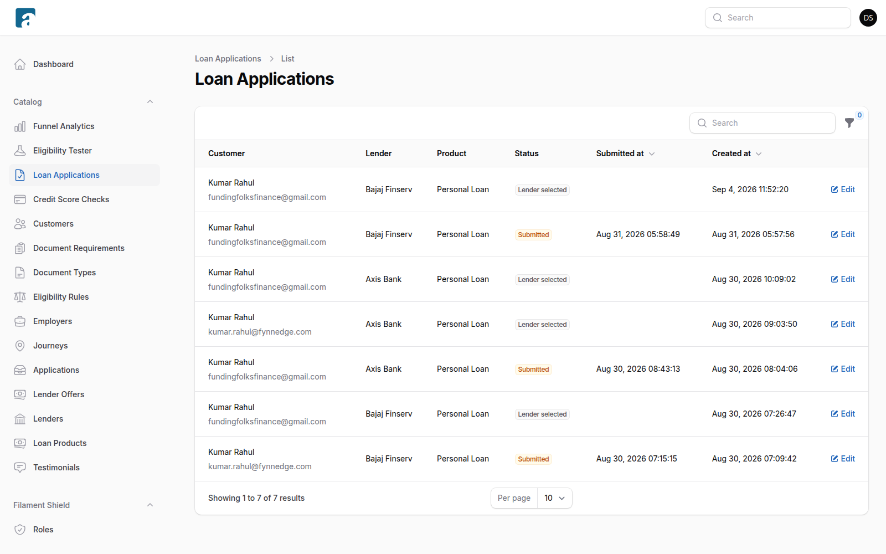
*Screenshot 3 — Loan Applications list*

#### C. The list screen

| Column | What it shows |
| --- | --- |
| Customer | Customer's full name, with their email address underneath |
| Lender | The lender the application went to |
| Product | The loan product applied for |
| Status | Colour-coded badge — grey (early), amber (in progress), green (approved/disbursed), red (ended without a loan) |
| Submitted at | When the customer submitted it |
| Created at | When the application record was first created |

- **Search:** Customer name, Lender name, Product name
- **Filter:** Status
- **Sort:** Submitted at, Created at. Newest first by default
- **Row action:** Edit
- **Bulk actions:** None
- **Create:** **Not available.** Applications only ever come from a real customer on the website

#### D. Create/Add New
Not applicable — there is no Create button for this section, by design.

#### E. The Edit screen

**Section: Application** — all read-only:

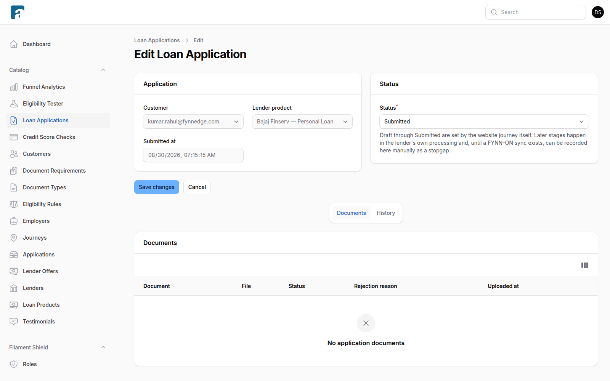
*Screenshot 4 — Loan Application detail*

| Field | Meaning |
| --- | --- |
| Customer | The applicant (shown by email) |
| Lender product | Which lender's offer this is, shown as *Lender — Product* |
| Submitted at | When it was submitted |

**Section: Status** — the only editable field:

| Field | Required? | What to Enter | Description |
| --- | --- | --- | --- |
| Status | Yes | Pick from the list | Where this application currently stands. See the workflow below |

> **📝 Note printed on the form**
> *"Draft through Submitted are set by the website journey itself. Later stages happen in the lender's own processing and, until a FYNN-ON sync exists, can be recorded here manually as a stopgap."*
> In other words: the early statuses look after themselves; the later ones are yours to keep up to date by hand.

#### F. Documents tab

Under the form is a **Documents** tab listing every file the customer uploaded.

| Column | What it shows |
| --- | --- |
| Document | Which document type it satisfies (PAN card, payslip…) |
| File | The original filename the customer uploaded |
| Status | **Uploaded** (amber), **Verified** (green) or **Rejected** (red) |
| Rejection reason | Why it was rejected — optional column, switch it on with the column icon |
| Uploaded at | When the customer uploaded it |

Two actions per document:

- **Verify** — marks it Verified, clears any rejection reason and stamps the verification time. Hidden once already verified.
- **Reject** — opens a small box asking for a **Reason** (required). The document becomes Rejected, the reason is stored and the verification time is cleared. Hidden once already rejected.

> **⚠️ Warning**
> You cannot upload or delete documents from the admin panel. Documents come only from the customer. A rejected document must be re-uploaded by the customer.

#### G. History tab
Full change history of the application. Read-only — no restore.

#### H. Delete
There is **no delete action** on loan applications, in the list or on the edit screen. They are permanent records.

#### I. Status workflow

The website sets these automatically as the customer progresses:

```
Draft
   ↓  (customer picks a lender from their eligibility results)
Lender selected
   ↓  (system lists what this lender requires)
Documents pending
   ↓  (customer uploads everything required)
Documents submitted
   ↓  (customer presses Submit — only possible once every required document, in the required quantity, is uploaded)
Submitted
```

From **Submitted** onwards, you record progress by hand as the lender reports it:

```
Submitted
   ↓
Under review        → lender is assessing it
   ↓
Sanctioned          → lender has approved it
   ↓
Agreement pending   → waiting on the customer to sign
   ↓
Disbursal processing→ lender is releasing funds
   ↓
Disbursed           → money has reached the customer. This is the successful end state
```

Three end states can be set at any point:

| Status | Use it when |
| --- | --- |
| **Rejected** | The lender declined the application |
| **Withdrawn** | The customer chose not to continue |
| **Cancelled** | The application was cancelled for any other reason |

**Who can change status:** anyone whose role includes *Update* permission on Loan Applications. There is no restriction on which status you may move to — the dropdown always offers all thirteen — so follow the sequence above as an operating discipline. Every change is written to the History tab with your name against it.

---

### 6.4 Credit Score Checks

#### A. Purpose
A read-only record of every free credit-score check a visitor ran on the public website. Useful for support ("did my check go through?") and for spotting failures with the bureau.

#### B. How to open it
Sidebar → **Catalog → Credit Score Checks**

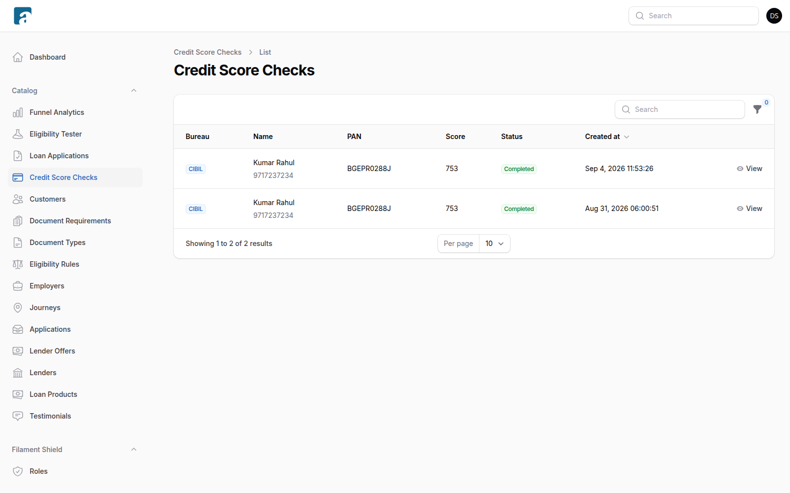
*Screenshot 8 — Credit Score Checks*

#### C. The list screen

| Column | What it shows |
| --- | --- |
| Bureau | CIBIL, Experian, Equifax or CRIF |
| Name | The applicant's name, with their mobile number underneath |
| PAN | The PAN quoted for the check |
| Score | The score returned, if the check completed |
| Status | **Completed** (green), **Pending** (amber), **Failed** (red), **Not requested** (grey) |
| Created at | When the check was run |

- **Search:** Name, PAN
- **Filters:** Bureau, Status
- **Sort:** Created at (newest first by default)
- **Row action:** View
- **Create / Edit / Delete:** **None.** This section is entirely read-only

#### D. The View screen

**Section: Check** — Bureau, Status, Score, Provider, IP address, Completed at.
**Section: Applicant** — Full name, Mobile number, PAN, Date of birth, Mobile verified at, Consent given at.

> **⚠️ Warning — handle with care**
> This screen contains personal and financial data (PAN, date of birth, credit score). Only open it when you have a genuine business reason, and never share what you see outside the organisation.

---

### 6.5 Customers

#### A. Purpose
One record per person who identified themselves on the website. It ties together every application journey that person started.

#### B. How to open it
Sidebar → **Catalog → Customers**

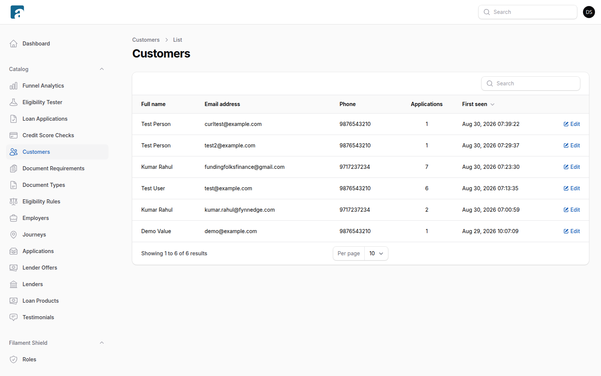
*Screenshot 7 — Customers list*

#### C. The list screen

| Column | What it shows |
| --- | --- |
| Full name | The customer's name |
| Email address | Their email |
| Phone | Their phone number |
| Applications | How many application journeys this person has started |
| First seen | When they first appeared on the website |

- **Search:** Full name, Email address, Phone
- **Sort:** First seen (newest first by default)
- **Filters:** None
- **Row action:** Edit
- **Create:** **Not available** — customers only ever come from the website

#### D. The Edit screen

| Field | Required? | What to Enter | Description |
| --- | --- | --- | --- |
| Full name | No | e.g. `Rahul Kumar` | Correct a typo or fill in a missing name |
| Email address | **Yes** | e.g. `rahul@example.com` | Must be a valid email. Cannot be left blank |
| Phone | No | e.g. `9876543210` | Contact number |

Click **Save changes**.

#### E. Applications tab
Below the form, a read-only list of every journey this customer started: Product, Current step, Status (Completed / In progress / Abandoned), Created at, Completed at. You cannot add or edit rows here — open **Catalog → Applications** to inspect one in full.

#### F. Delete
A **Delete** button sits at the top of the Edit screen. You are asked to confirm.

> **⚠️ Warning**
> Deleting a customer is **permanent** — there is no trash for customers. Their linked journeys, eligibility results and applications lose their owner. Only delete on a genuine data-removal request, and record why.

---

### 6.6 Document Requirements

#### A. Purpose
Defines exactly which documents a given lender wants for a given loan product, and how many of each. This is what the website shows the customer as their upload checklist — and what decides whether they are allowed to submit.

#### B. How to open it
Sidebar → **Catalog → Document Requirements**

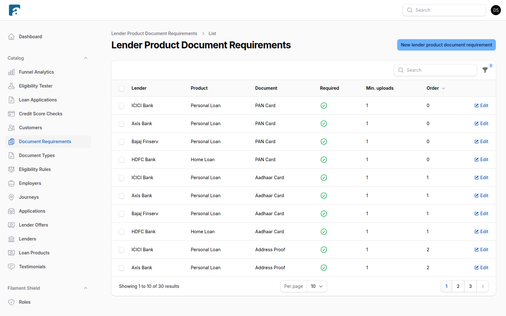
*Screenshot 21 — Document Requirements*

#### C. The list screen

| Column | What it shows |
| --- | --- |
| Lender | The lender |
| Product | The loan product |
| Document | Which document type is required |
| Required | Tick = mandatory, cross = optional |
| Min. uploads | How many files are needed to satisfy it |
| Order | Position in the customer's checklist |

- **Search:** Lender, Product, Document
- **Filter:** Lender product
- **Sort:** Order (default)
- **Row action:** Edit
- **Bulk action:** Delete selected

#### D. Create / Add New

1. Click **New document requirement**.
2. Complete the form:

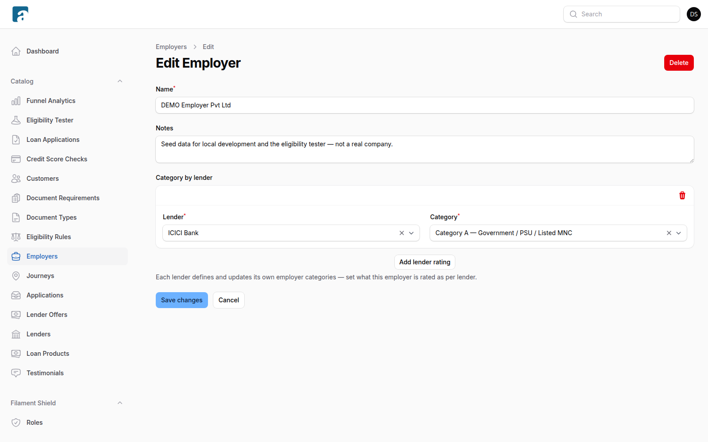
*Screenshot 50 — Employer edit form with per-lender ratings*

| Field | Required? | What to Enter | Description | Example |
| --- | --- | --- | --- | --- |
| Lender product | Yes | Search and pick | Shown as *Lender — Product*. This is the specific lender offer the requirement belongs to | `HDFC Bank — Personal Loan` |
| Document type | Yes | Search and pick | Which kind of document. Managed in **Document Types** | `Salary Slip` |
| Required | No | On / Off (default **On**) | On = the customer cannot submit without it | On |
| Order | No | Number (default `0`) | Lower numbers appear first in the checklist | `3` |
| Minimum uploads required | No | Number, 1 or more (default `1`) | How many files satisfy it. **Only applies while "Required" is on** | `3` for three months of payslips |
| Notes | No | Short text | Extra instruction shown alongside | `Last 3 months, PDF preferred` |

3. Click **Create**.

#### E. Edit / Delete
**Edit** changes any field above. **Delete** is on the Edit screen and in the bulk menu; it is **permanent**.

> **⚠️ Warning**
> Changing requirements affects **in-flight applications**. Raising "Minimum uploads" from 1 to 3 means customers who had already finished uploading can no longer submit until they add two more files. Add new requirements early in the day and tell your operations team.

---

### 6.7 Document Types

#### A. Purpose
The master list of *kinds* of document (PAN card, Aadhaar, payslip, bank statement…). Document Requirements point at these, so each type is defined once and reused across every lender.

#### B. How to open it
Sidebar → **Catalog → Document Types**

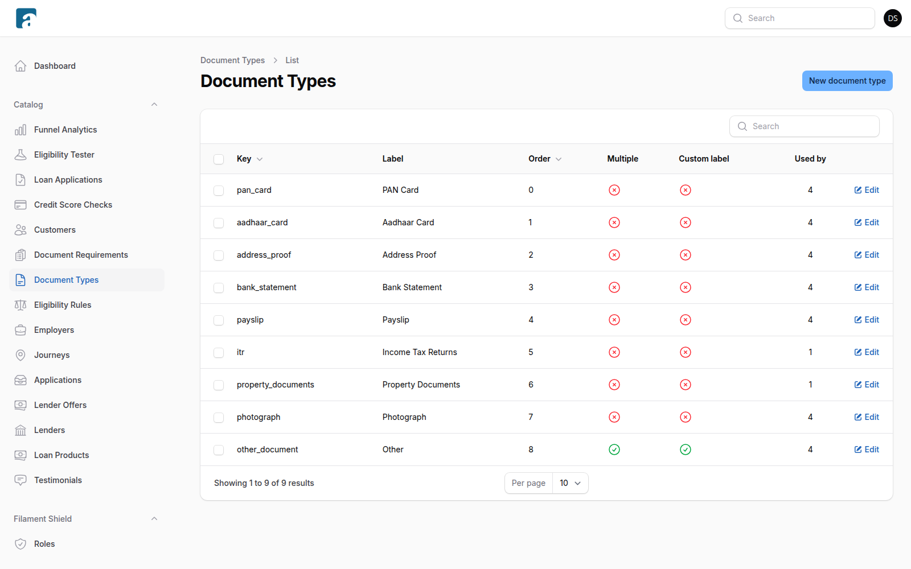
*Screenshot 20 — Document Types*

#### C. The list screen

| Column | What it shows |
| --- | --- |
| Key | The stable internal code |
| Label | What the customer sees |
| Order | Display position |
| Multiple | Tick if the customer may upload several files |
| Custom label | Tick if the customer is asked to name each upload |
| Used by | How many lender requirements reference this type |

- **Search:** Key, Label
- **Sort:** Order (default), Key
- **Row action:** Edit
- **Bulk action:** Delete selected

#### D. Create / Add New

| Field | Required? | What to Enter | Description | Example |
| --- | --- | --- | --- | --- |
| Key | Yes | Lower-case, underscores, no spaces. Must be unique | The stable identifier requirements refer to. **Do not change it after it is in use** | `pan_card` |
| Label | Yes | Plain English | What the customer sees on the upload screen | `PAN Card` |
| Description | No | A sentence or two | Extra guidance for the customer | `A clear photo or scan of your PAN card` |
| Order | No | Number (default `0`) | Lower shows first | `1` |
| Allow multiple uploads | No | On / Off (default **Off**) | Gives the customer an "Add another document" button | On, for `Other` |
| Ask customer to name each upload | No | On / Off (default **Off**) | Adds a text box per file so the customer can label it | On, for `Other` |

#### E. Delete

> **⚠️ Warning**
> Deleting is **permanent**. Check the **Used by** column first — deleting a type still referenced by lender requirements breaks those checklists. Set the count to zero before deleting.

---

### 6.8 Eligibility Rules

#### A. Purpose
This is the heart of the matching engine. For each lender offer you build a **rule set**: a numbered version containing the rules that decide whether an applicant qualifies with that lender. Rule sets are versioned, so you can prepare next month's criteria as a draft while today's stay live.

#### B. How to open it
Sidebar → **Catalog → Eligibility Rules**

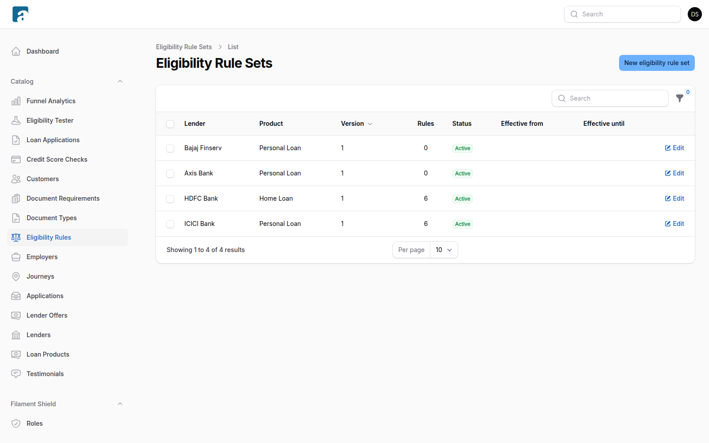
*Screenshot 11 — Eligibility Rules*

#### C. The list screen

| Column | What it shows |
| --- | --- |
| Lender | The lender |
| Product | The loan product |
| Version | The version number of this rule set |
| Rules | How many rules it contains |
| Status | **Active** (green), **Draft** (amber), **Archived** (grey) |
| Effective from | Date it takes effect |
| Effective until | Date it stops |

- **Search:** Lender, Product
- **Filter:** Status
- **Sort:** Newest first by default
- **Row actions:** **Publish** (drafts only) and **Edit**
- **Bulk action:** Delete selected

#### D. Create a rule set

1. Click **New eligibility rule set**.

| Field | Required? | What to Enter | Description |
| --- | --- | --- | --- |
| Lender product | Yes | Search and pick | Shown as *Lender — Product* |
| Version | Yes | Number (default `1`) | Increase it for each new revision so you can tell versions apart |
| Status | Yes | Draft *(default)* / Active / Archived | **Always leave new sets as Draft** and publish them with the Publish button |
| Effective from | No | Date | When these criteria start applying. Filled in automatically on publish if left blank |
| Effective until | No | Date | When they stop |
| Notes | No | Free text | *Why* this version exists — e.g. `FOIR relaxed from 50% to 55% per bank circular dated 01-09-2026` |

2. Click **Create**. You are returned to the list. Now click **Edit** on your new set to add its rules.

#### E. Adding rules

On the Edit screen, a **Rules** tab appears underneath. Click **New rule**.

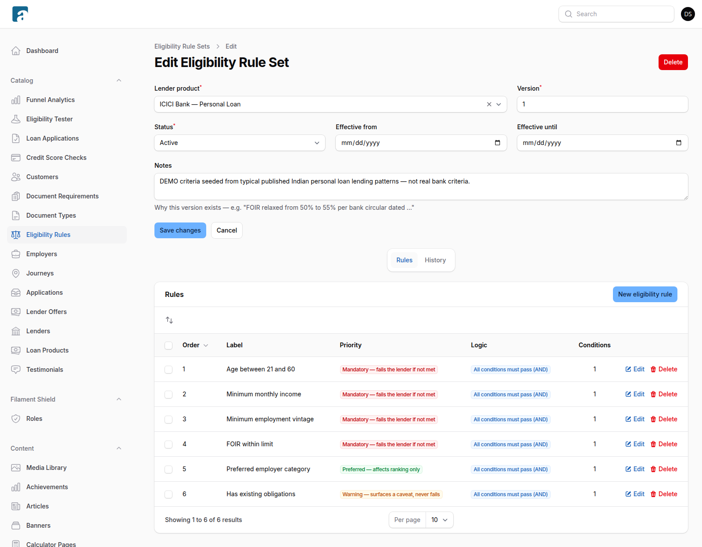
*Screenshot 12 — An eligibility rule set and its Rules tab*

| Field | Required? | What to Enter | Description |
| --- | --- | --- | --- |
| Label | Yes | Short name | What this check is called internally, e.g. `Minimum age` |
| Priority | Yes | Default **Mandatory** | See the table below |
| Combine conditions with | Yes | Default **All conditions must pass (AND)** | AND = every condition must be true. OR = any one is enough |
| Customer-facing message | No | A sentence | Shown to the applicant explaining this specific check, whether it passes or fails |
| Order | No | Number (default `0`) | Position in the list |

**Priority — what each one does:**

| Priority | Effect |
| --- | --- |
| **Mandatory** | If it fails, the applicant is **not eligible** with this lender |
| **Preferred** | Affects ranking only — never blocks eligibility |
| **Warning** | Surfaces a caveat to the applicant — never blocks eligibility |

**Conditions.** Every rule needs at least one condition. Click **Add condition**:

| Field | Required? | What to Enter | Description |
| --- | --- | --- | --- |
| Attribute | Yes | The thing being tested | `age`, `total_monthly_income`, `city`, `employer_category`, `foir`, `credit_score` — or the key of any field in that product's journey form |
| Operator | Yes | Pick one | See the operator table below |
| Value | Yes | The value to compare against | The hint under the box changes with the operator: a **single value** for most, **comma-separated** for *Is one of*, *Is not one of* and *Between* |
| Order | No | Number | Position within the rule |

**Operators available:** Equals (=), Not equals (!=), Greater than (>), Greater than or equal (>=), Less than (<), Less than or equal (<=), Is one of (IN), Is not one of (NOT IN), Between (inclusive), Contains text, Starts with text.

> **💡 Worked example**
> Rule: **"Income and location"** · Priority **Mandatory** · Combine with **AND**
> Condition 1 — Attribute `total_monthly_income`, Operator `Greater than or equal (>=)`, Value `40000`
> Condition 2 — Attribute `city`, Operator `Is one of (IN)`, Value `Delhi, Mumbai, Bengaluru`
> Result: only applicants earning ₹40,000+ a month **and** living in one of those three cities pass. Anyone else is not eligible with this lender.

#### F. Publishing a rule set

Click **Publish** — on the list row, or at the top of the Edit screen. It is only offered while the set is a **Draft**. You are asked to confirm:

> *"This makes it the active rule set for this lender product and archives whichever version was active before."*

**What happens on a successful publish:**
1. Whichever version was **Active** for this lender offer becomes **Archived**.
2. This set becomes **Active**.
3. If **Effective from** was blank, today's date is filled in.
4. A green *"Rule set published"* message appears.

**The panel refuses to publish and shows a red "Could not publish" message if:**

| Reason shown | How to fix it |
| --- | --- |
| *"This rule set has no rules yet — add at least one before publishing."* | Add a rule |
| *"Rule "X" has no conditions — remove it or add at least one."* | Give that rule a condition, or delete the rule |
| *"At least one mandatory rule is required, otherwise every applicant would be eligible by default."* | Set at least one rule's priority to Mandatory |
| *"The effective-from date must be before the effective-until date."* | Correct the dates |

> **⚠️ Warning**
> Publishing takes effect **immediately** for every visitor. Always test the new criteria in the **Eligibility Tester** ([Section 6.2](#62-eligibility-tester)) before you publish.

#### G. Status workflow

```
Draft  ──── Publish ────►  Active  ──── (a newer version is published) ────►  Archived
```

| Status | Meaning | Who can change it |
| --- | --- | --- |
| **Draft** | Being built. Not used by any visitor | Anyone with Update on Eligibility Rules |
| **Active** | Live. Used to evaluate every applicant for this lender offer. Only one per lender offer at a time | Set only by the Publish button |
| **Archived** | Superseded. Kept for reference | Set automatically when a newer version is published |

#### H. Delete
**Delete** is on the Edit screen and in the bulk menu, and is **permanent**. Prefer archiving over deleting so your audit trail stays intact.

---

### 6.9 Employers

#### A. Purpose
A list of employers, and how each lender grades them. Many lenders offer better terms to employees of large or listed companies, so they group employers into categories (A, B, C…). This section records which category each lender puts each employer in — and eligibility rules can then test `employer_category`.

#### B. How to open it
Sidebar → **Catalog → Employers**

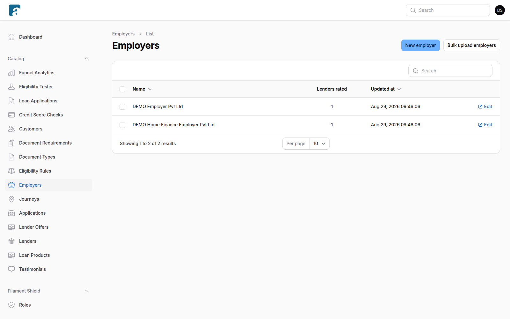
*Screenshot 19 — Employers*

#### C. The list screen

| Column | What it shows |
| --- | --- |
| Name | The employer's name |
| Lenders rated | How many lenders have graded this employer |
| Updated at | When it last changed |

- **Search:** Name
- **Sort:** Name (default), Updated at
- **Filters:** None
- **Row action:** Edit
- **Bulk action:** Delete selected
- **Header buttons:** **New employer** and **Bulk upload employers**

#### D. Create / Add New

| Field | Required? | What to Enter | Description |
| --- | --- | --- | --- |
| Name | Yes | Company name. Must be unique | e.g. `Tata Consultancy Services` |
| Notes | No | Free text | Anything useful internally |
| Category by lender | No | Repeating rows | For each lender that grades this employer, add a row |

For each **Category by lender** row:

| Field | Required? | What to Enter |
| --- | --- | --- |
| Lender | Yes | Search and pick the lender |
| Category | Yes | Pick one of that lender's own categories |

> **📝 Note**
> The **Category** list is filtered by the lender you picked in that same row. If it is empty, that lender has no categories set up yet — add them first under **Lenders → (the lender) → Employer categories**.

#### E. Delete
Permanent, with a confirmation. Removing an employer removes its lender ratings too, and any rule testing `employer_category` will simply find nothing for that employer.

#### F. Bulk upload
See [Section 14.2](#142-bulk-upload-employers).

---

### 6.10 Journeys

#### A. Purpose
Defines the step-by-step form a visitor fills in on the website for a given loan product — the steps, the questions on each step, and when a question should appear. Like eligibility rules, journeys are versioned.

#### B. How to open it
Sidebar → **Catalog → Journeys**

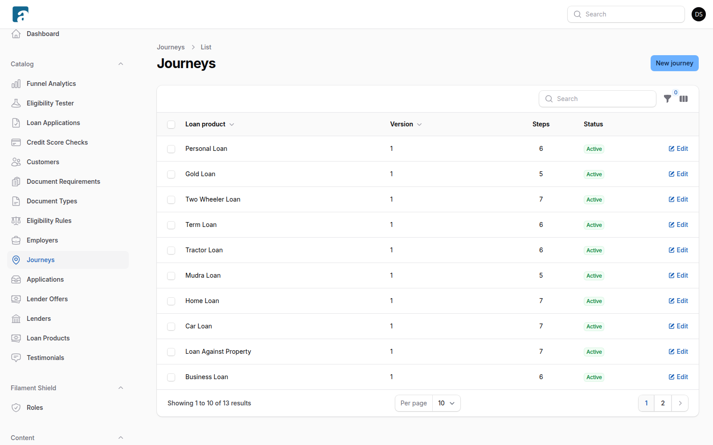
*Screenshot 44 — Journeys*

#### C. The list screen

| Column | What it shows |
| --- | --- |
| Loan product | The product this journey belongs to |
| Version | Version number |
| Steps | How many steps it has |
| Status | **Active** (green), **Draft** (amber), **Archived** (grey) |
| Updated at | Optional column |

- **Search:** Loan product
- **Filter:** Status
- **Row action:** Edit
- **Bulk action:** Delete selected

#### D. Create a journey

| Field | Required? | What to Enter | Description |
| --- | --- | --- | --- |
| Loan product | Yes | Search and pick | Which product this form is for |
| Version | Yes | Number (default `1`) | Increase for each revision |
| Status | Yes | Draft *(default)* / Active / Archived | **Only one journey per product should be Active** |

> **⚠️ Warning**
> Unlike Eligibility Rules, journeys have **no Publish button**. You change Status by hand on the Edit screen. Before setting a new version to **Active**, set the old one to **Archived** yourself — otherwise two versions are active at once and the website picks the highest version number, which may not be the one you intended.

#### E. Adding steps

Open the journey, then the **Steps** tab → **New step**.

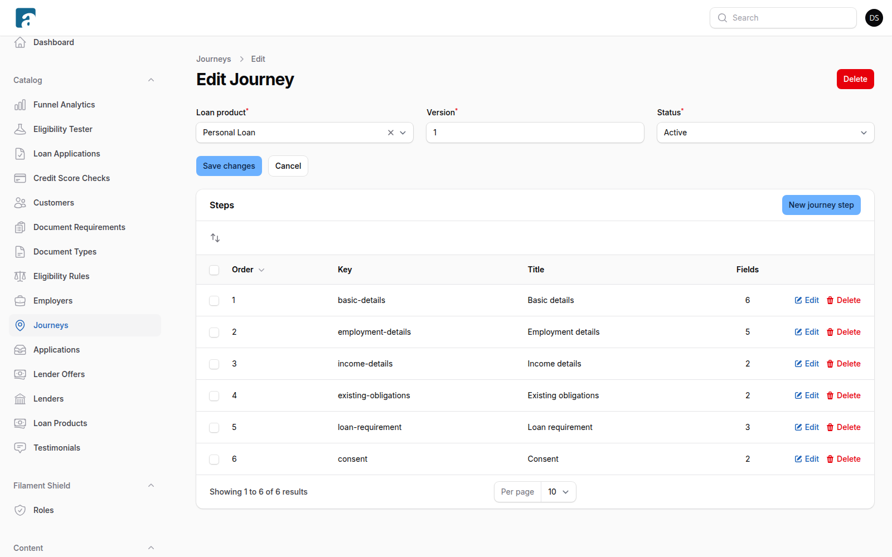
*Screenshot 51 — Journey edit screen with its Steps tab*

| Field | Required? | What to Enter | Description |
| --- | --- | --- | --- |
| Key | Yes | Lower-case with hyphens | Stable identifier, e.g. `employment-details` |
| Title | Yes | Plain English | The heading the customer sees |
| Order | Yes | Number (default `0`) | Step sequence. Rows can also be dragged |
| Description | No | A sentence | Shown to the customer under the step title |

#### F. Adding fields (questions) to a step

Inside a step, use **Add field**. Each field has:

| Field | Required? | What to Enter | Description |
| --- | --- | --- | --- |
| Key | Yes | Lower-case with underscores | The answer key, e.g. `monthly_income`. **Eligibility rules test these keys**, so keep them consistent |
| Label | Yes | Plain English | The question the customer reads |
| Type | Yes | Pick one | See the type list below |
| Help text | No | A sentence | Small print under the question |
| Order | No | Number | Position on the step |
| Validation rules | No | Tags | Laravel rule names, one per tag, e.g. `required`, `numeric` |

**Field types:** Text · Number · Email · Phone · Date · Select (dropdown) · Searchable dropdown (with "Other") · Radio buttons · Checkbox · Long text.

**Options** — a repeating Value/Label list — **appears only when Type is Select, Searchable dropdown or Radio buttons.**

**"Only show this field when…"** — makes a question conditional on an earlier answer:

| Field | What to Enter |
| --- | --- |
| Field key | The key of the earlier question, e.g. `has_existing_emis` |
| Operator | *equals* (default), *not equals*, or *is one of* |
| Value | The answer that reveals this field, e.g. `yes` |

Leave all three blank and the question always shows.

> **💡 Example**
> Field `existing_emi_amount` with *Only show this field when* → Field key `has_existing_emis`, Operator `equals`, Value `yes`. The customer is only asked how much their EMIs are if they said they have some.

#### G. Delete
Permanent. Deleting a journey does not delete the applications visitors already made with it.

---

### 6.11 Applications (Journey Sessions)

#### A. Purpose
Every application journey a visitor actually started — how far they got, and every answer they gave. This is where you look to understand an individual lead in detail.

#### B. How to open it
Sidebar → **Catalog → Applications**

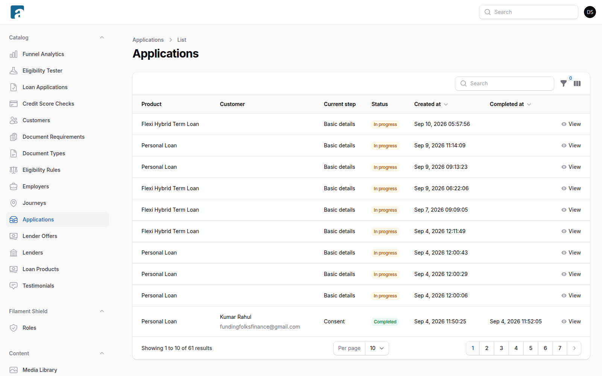
*Screenshot 5 — Applications (journey sessions)*

#### C. The list screen

| Column | What it shows |
| --- | --- |
| Product | The loan product |
| Customer | Name, with email underneath |
| Current step | Which step they are on (or stopped at) |
| Status | **Completed** (green), **In progress** (amber), **Abandoned** (grey) |
| Source | The marketing source (`utm_source`) — optional column |
| Created at | When they started |
| Completed at | When they finished |

- **Search:** Product, Customer
- **Filter:** Status
- **Sort:** Created at, Completed at (newest first by default)
- **Row action:** View
- **Create / Edit / Delete:** **None.** This section is entirely read-only

#### D. The View screen

**Section: Application** — Loan product, Customer, Status, Current step, Completed at. All read-only.

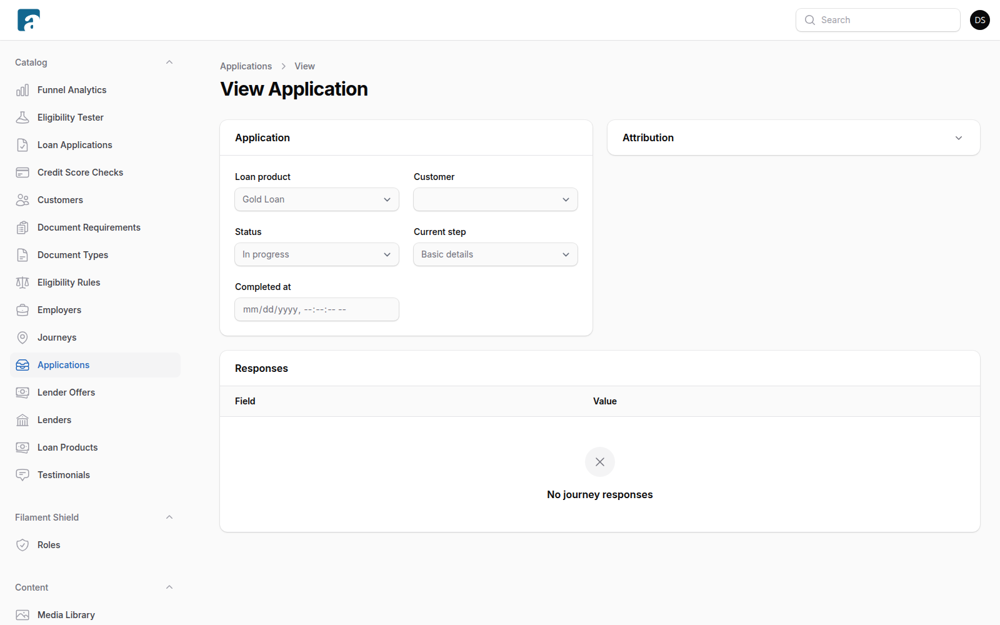
*Screenshot 6 — Application (journey session) detail*

**Section: Credit bureau consent** — **appears only if the visitor gave bureau consent during this journey.** Shows Purpose, Terms version, IP address and Consented at. This is your consent audit record.

**Section: Attribution** — collapsed by default; click to open. Shows utm_source, utm_medium, utm_campaign, Referrer and Landing page — where this lead came from.

**Responses tab** — every question key and the answer the visitor gave. Multiple-choice answers are shown comma-separated.

---

### 6.12 Lender Offers

#### A. Purpose
One lender's specific terms for one loan product: amounts, tenure, interest rate, processing fee, and who typically qualifies. Everything the public comparison tables show comes from here.

#### B. How to open it
Sidebar → **Catalog → Lender Offers**

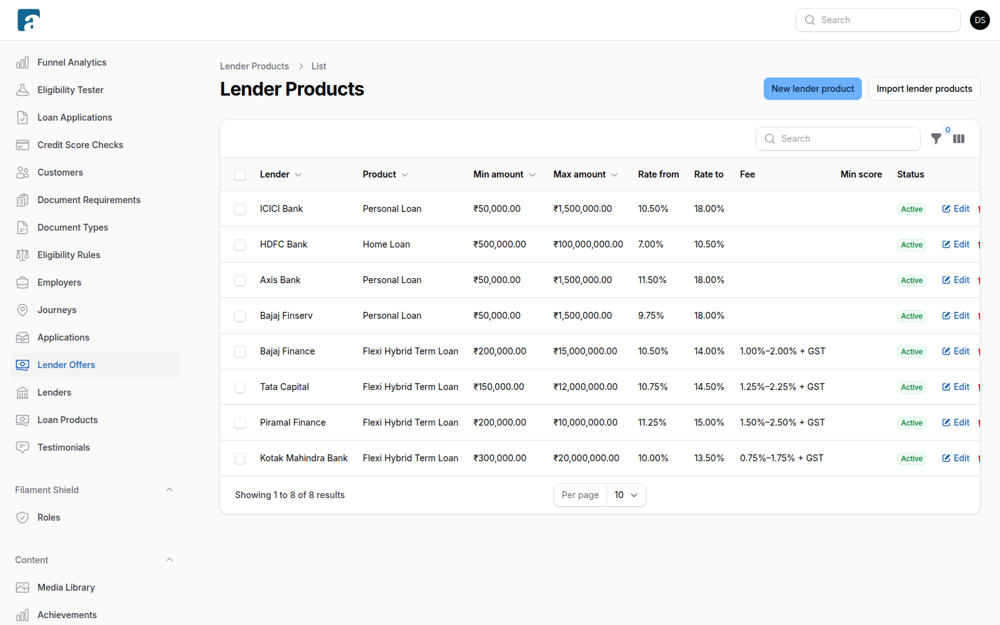
*Screenshot 15 — Lender Offers list*

#### C. The list screen

| Column | What it shows |
| --- | --- |
| Lender | The lender |
| Product | The loan product |
| Min amount / Max amount | The lending range, in ₹ |
| Rate from / Rate to | The interest range, as a % |
| Fee | The processing fee, formatted for display — optional column |
| Min score | Minimum credit score — optional column |
| Status | **Active** (green) or **Inactive** (grey) |
| Updated at | Optional column |

- **Search:** Lender, Product
- **Filters:** Product, Status
- **Sort:** Lender, Product, Min amount, Max amount
- **Row actions:** Edit, Delete
- **Bulk action:** Delete selected
- **Header buttons:** **New lender product** and **Import**

> **📝 Note**
> **Status = Inactive** takes this offer out of eligibility matching and off the public comparison tables immediately, but keeps the record and its rules. This is the safe way to pause a lender — much safer than deleting.

#### D. Create / Add New

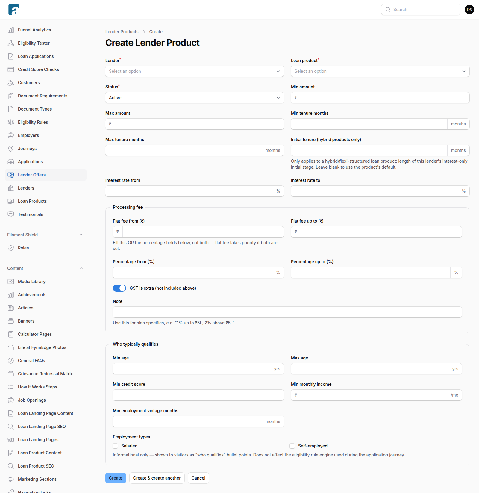
*Screenshot 16 — Creating a Lender Offer*

**Top of the form:**

| Field | Required? | What to Enter | Description |
| --- | --- | --- | --- |
| Lender | Yes | Search and pick | Which bank/NBFC |
| Loan product | Yes | Search and pick | Which product. **A lender may only have one offer per product** — you get *"This lender already has an offer for this loan product."* if it exists |
| Status | Yes | Active *(default)* / Inactive | Whether this offer is live |

**Offer terms:**

| Field | Required? | What to Enter | Description |
| --- | --- | --- | --- |
| Min amount | No | Number in ₹ | Smallest loan this lender will give |
| Max amount | No | Number in ₹ | Largest loan |
| Min tenure months | No | Number | Shortest term |
| Max tenure months | No | Number | Longest term |
| Initial tenure (hybrid products only) | No | Number of months | **Only meaningful for a hybrid/flexi loan.** The interest-only opening stage for this lender. Blank = use the product's default. Ignored on a standard EMI product |
| Interest rate from | No | Number, % | Lowest rate offered |
| Interest rate to | No | Number, % | Highest rate offered |

**Processing fee** (a bordered group):

| Field | Required? | What to Enter | Description |
| --- | --- | --- | --- |
| Flat fee from (₹) | No | Number | Fill in **either** the flat pair **or** the percentage pair — not both |
| Flat fee up to (₹) | No | Number | |
| Percentage from (%) | No | Number | |
| Percentage up to (%) | No | Number | |
| GST is extra (not included above) | No | On / Off (default **On**) | Whether the quoted fee excludes GST |
| Note | No | Short text | For slab detail, e.g. `1% up to ₹5L, 2% above ₹5L` |

> **⚠️ Warning**
> If you fill in both a flat fee **and** a percentage, **the flat fee wins** on the public site. Use one or the other.

**Who typically qualifies** (a bordered group):

| Field | Required? | What to Enter | Description |
| --- | --- | --- | --- |
| Min age / Max age | No | Number, years | |
| Min credit score | No | Number | |
| Min monthly income | No | Number in ₹ per month | |
| Min employment vintage months | No | Number | Months in the current job |
| Employment types | No | Tick Salaried and/or Self-employed | |

> **⚠️ Important**
> Everything in **"Who typically qualifies"** is **informational only** — it is displayed to visitors as "who qualifies" bullet points. It does **not** affect the eligibility engine. Real matching is done by the rules in **Eligibility Rules** ([Section 6.8](#68-eligibility-rules)). If you tighten a number here and nothing changes in matching, that is why.

#### E. Edit / Delete
**Edit** changes anything above. **Delete** is on the row and in the bulk menu.

> **⚠️ Warning**
> Deleting a lender offer is **permanent — there is no trash for lender offers.** Its eligibility rule sets and document requirements lose their parent. To pause an offer, set **Status = Inactive** instead.

#### F. Import
See [Section 14.1](#141-import-lender-offers).

---

### 6.13 Lenders

#### A. Purpose
The banks and NBFCs on your panel. A lender record holds the brand information plus that lender's own employer-grading scale.

#### B. How to open it
Sidebar → **Catalog → Lenders**

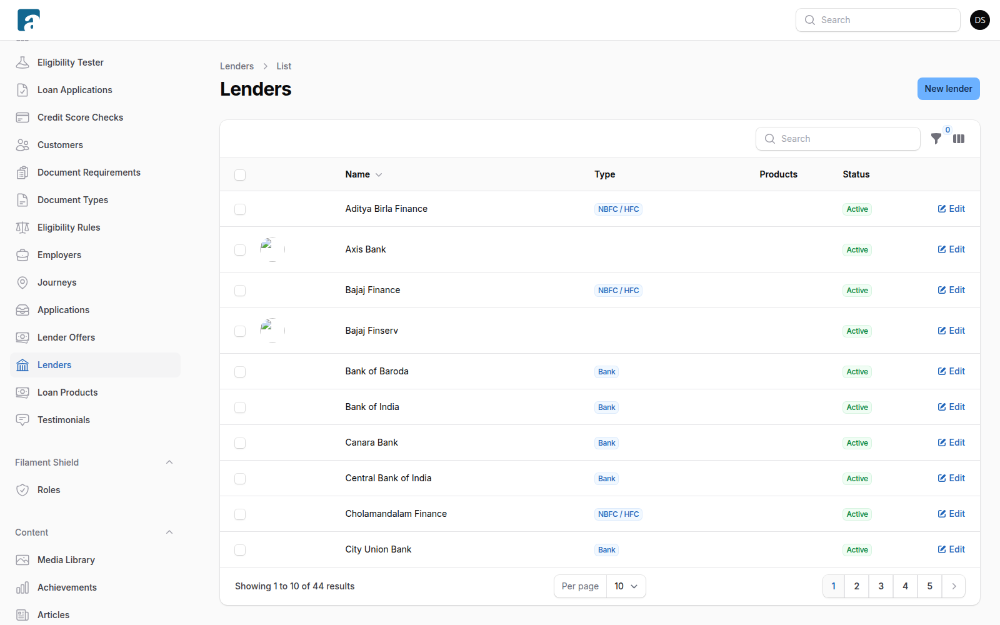
*Screenshot 13 — Lenders list*

#### C. The list screen

| Column | What it shows |
| --- | --- |
| *(logo)* | The lender's logo, shown as a circle |
| Name | The lender's name |
| Type | **Bank** or **NBFC / HFC** — optional column |
| Products | How many loan products this lender offers |
| Status | **Active** (green) or **Inactive** (grey) |
| Updated at | Optional column |

- **Search:** Name
- **Filters:** Status, Type, **Trashed**
- **Sort:** Name (default)
- **Row action:** Edit
- **Bulk actions:** Delete selected, Force-delete selected, Restore selected

#### D. Create / Add New

| Field | Required? | What to Enter | Description | Example |
| --- | --- | --- | --- | --- |
| Name | Yes | The lender's name | Typing here **auto-fills the Slug** below | `HDFC Bank` |
| Slug | Yes | Lower-case with hyphens. Must be unique | Used in web addresses. Auto-filled from the name — only change it if you must | `hdfc-bank` |
| Logo | No | PNG, SVG or WebP, up to 2 MB | Shown on comparison tables | |
| Description | No | A short paragraph | Internal/marketing description | |
| Status | Yes | Active *(default)* / Inactive | Inactive removes the lender from public display | |
| Type | No | Bank / NBFC / HFC | | `Bank` |
| Serviceable locations | No | Type a city and press Enter for each | Cities or regions this lender covers. **Leave empty if nationwide** | `Delhi`, `Mumbai` |

#### E. Employer categories tab

On the Edit screen, an **Employer categories** tab holds this lender

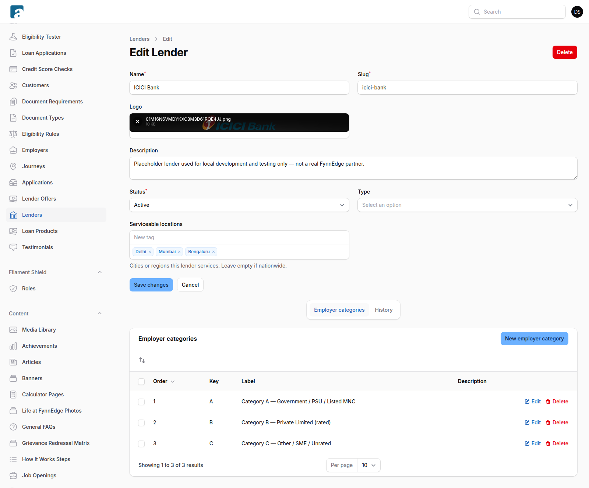
*Screenshot 14 — Lender edit screen with the Employer categories tab*'s own grading scale. Each lender defines its own — Category "A" for one bank means nothing to another.

| Field | Required? | What to Enter | Description |
| --- | --- | --- | --- |
| Key | Yes | A short code | Used in eligibility rules, e.g. `A` |
| Label | Yes | Plain English | e.g. `Category A — MNC / Listed` |
| Order | No | Number (default `0`) | Display position — rows can also be dragged |
| Description | No | Free text | |

> **📝 Note**
> Set these up **before** grading employers or bulk-uploading employer ratings. The employer bulk upload rejects any row naming a category this lender does not have.

#### F. History tab
Full change history. Read-only — no restore.

#### G. Delete / Restore
**Delete** moves the lender to the trash. Use the **Trashed** filter to find it again, then **Restore** it, or **Force delete** to destroy it permanently.

> **⚠️ Warning**
> Deleting a lender affects every lender offer, eligibility rule set and document requirement underneath it. To take a lender off the site temporarily, set **Status = Inactive** instead.

---

### 6.14 Loan Products

#### A. Purpose
The loan types FynnEdge offers — Personal Loan, Home Loan, Car Loan and so on. A loan product record holds its public page content, its EMI calculator configuration and its SEO settings.

#### B. How to open it
Sidebar → **Catalog → Loan Products**

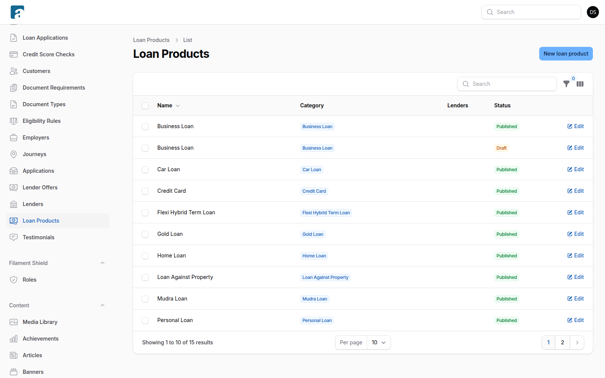
*Screenshot 17 — Loan Products list*

#### C. The list screen

| Column | What it shows |
| --- | --- |
| Name | The product name |
| Category | Its loan category badge |
| Lenders | How many lenders offer it |
| Status | **Published** (green) or **Draft** (amber) |
| Published at | Optional column |
| Updated at | Optional column |

- **Search:** Name
- **Filters:** Category, Status, **Trashed**
- **Sort:** Name (default)
- **Row action:** Edit
- **Bulk actions:** Delete, Force delete, Restore

#### D. Create / Add New — section by section

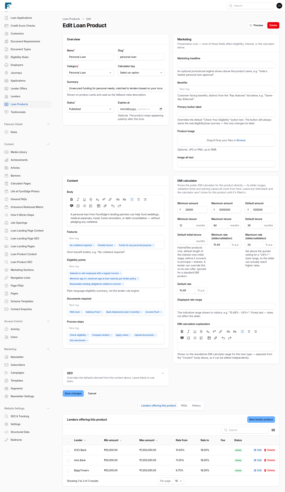
*Screenshot 18 — Loan Product edit form*

**Section 1: Overview**

| Field | Required? | What to Enter | Description |
| --- | --- | --- | --- |
| Name | Yes | e.g. `Personal Loan` | **Auto-fills the Slug** below |
| Slug | Yes | Unique, lower-case with hyphens | The web address part, e.g. `/loans/personal-loan` |
| Category | Yes | Pick one | Personal Loan, Home Loan, Car Loan, Loan Against Property, Business Loan, Credit Card, Gold Loan, Two Wheeler Loan, Term Loan, Tractor Loan, Mudra Loan, Flexi Hybrid Term Loan |
| Calculator key | No | EMI / Personal Loan / Home Loan / Business Loan / Loan Against Property | Which calculator style this product uses |
| Summary | No | Up to 160 characters | Shown on product cards; also the fallback meta description |
| Status | Yes | Draft *(default)* / Published | |
| Published at | Conditional | Date and time | **Appears only when Status is Published.** Set a future time to schedule it |
| Expires at | No | Date and time | The product stops appearing publicly after this time |

**Section 2: Marketing** — *presentation only; none of these affect eligibility, interest or the calculator.*

| Field | Required? | What to Enter | Description |
| --- | --- | --- | --- |
| Marketing headline | No | Up to 255 characters | A tagline above the product name, e.g. `India's fastest personal loan approval` |
| Benefits | No | Type and press Enter for each | Customer-facing benefits, e.g. `Same-day disbursal` |
| Primary button label | No | Up to 255 characters | Overrides the default "Check Your Eligibility" wording. **The button still starts the real eligibility journey** — only the wording changes |
| Product image | No | JPG/PNG/WebP up to 5 MB | |
| Image alt text | No | A short description | For screen readers and search engines |

**Section 3: Content**

| Field | Required? | What to Enter | Description |
| --- | --- | --- | --- |
| Body | No | Rich text | The main page copy — headings, bold, lists, links |
| Features | No | Tags | Short benefit bullets, e.g. `No collateral required` |
| Eligibility points | No | Tags | A plain-language eligibility summary. **This is text only — it is not the rule engine** |
| Documents required | No | Tags | A plain-language document list |
| Process steps | No | Tags | The steps shown to a customer |

**Section 4: EMI calculator**

> **⚠️ Important**
> These fields **drive the public EMI calculator directly** — its sliders, its limits and its starting values. **Leave any of them blank and the calculator will not appear for this product.**

| Field | Required? | What to Enter | Description |
| --- | --- | --- | --- |
| Minimum amount | No* | ₹ | Lower end of the amount slider |
| Maximum amount | No* | ₹ | Upper end of the amount slider |
| Default amount | No* | ₹ | Where the amount slider starts |
| Minimum tenure | No* | Months | |
| Maximum tenure | No* | Months | |
| Default tenure | No* | Months | |
| Default initial tenure | No | Months | **Hybrid/flexi products only** — the interest-only opening stage before it converts to principal + interest. A lender can override it on its own offer. Ignored for a standard EMI product |
| Minimum rate | No* | % p.a. | Lower end of the rate slider |
| Maximum rate | No* | % p.a. | Upper end. Set it above your quoted ceiling for a `24%+`-style range so the slider can actually reach higher |
| Default rate | No* | % p.a. | Where the rate slider starts |
| Displayed rate range | No | Free text | The indicative range shown to visitors, e.g. `10.49% – 24%+`. **Purely text — it does not move the slider** |
| EMI calculation explanation | No | Rich text | Shown on this loan type's standalone EMI calculator page, separate from the Content body |

\* Not enforced by the form, but the calculator is hidden until the set is complete.

**Section 5: SEO** — collapsed by default. See [Section 7.1](#71-the-shared-seo-section).

#### E. Header buttons on the Edit screen

- **Preview** — opens the live public page in a new tab using a temporary signed link valid for 30 minutes, so you can check a **draft** exactly as it will look without publishing it.
- **Delete** — moves it to the trash.
- **Force delete / Restore** — shown when you are viewing a trashed record.

#### F. Lenders offering this product tab
Add or edit the lender offers for this product without leaving the page — the same fields as [Section 6.12](#612-lender-offers), minus the product picker.

#### G. History tab
Read-only. **No "Restore this version"** here — see the note in [Section 5.4](#54-the-history-tab).

#### H. Publishing workflow

| Status | What visitors see |
| --- | --- |
| **Draft** | Nothing. The product is invisible on the public site |
| **Published**, Published at blank or in the past, Expires at blank or in the future | The product is live |
| **Published**, Published at in the future | Not yet live — it appears automatically at that time |
| **Published**, Expires at in the past | No longer live — it disappeared automatically at that time |

---

### 6.15 Testimonials

#### A. Purpose
Customer quotes displayed across the website.

#### B. How to open it
Sidebar → **Catalog → Testimonials**

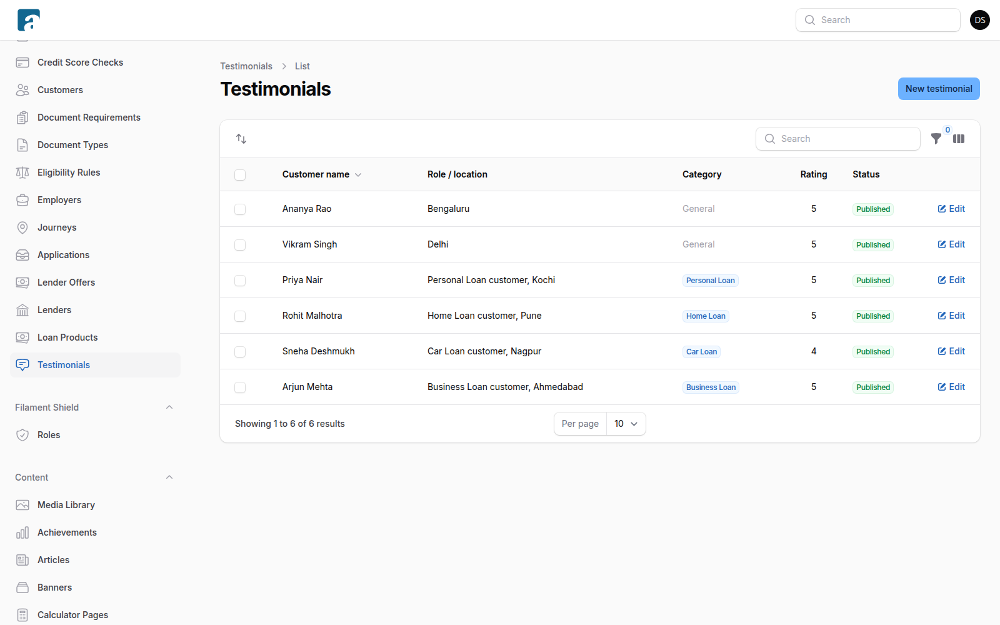
*Screenshot 30 — Testimonials*

#### C. The list screen
Columns: avatar, Customer name, Role / location, Category (shows **General** when blank), Rating, Status, Order, Updated at.

- **Search:** Customer name
- **Filters:** Category, Status, **Trashed**
- **Sort / reorder:** Drag rows, or use Sort order
- **Row action:** Edit
- **Bulk actions:** Delete, Force delete, Restore

#### D. Create / Add New

| Field | Required? | What to Enter | Description |
| --- | --- | --- | --- |
| Customer name | Yes | e.g. `Priya Sharma` | |
| Role / location | No | e.g. `Personal Loan customer, Bengaluru` | Shown under the name |
| Loan category | No | Pick one, or leave blank | **Blank = shown on every loan page.** Set it to also show on that category's pages |
| Rating | No | 1 to 5 | |
| Quote | Yes | The testimonial text | |
| Avatar | No | JPG/PNG/WebP up to 2 MB | |
| Avatar alt text | No | A short description | |
| Sort order | No | Number (default `0`) | Lower shows first |
| Status | Yes | Draft *(default)* / Published | |
| Published at | Conditional | Date and time | **Appears only when Status is Published** |
| Expires at | No | Date and time | Stops showing after this time |

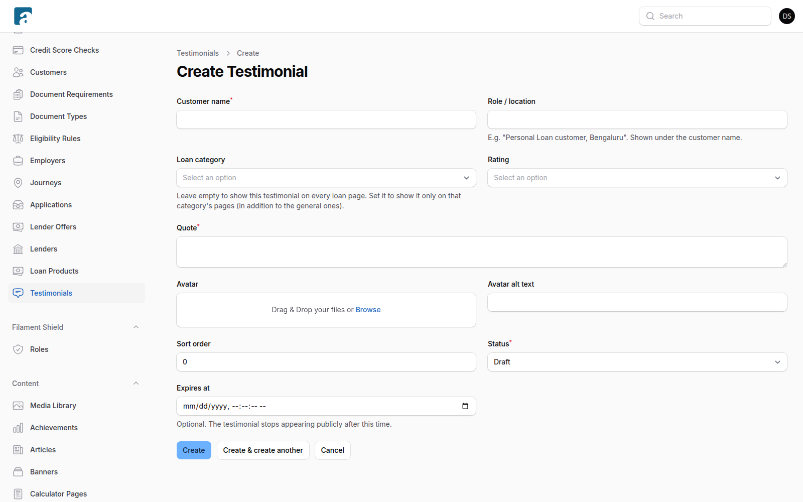
*Screenshot 67 — Testimonial form*

> **⚠️ Warning — compliance**
> Only publish testimonials you actually received and have permission to use. They are public claims about your service.

---

## 7. Content — Website Content Modules

### 7.1 The shared SEO section

Four sections — **Loan Products, Loan Landing Pages, Articles and Pages** — carry an identical **SEO** panel at the bottom of their form. It is **collapsed by default**; click the heading to open it.

*Every field is optional.* Leave one blank and the site works out a sensible value from the content above it.

| Field | What to Enter | Description |
| --- | --- | --- |
| SEO title | Up to 60 characters | The blue clickable line in Google. Blank = the record's own title |
| Meta description | Up to 160 characters | The grey summary under it in Google. Blank = the summary/excerpt |
| Canonical URL | A full URL | Only when this content also lives at another address and you want Google to prefer that one |
| Robots | Index, follow *(default)* / Noindex, follow / Noindex, nofollow | Whether search engines may list this page |
| Social share image | Image, 1200×630 px recommended, up to 2 MB | The picture in WhatsApp/Facebook/LinkedIn previews. Blank = the sitewide default |
| Social share title | Up to 70 characters | Blank = falls back to the SEO title |
| X (Twitter) title | Up to 70 characters | Blank = falls back to the social share title |
| Social share description | Up to 200 characters | Blank = falls back to the meta description |
| X (Twitter) description | Up to 200 characters | Blank = falls back to the social share description |
| X (Twitter) image | Image up to 2 MB | Only when X should show a different picture |
| Page type (schema.org) | Pick one | **Only visible to users who may edit structured data.** Blank = the sitewide default |
| Schema template | Pick one | **Only visible to users who may edit structured data.** Applies a reusable JSON-LD blueprint |
| Custom JSON-LD structured data | A JSON object | Advanced escape hatch. Paste the JSON object only — no `<script>` tag. **Must be valid JSON** or saving is refused with *"The custom JSON-LD must be a valid JSON object or array."* |

> **📝 Note**
> FAQ structured data is generated automatically from the FAQs tab. Do not paste it here as well.

---

### 7.2 Articles

**Purpose.** Blog / resources articles published on the website.
**Open:** Sidebar → **Content → Articles**

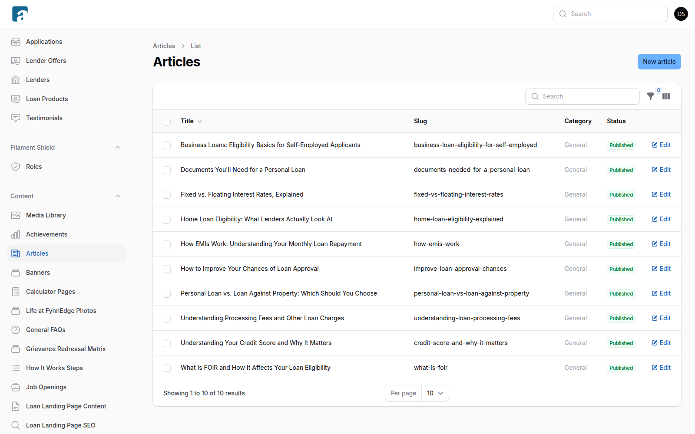
*Screenshot 24 — Articles*

**List:** Title, Slug, Category (shows **General** when blank), Status, Published at, Updated at.
Search: Title, Slug · Filters: Status, Category, Trashed · Sort: Title (default) · Row action: Edit · Bulk: Delete, Force delete, Restore.

**Form:**

| Field | Required? | What to Enter | Description |
| --- | --- | --- | --- |
| Title | Yes | The headline | **Auto-fills the Slug** |
| Slug | Yes | Unique, lower-case with hyphens | The web address part |
| Excerpt | No | Up to 160 characters | Shown on article cards; used as the fallback meta description |
| Category | No | A loan category, or blank | **Blank = shows as a general resource across all loan types** |
| Status | Yes | Draft *(default)* / Published | |
| Published at | Conditional | Date and time | **Appears only when Status is Published**. A future time schedules it |
| Expires at | No | Date and time | Stops showing after this time |
| Body | No | Rich text | The article itself |
| SEO | — | See [Section 7.1](#71-the-shared-seo-section) | |

**Header buttons:** Preview (30-minute signed link, works on drafts), Delete, Force delete, Restore.
**History tab:** yes — **with "Restore this version"**.

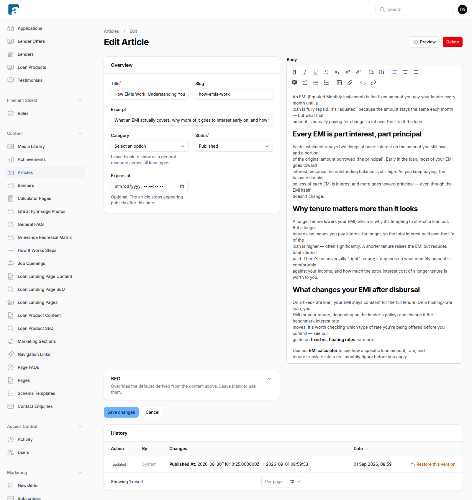
*Screenshot 25 — Article edit form, with the SEO section at the bottom*

---

### 7.3 Pages

**Purpose.** Static pages such as About, Privacy Policy, Terms and Disclaimer.
**Open:** Sidebar → **Content → Pages**

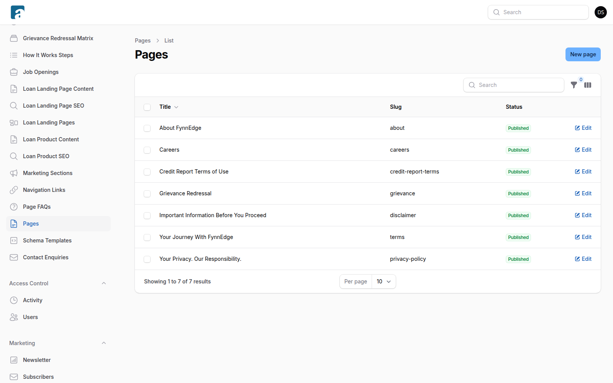
*Screenshot 26 — Pages*

**List:** Title, Slug, Status, Published at, Updated at. Search: Title, Slug · Filters: Status, Trashed · Row action: Edit · Bulk: Delete, Force delete, Restore.

**Form:** Title (required, auto-fills Slug) · Slug (required, unique) · Excerpt (up to 160 characters) · Status · Published at (only when Published) · Expires at · Body (rich text) · SEO section.

**FAQs tab.** Add FAQs that belong to this page only:

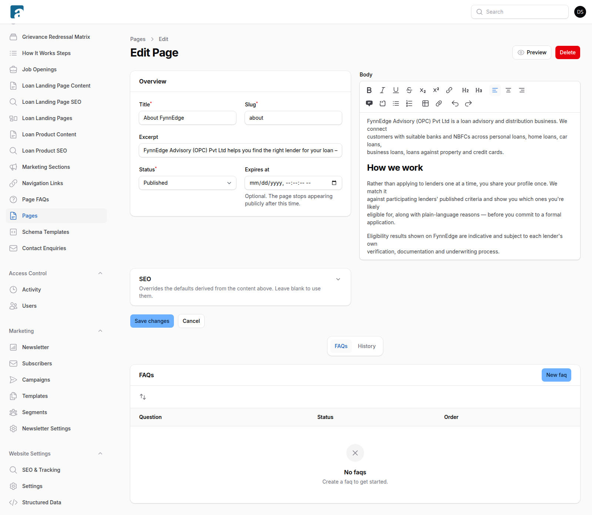
*Screenshot 52 — Page edit screen with its FAQs tab*

| Field | Required? | What to Enter |
| --- | --- | --- |
| Question | Yes | The question |
| Answer | Yes | The answer |
| Sort order | No | Number (default `0`) |
| Status | Yes | Draft *(default)* / Published |
| Published at | Conditional | Only when Status is Published. Blank = publish immediately |
| Expires at | No | Stops showing after this time |

**History tab:** yes — with restore.

> **📝 Note about Preview on Pages**
> The **Preview** button only appears when the page's slug matches a real website address. A newly created page with a brand-new slug shows no Preview button until a developer wires that address up. This prevents dead preview links.

---

### 7.4 General FAQs

**Purpose.** FAQs that are **not** attached to any particular page or product — the general pool.
**Open:** Sidebar → **Content → General FAQs**

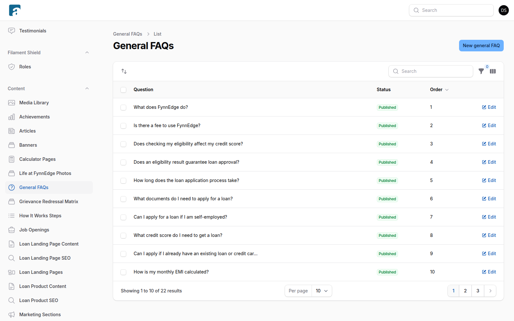
*Screenshot 54 — General FAQs*

**List:** Question (shortened to 60 characters), Status, Order, Published at, Expires at. Search: Question · Filter: Status · Reorder: drag rows · Row action: Edit · Bulk: Delete.

**Form:** Question (required) · Answer (required) · Sort order · Status · Published at (only when Published) · Expires at.

> **📝 Note**
> This list shows **only** FAQs with no owner and no page placement. FAQs attached to a Page or Loan Product live on that record's FAQs tab, and FAQs pinned to whole pages live in **Page FAQs**. The three lists never overlap, so the same FAQ can never appear twice.

---

### 7.5 Page FAQs

**Purpose.** FAQs pinned to whole website pages — for example, showing the same three questions on every loan product page.
**Open:** Sidebar → **Content → Page FAQs**

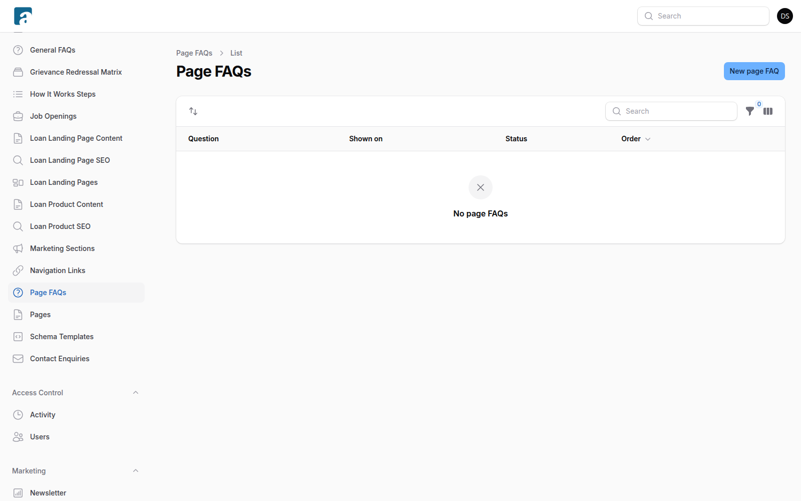
*Screenshot 27 — Page FAQs*

**List:** Question, **Shown on** (a badge per placement), Status, Order, Expires at. Search: Question · Filters: Status, Page · Reorder: drag rows.

**Form:**

| Field | Required? | What to Enter | Description |
| --- | --- | --- | --- |
| Question | Yes | The question | |
| Answer | Yes | The answer | Shown to visitors **and published as FAQ structured data** — write a direct, self-contained answer |
| Show on these pages | **Yes** | Pick one or more | Grouped and searchable. Every page is listed individually, and each group also offers an **"Every …"** option covering all pages of that type at once |
| Sort order | No | Number (default `0`) | Lower shows first. The same order applies on every page it appears on |
| Status | Yes | Draft *(default)* / Published | |
| Published at | Conditional | Only when Status is Published | Blank = publish immediately |
| Expires at | No | | Stops showing after this time |

**Placement groups available:** Main pages (Homepage, About, Careers, Contact, FAQs page, Check eligibility page) · Loan pages (Loans directory, Every loan product page, Every loan landing page) · Resources (Resources index, Every article page) · Calculators (directory, Every EMI calculator page, Every eligibility calculator page, Every prepayment calculator page, Fixed Deposit, SIP, Daily SIP, GST) · Legal & policy (Grievance redressal, Privacy policy, Terms & conditions, Disclaimer, Credit report terms).

---

### 7.6 Banners

**Purpose.** The sliding banner in the top-right of the homepage.
**Open:** Sidebar → **Content → Banners**

**List:** Image thumbnail, Heading, Status, Order, Published at, Expires at. Filter: Status · Reorder: drag rows.

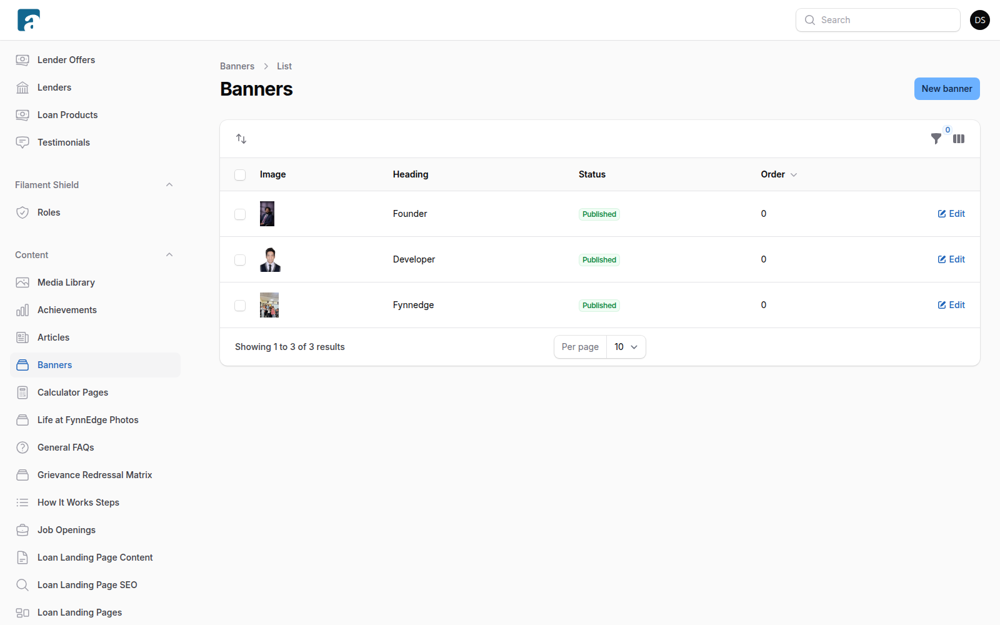
*Screenshot 28 — Banners list*

**Form:**

| Field | Required? | What to Enter | Description |
| --- | --- | --- | --- |
| Image | **Yes** | JPG/PNG/WebP up to 5 MB | **Recommended 1440 × 1000 px (about 1.4:1).** It fills the right-hand 60% of the homepage banner. The box is 1.2:1 on smaller laptops and 1.8:1 on tablets and the image is **centre-cropped**, so keep faces, logos and text in the middle and leave room at the edges |
| Image alt text | No | A short description | |
| Heading | **Yes** | The headline | |
| Subtitle | No | A supporting line | |
| Button label | No | e.g. `Explore loans` | |
| Button link | No | `https://…` or `/loans` | **Must start with `http://`, `https://` or `/`**, otherwise: *"The button link must start with http://, https:// or /."* |
| Sort order | No | Number (default `0`) | Position in the rotation |
| Status | Yes | Draft *(default)* / Published | |
| Published at | Conditional | Only when Published | Blank = publish immediately |
| Expires at | No | | Stops showing after this time |

**Delete:** permanent — banners have no trash. **History tab:** yes, with restore.

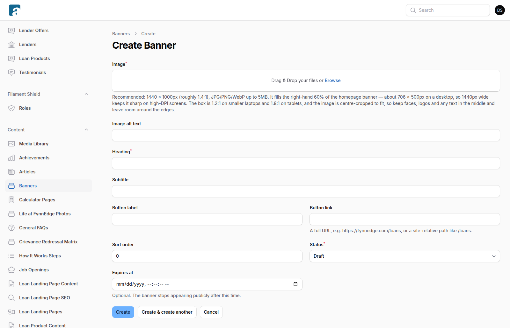
*Screenshot 66 — Banner form*

---

### 7.7 Marketing Sections

**Purpose.** Lets you rewrite specific call-to-action blocks on the website without a developer. Each block lives in a **fixed slot** and shows built-in default wording until you publish a section for that slot.
**Open:** Sidebar → **Content → Marketing Sections**

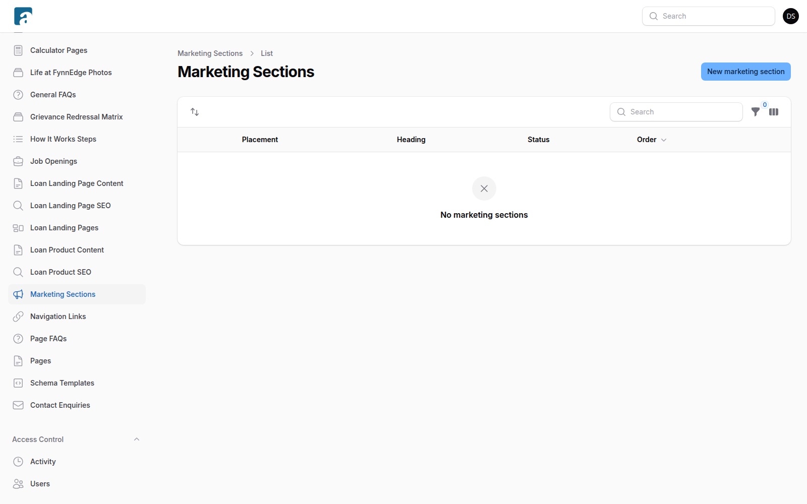
*Screenshot 29 — Marketing Sections*

**The six available slots:**

| Placement | Where it appears on the website |
| --- | --- |
| Homepage — "Not sure which loan fits?" CTA | Homepage |
| Homepage — "Plan your EMI" CTA | Homepage |
| Homepage — closing "Ready to see what you're eligible for?" CTA | Bottom of the homepage |
| Homepage — Flexi Hybrid marquee strip (below header) | Scrolling strip under the header |
| Homepage — Quick Enquiry box | Homepage |
| Loan pages — enquiry form (all loan and landing pages) | Every loan and landing page |

**Form:**

| Field | Required? | What to Enter | Description |
| --- | --- | --- | --- |
| Placement | **Yes** | Pick a slot | **Changing this changes the hints on the fields below** |
| Heading | **Yes** | The heading text | See the slot-specific guidance below |
| Subheading | No | A supporting line | |
| Description | No | A short paragraph | |
| Image | No | JPG/PNG/WebP up to 5 MB | |
| Image alt text | No | A short description | |
| Button label | No | e.g. `Submit Enquiry` | |
| Button link | No | `https://…` or `/eligibility` | **Must start with `http://`, `https://` or `/`** |
| Sort order | No | Number (default `0`) | |
| Status | Yes | Draft *(default)* / Published | Nothing changes on the site until this is Published |
| Published at | Conditional | Only when Published | Blank = publish immediately |
| Expires at | No | | |

**Slot-specific guidance shown on the form:**

| If Placement is… | Then… |
| --- | --- |
| Flexi Hybrid marquee strip | **Heading** is the small badge label, e.g. `Our Specialty`. **Description** is the scrolling text |
| Loan pages — enquiry form | **Heading:** write `:product` where the loan name should go, e.g. `Apply for a :product` — one row words every loan page. **Subheading** is the small label above the form, e.g. `Instant :product`. The rate and loan ceiling under it come from the loan product's own fields. **Button label** is the submit button |
| Homepage — Quick Enquiry box | **Heading** is above the box, e.g. `Get Started with a Quick Enquiry`. **Button label** is the submit button |

**Filters:** Status, Trashed · **Reorder:** drag rows · **Bulk:** Delete, Force delete, Restore · **History:** yes, with restore.

---

### 7.8 Achievements

**Purpose.** The strip of numbers on the homepage ("550+ Cities served").
**Open:** Sidebar → **Content → Achievements**

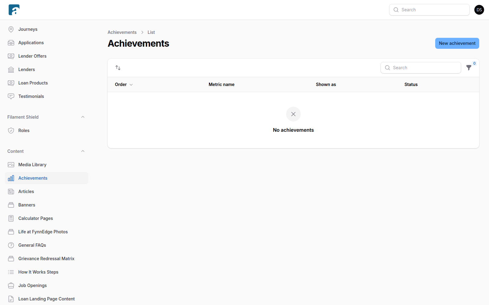
*Screenshot 47 — Achievements*

**List:** Order, Metric name, **Shown as** (the finished figure, prefix + value + suffix), Status. Search: Metric name · Filter: Status · Reorder: drag rows.

**Form:**

| Field | Required? | What to Enter | Description | Example |
| --- | --- | --- | --- | --- |
| Metric name | Yes | Up to 60 characters | The caption under the number | `Cities served` |
| Value | Yes | Up to 20 characters | The figure itself | `550` |
| Prefix | No | Up to 10 characters | Goes before the value | `₹` |
| Suffix | No | Up to 10 characters | Goes after the value | `+` |
| Display order | No | Number (default `0`) | Lowest first. Publish as many as you like — the row spreads them evenly | `1` |
| Status | Yes | Draft *(default)* / Published | | |

> **⚠️ Warning — printed on the form**
> *"Publish only figures the business has verified — this appears as a public claim."*

**Delete:** permanent (no trash). **History tab:** yes, with restore.

---

### 7.9 Contact Enquiries

#### A. Purpose
Every enquiry the public website's forms produce, in one list — the contact page form, the homepage Quick Enquiry box and the loan-page enquiry form. This is your lead inbox.

#### B. How to open it
Sidebar → **Content → Contact Enquiries** *(at the bottom of the Content group)*


*Screenshot 22 — Contact Enquiries list*

#### C. The list screen

| Column | What it shows |
| --- | --- |
| Name | The visitor's name, or *"Not provided"* — the Quick Enquiry box only asks for a phone number |
| Mobile | Their phone number, stored as a clean 10-digit number |
| Loan product | Which loan they enquired about, or `—` if it was a general enquiry |
| Lead source | Where the lead came from — currently always **Website** |
| Enquiry source | The specific form, e.g. `Personal Loan Page`, `Homepage Quick Enquiry`, `Contact Page` |
| Status | New (amber) · Contacted (blue) · Follow Up (dark blue) · Converted (green) · Rejected (red) · Closed (grey) |
| Created at | When it arrived |
| Type | Contact Form / Quick Enquiry / Loan Enquiry — optional column |
| Amount | The loan amount stated — optional column |
| Email | Optional column |
| Enquiries | How many times this person has enquired — optional column |
| Handled | Tick once a follow-up time is recorded — optional column |

- **Search:** Name, Mobile, Enquiry source, Email
- **Filters:** Loan product *(only lists products that have actually produced an enquiry)*, Lead source, **Status (multiple)**, Type, **Enquiry date (From / Until)**, Handled (Yes / No / All)
- **Sort:** Created at (newest first by default), Loan product, Status
- **Row action:** Edit
- **Bulk action:** Delete selected
- **Create:** **Not available** — enquiries only come from real visitors

> **💡 About the "Enquiries" count**
> When the same phone number enquires again about the same product, the panel **bumps the count on the existing row instead of creating a second one** — so your list stays one row per person per product. A number above 1 means they have asked more than once, which usually means they should be called sooner.
> A general enquiry (the Quick Enquiry box, which names no product) is matched against **anything** already held for that number, because "call me back" is the same request whatever page they were on.

#### D. The Edit screen

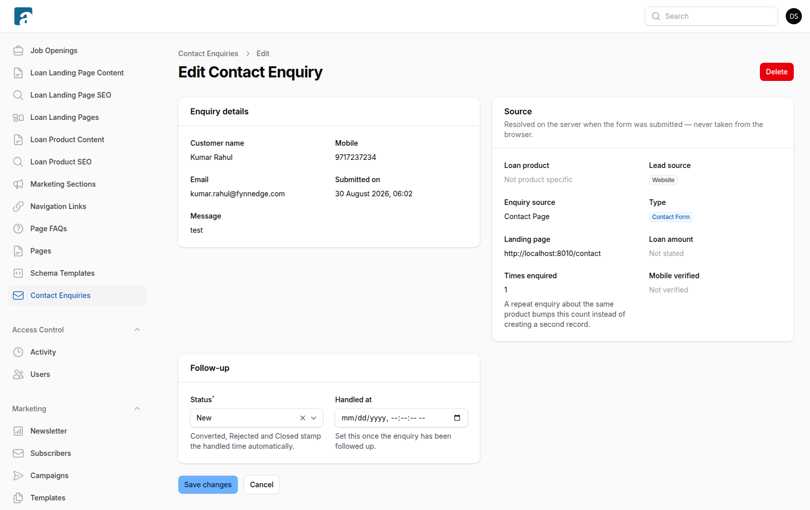
*Screenshot 23 — Contact Enquiry detail*

**Section: Enquiry details** — read-only. Customer name, Mobile, Email, Submitted on, Message.

**Section: Source** — read-only, *"resolved on the server when the form was submitted — never taken from the browser"*. Loan product, Lead source, Enquiry source, Type, Landing page, Loan amount (formatted in Indian style, e.g. ₹5,00,000), Times enquired, Mobile verified.

**Section: Follow-up** — the only editable part:

| Field | Required? | What to Enter | Description |
| --- | --- | --- | --- |
| Status | **Yes** | Pick one | Where this lead currently stands |
| Handled at | No | Date and time | Set this once the enquiry has been followed up |

> **📝 Automatic behaviour**
> Saving with Status set to **Converted, Rejected or Closed** stamps **Handled at** with the current time automatically, if it was empty. A follow-up time you have already recorded is **never** erased.

#### E. Why so much is read-only

Everything the visitor submitted, and everything the server worked out about where they came from, is deliberately locked. An editable "Loan product" or "Enquiry source" would quietly rewrite the marketing numbers those columns exist to produce.

#### F. Delete
**Delete** is on the Edit screen and in the bulk menu. It is **permanent — enquiries have no trash.**

#### G. Status workflow

```
New  ──►  Contacted  ──►  Follow Up  ──►  Converted   (success)
                                     └─►  Rejected    (not proceeding)
                                     └─►  Closed      (no longer active)
```

| Status | Meaning | Counts as |
| --- | --- | --- |
| **New** | Just arrived, nobody has called yet | **Open** |
| **Contacted** | You have spoken to them once | **Open** |
| **Follow Up** | A call-back is arranged or needed | **Open** |
| **Converted** | They went ahead — this is the win | **Settled** |
| **Rejected** | Not proceeding | **Settled** |
| **Closed** | Closed for any other reason | **Settled** |

You may move between any of these; the dropdown always offers all six.

> **💡 What "reopening" means**
> If a person whose enquiry was already **settled** enquires again, the panel **puts the row back to New and clears the handled time** so it reappears in your open work. If their enquiry was still **open**, only the count goes up — the status is left alone.

---

### 7.10 Other Content sections (quick reference)

These follow the standard pattern from [Section 5](#5-how-every-list-screen-works). Each is listed with its fields.

#### Life at FynnEdge Photos
*Content → Life at FynnEdge Photos.* The company photo gallery.

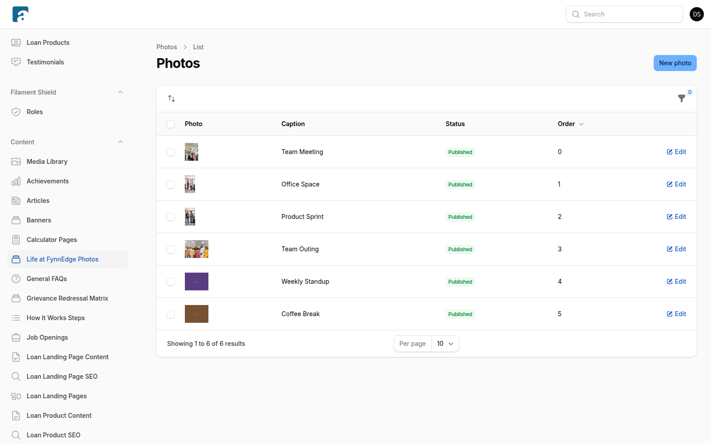
*Screenshot 60 — Life at FynnEdge Photos*

- **Adding photos:** the **New photo** form lets you select **up to 8 images at once**, and each becomes its own photo record. Fields: **Photos** (required, JPG/PNG/WebP up to 5 MB each, drag to reorder), **Caption** (applied to every photo in the batch — edit a photo afterwards to give it its own), **Starting order** (each photo after the first gets the next number), **Status**.
- **Editing one photo:** Photo (required), Image alt text, Caption, Sort order, Status.
- List: thumbnail, Caption, Status, Order. Filter: Status. Reorder: drag. Delete: permanent. History: yes, with restore.

#### How It Works Steps
*Content → How It Works Steps.* The numbered "how it works" strip.

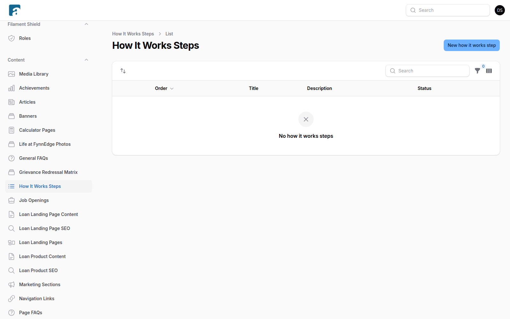
*Screenshot 55 — How It Works Steps*

| Field | Required? | What to Enter |
| --- | --- | --- |
| Title | Yes | Up to 80 characters |
| Description | No | A sentence or two |
| Icon | No | A small square image up to 1 MB |
| Sort order | No | Number (default `0`) |
| Status | Yes | Draft *(default)* / Published |

Search: Title · Filter: Status · Reorder: drag · Delete: permanent.

#### Job Openings
*Content → Job Openings.* Roles listed on the Careers page.

| Field | Required? | What to Enter |
| --- | --- | --- |
| Title | Yes | The job title |
| Order | No | Number (default `0`) — lower shows first on the Careers page |
| Status | Yes | Draft *(default)* / Published |

Search: Title · Filter: Status · Reorder: drag · Delete: permanent.

#### Grievance Redressal Matrix

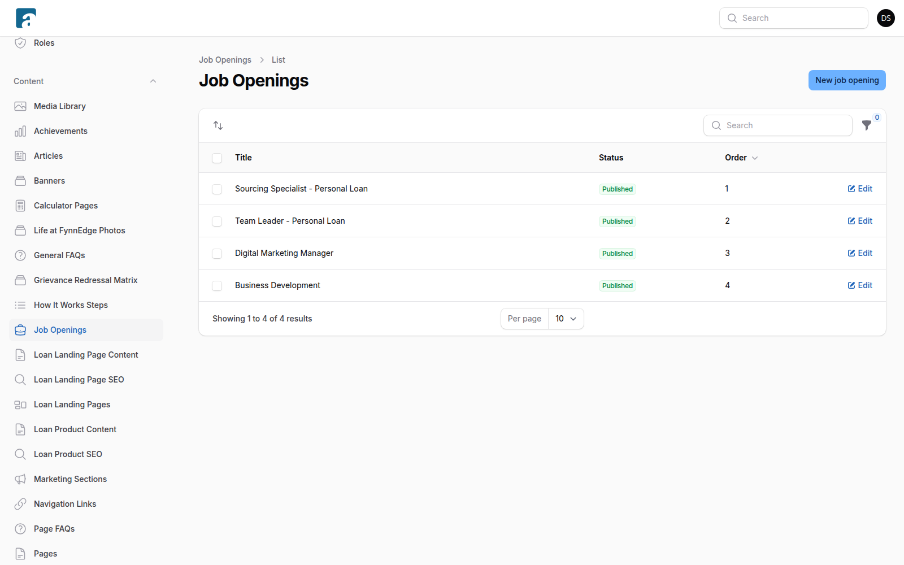
*Screenshot 56 — Job Openings*
*Content → Grievance Redressal Matrix.* The complaints-escalation contact table required on the grievance page.

| Field | Required? | What to Enter | Example |
| --- | --- | --- | --- |
| Level | **Yes** | The escalation stage | `Level 1` |
| Turnaround time | **Yes** | The commitment | `7 Working Days` |
| Name | **Yes** | The contact person | |
| Designation | **Yes** | Their job title | `Grievance Officer` |
| Address | No | Postal address | |
| Phone | No | Contact number | |
| Email | No | Contact email | |
| Sort order | No | Number (default `0`) | |
| Status | Yes | Draft *(default)* / Published | |

Filter: Status · Reorder: drag · Delete: permanent.

> **⚠️ Warning — compliance**

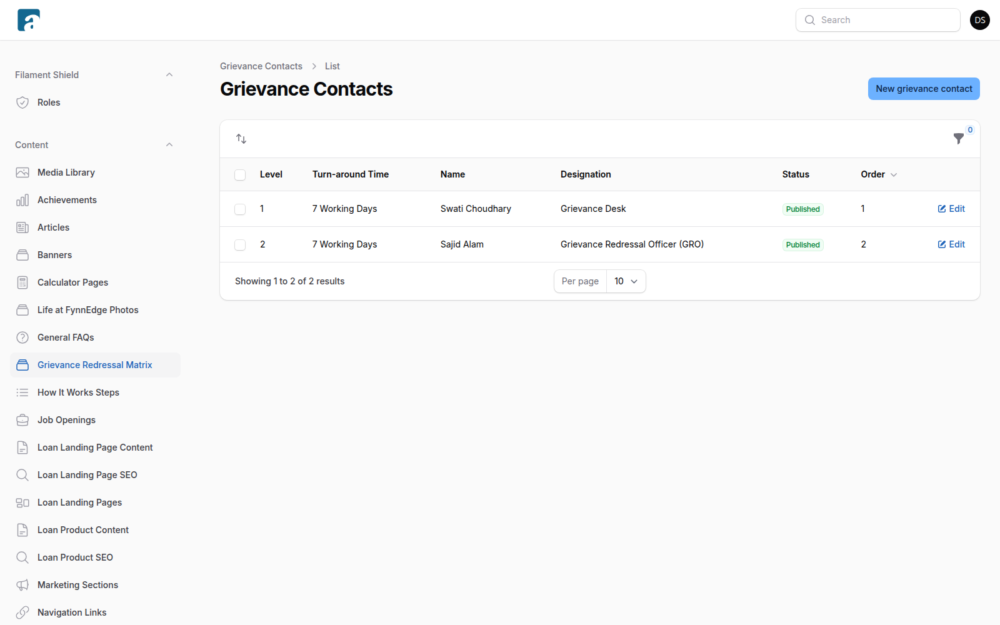
*Screenshot 57 — Grievance Redressal Matrix*
> These contacts are a regulatory disclosure. Keep names, phone numbers and turnaround times accurate and current.

#### Navigation Links
*Content → Navigation Links.* The footer "Quick Links".

| Field | Required? | What to Enter | Description |
| --- | --- | --- | --- |
| Label | Yes | Up to 60 characters | The wording visitors click |
| **Internal route name** | One of these two | e.g. `contact`, `loans.index`, `faqs.index` | **The safer choice** — the link disappears automatically if that page is ever renamed or removed, instead of becoming a broken link. **Takes priority** if both are filled in |
| **External or internal URL** | One of these two | `https://…`, `/careers`, `mailto:…`, `tel:…` | Must start with one of those. **Never a route name** |
| Opens in a new tab | No | On / Off | Switch on for links leaving the FynnEdge site |
| Location | Yes | Footer — Quick Links *(the only option)* | |
| Sort order | No | Number (default `0`) | |
| Is active | No | On *(default)* / Off | Off hides the link without deleting it |

Search: Label · Filters: Location, Is active · Reorder: drag · Delete: permanent.

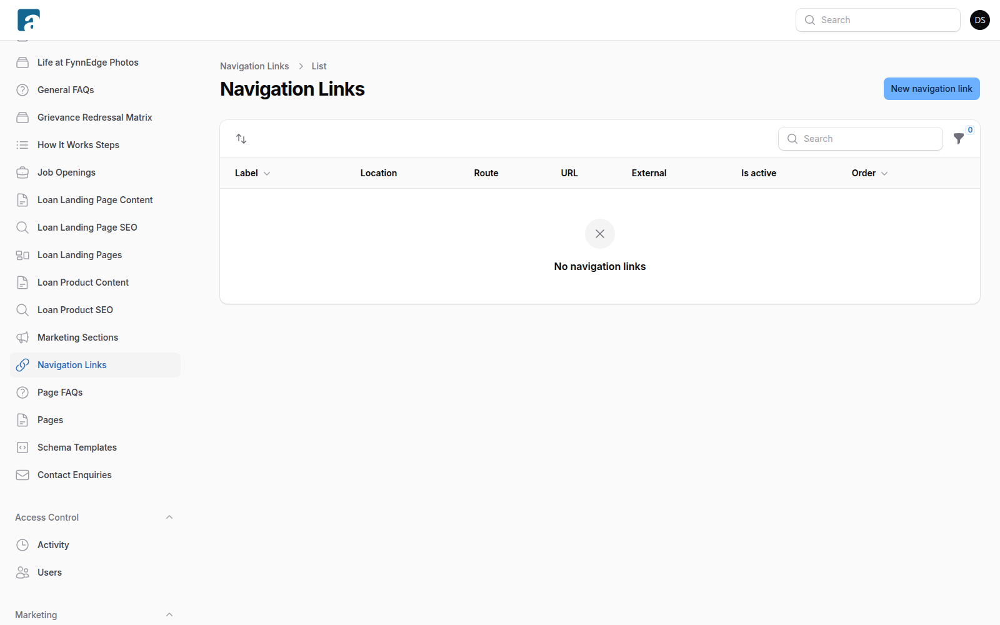
*Screenshot 58 — Navigation Links*

> **📝 Note**
> You must set **exactly one** of *Internal route name* or *External or internal URL*. Leaving both blank is rejected.

#### Calculator Pages
*Content → Calculator Pages.* Explanatory copy under the standalone calculators.

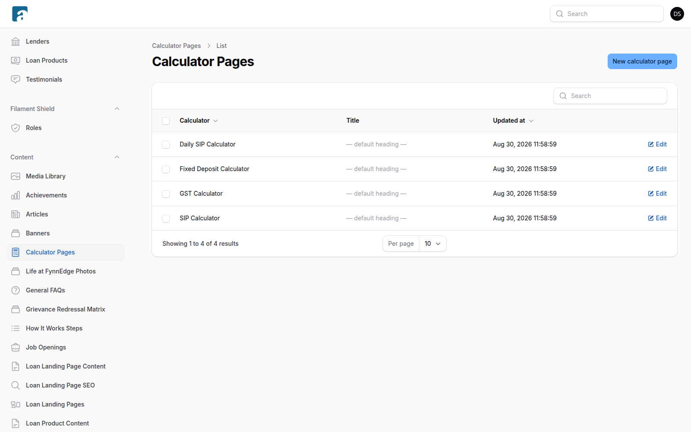
*Screenshot 59 — Calculator Pages*

| Field | Required? | What to Enter | Description |
| --- | --- | --- | --- |
| Calculator | **Yes** | Pick one. **Each calculator may only have one entry** | Which calculator page this text appears on |
| Title | No | A heading | Blank = the default heading *"About this calculator"* |
| Content | No | Rich text | Shown below the calculator, above the footer. Changes go live immediately |

> **📝 Note printed on the form**
> Loan-category calculators (EMI, Eligibility, Prepayment) do **not** use this section. Their text comes from the **"EMI calculation explanation"** field on the relevant **Loan Product**.

#### Schema Templates
*Content → Schema Templates.* Reusable structured-data blueprints for SEO specialists.

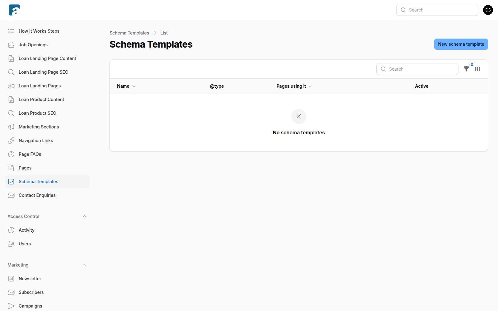
*Screenshot 61 — Schema Templates*

| Field | Required? | What to Enter | Description |
| --- | --- | --- | --- |
| Name | Yes | Up to 120 characters, unique | How it appears in the Schema template picker on a page's SEO section |
| schema.org @type | Yes | Letters and digits only, up to 60 | e.g. `HowTo`, `Event`, `Course`, `VideoObject`, `BreadcrumbList` |
| Active | No | On *(default)* / Off | Off stops it rendering everywhere it is attached, without detaching it |
| Notes | No | Up to 500 characters | What it is for and which pages should use it |
| JSON-LD body | **Yes** | A JSON object | No `<script>` tag. Placeholders in `{{ … }}` are filled in per page; a placeholder with nothing to fill it **removes its property** rather than leaving it blank. `@id` is added automatically if omitted. **Invalid JSON is rejected** with *"The JSON-LD body must be a valid JSON object or array."* |

List: Name, @type, **Pages using it**, Active, Updated at. Search: Name, @type · Filter: Active · Row action: Edit · Bulk: Delete.

> **⚠️ Warning**
> Check **Pages using it** before deleting or deactivating — every one of those pages loses this structured data.
> **Prefer switching Active off to deleting.** A deleted schema template is technically recoverable, but this list has no Trashed filter, so you cannot find it again from inside the panel. See [Section 5.2](#52-trash-and-restore-soft-delete).

#### Loan Landing Pages
*Content → Loan Landing Pages.* Targeted landing pages such as "₹5 Lakh Personal Loan".

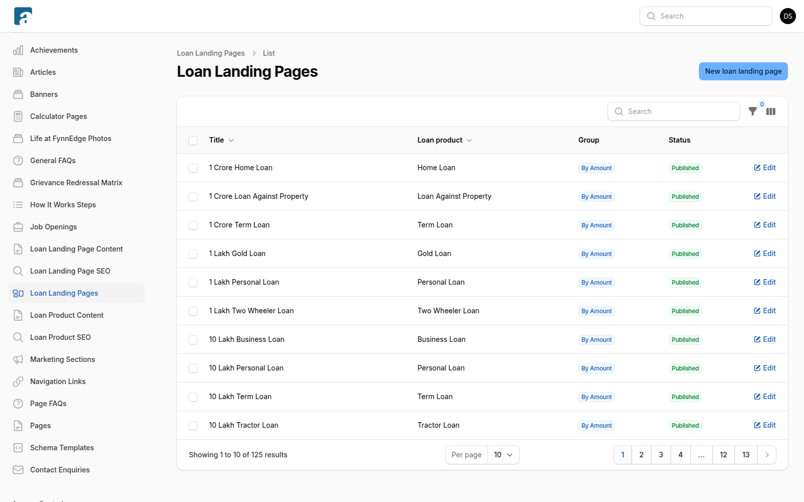
*Screenshot 46 — Loan Landing Pages*

| Field | Required? | What to Enter | Description |
| --- | --- | --- | --- |
| Loan product | Yes | Search and pick | Which product this page promotes |
| Group | Yes | **By Amount** / **By Type** / **By Need** | How it is categorised |
| Title | Yes | The page title | **Auto-fills the Slug** |
| Slug | Yes | Unique | The web address part |
| **Amount (₹)** | Conditional | A number | **Appears only when Group is "By Amount"** |
| Excerpt | No | Up to 160 characters | |
| Primary button label | No | Free text | Overrides "Check Your Eligibility". The button still starts the real journey |
| Status | Yes | Draft *(default)* / Published | |
| Published at | Conditional | Only when Published | |
| Expires at | No | | |
| Body | No | Rich text | |
| SEO | — | See [Section 7.1](#71-the-shared-seo-section) | |

List: Title, Loan product, Group, Status, Published at, Updated at. Search: Title · Filters: Loan product, Group, Status, Trashed · Bulk: Delete, Force delete, Restore.

#### Media Library
*Content → Media Library.* A read-only inventory of every file uploaded anywhere in the panel, so you can see what is actually in use.

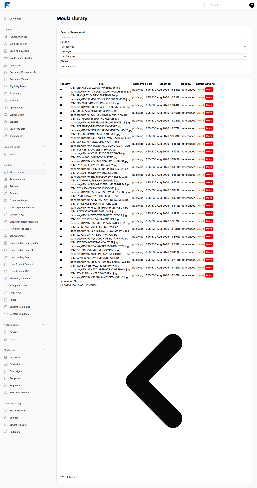
*Screenshot 31 — Media Library*

| Column | What it shows |
| --- | --- |
| Preview | A thumbnail |
| File | Filename and full path |
| Disk / Type / Size | Where it is stored, its file type, how big it is |
| Modified | When it was last changed |
| Used by | Which record references it, or **"Not referenced"** |
| Status | **Used** · **Unused** · **Missing** (a record points at a file that is no longer there) |
| Actions | A **Delete** button on unused files only |

**Filters at the top:** Search filename/path · Source · File type · Status. Paginated 25 per page.

**Deleting an unused file.** Click **Delete** on its row. Before deleting, the panel re-checks the file:
- Still unused → the file is deleted and *"Unused file deleted"* appears.
- Now referenced by something → nothing is deleted and a red *"This file is still referenced — it was not deleted"* appears.

> **⚠️ Warning**
> Deleting a file here removes it from storage **permanently**. There is no undo and no trash. Only delete files clearly marked **Unused**.

---

### 7.11 The restricted "Content" and "SEO" doors

Four menu items look like duplicates of Loan Products and Loan Landing Pages, but they are not extra records — they are **narrower doors onto the same records**, so a marketing or SEO colleague can do their job without being able to touch commercial figures.

| Menu item | Opens | Shows only |
| --- | --- | --- |
| **Loan Product Content** | The same loan products | Publishing, Marketing and Content fields |
| **Loan Product SEO** | The same loan products | The SEO section |
| **Loan Landing Page Content** | The same landing pages | Publishing, Marketing and Content fields |
| **Loan Landing Page SEO** | The same landing pages | The SEO section |

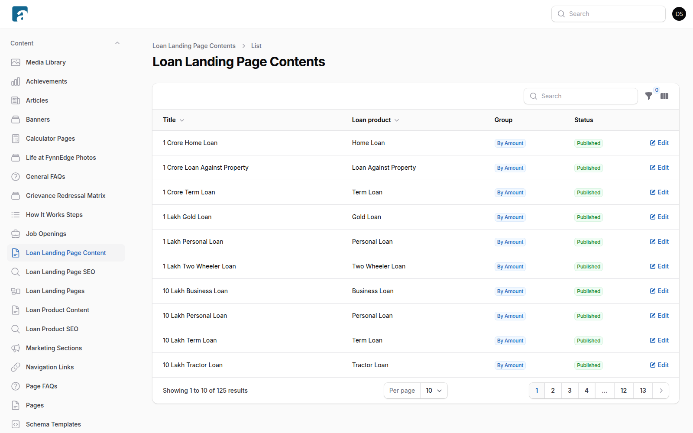
*Screenshot 65 — Loan Landing Page Content (the restricted marketing view)*

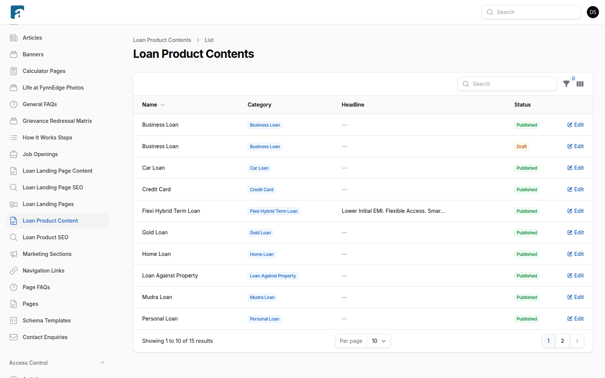
*Screenshot 45 — Loan Product Content (the restricted marketing view)*

**What these four have in common:**
- The record's **name is shown but locked**, so you always know which product you are editing.
- There is **no Create button and no Delete button** — records are created and removed only through the full Loan Products / Loan Landing Pages sections.
- A **History** tab is present, but **without** "Restore this version".
- Access is controlled by its own separate permission. Being allowed into *Loan Product Content* gives you **no** access to the full *Loan Products* section, and vice versa.

> **📝 Note**
> The restriction is enforced when the record is saved, not merely by hiding fields on screen. A commercial field cannot be changed through these pages by any means.

**Loan Product Content — the fields you get:**
- *Loan product:* Name (locked)
- *Publishing:* Status, Published at (only when Published), Expires at
- *Marketing:* Marketing headline, Summary, Benefits, Primary button label, Product image, Image alt text
- *Content:* Body, Features, Eligibility explanation, Documents explanation, Process steps

**Not included** — and therefore only editable by an administrator in the full **Loan Products** section: Name, Slug, Category, Calculator key, and every EMI-calculator field (amounts, tenures, rates).

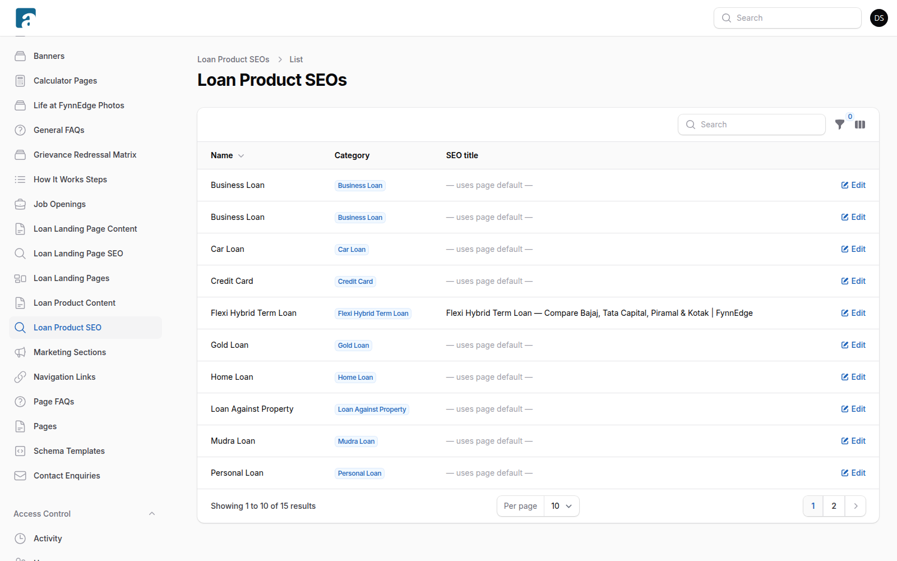
*Screenshot 53 — Loan Product SEO (the restricted SEO view)*

---

## 8. Marketing — Newsletter Modules

### 8.1 Newsletter Dashboard

**Purpose.** The newsletter overview: list health, where subscribers come from, and which pages win subscribers.
**Open:** Sidebar → **Marketing → Newsletter**

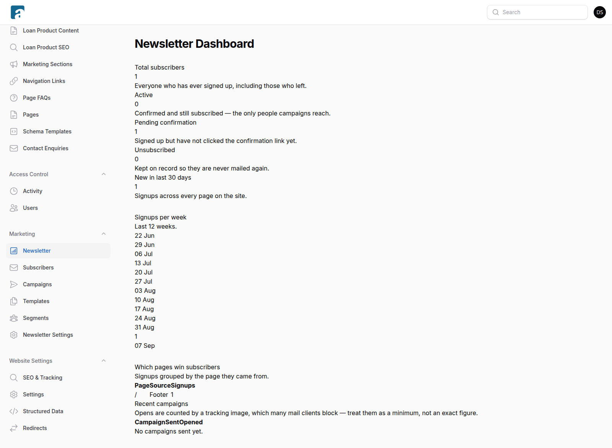
*Screenshot 32 — Newsletter Dashboard*

**Statistics cards:**

| Card | What the number means |
| --- | --- |
| Total subscribers | Everyone who has ever signed up, including those who left |
| Active | Confirmed and still subscribed — **the only people campaigns reach** |
| Pending confirmation | Signed up but have not clicked the confirmation link yet |
| Unsubscribed | Kept on record so they are never mailed again |
| New in last 30 days | Signups across every page on the site |

**Growth.** Twelve weeks of signups as a simple bar table, one bucket per week, labelled by the week's start date. Use it to spot a trend, not exact daily figures.

**Top pages.** The ten pages that produced the most signups, grouped by exact URL, with the source and a count. This is how you find out that one article outperforms the homepage.

**Recent campaigns.** The last five campaigns that are sending or already sent, with how many recipients they had and how many opened.

> **📝 Note**
> There is **no per-article conversion rate**, because the site does not track article views — a rate would need a denominator that does not exist. Signups per page are reported instead.

**Filters / export:** none. This page is read-only.

---

### 8.2 Subscribers

**Purpose.** Everyone who has signed up to the newsletter, with their consent record.
**Open:** Sidebar → **Marketing → Subscribers**

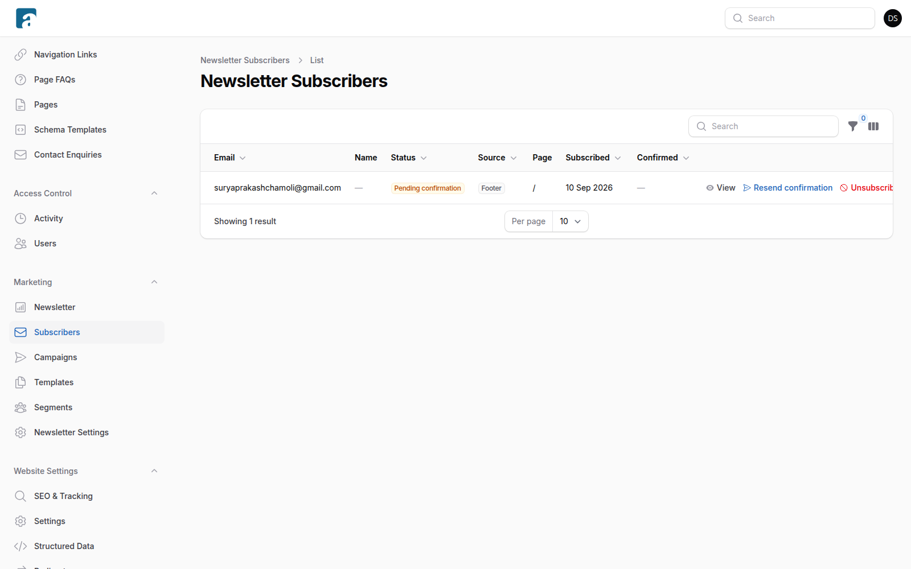
*Screenshot 34 — Newsletter Subscribers*

**List:** Email (copyable), Name, Status, Source, Page, Subscribed, Confirmed.
Search: Email, Name · Filters: **Status (multiple)**, **Source (multiple)**, **Subscribed from / until dates** · Sort: newest first by default.

**Status meanings:**

| Status | Meaning | Will they receive campaigns? |
| --- | --- | --- |
| **Pending confirmation** (amber) | Signed up, has not clicked the confirmation link | No |
| **Active** (green) | Confirmed and subscribed | **Yes** |
| **Unsubscribed** (grey) | Opted out | No |
| **Bounced** (red) | Email could not be delivered | No |

**Row actions:**

| Action | When it shows | What it does |
| --- | --- | --- |
| **View** | Always | Opens the read-only detail |
| **Resend confirmation** | Only while status is *Pending confirmation* | Issues a **fresh** confirmation link and emails it. Any older link in their inbox stops working. Confirms with *"Confirmation email queued"* |
| **Unsubscribe** | Whenever they are not already unsubscribed | Marks them Unsubscribed and stamps the time. Asks to confirm first, warning: *"The record is kept — it is what stops this address being mailed again."* |

**The View screen (read-only):**
- *Subscriber* — Email, Name, Status, **Topics** (shows *"All topics (no preferences set)"* when they never chose — that is what a one-field signup means, not "none")
- *Where they signed up* — Source, Page
- *Consent & history* — Subscribed, Confirmed, Unsubscribed, Consent recorded, Consent IP, First seen

**Create / Edit / Delete:** **None of the three.** Subscribers only exist through their own consented signup, their status is the outcome of *their* actions, and there is no delete button anywhere.

> **⚠️ Why there is no Delete**
> A subscriber row is both a **consent record** and an **unsubscribe record**. Deleting one is exactly how an address that opted out silently becomes mailable again. Use **Unsubscribe**, never deletion.

---

### 8.3 Campaigns

**Purpose.** Compose, preview, schedule and send newsletter emails.
**Open:** Sidebar → **Marketing → Campaigns**

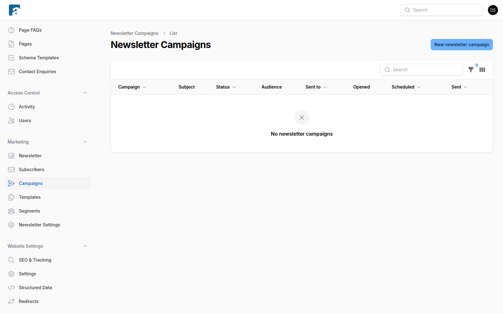
*Screenshot 33 — Newsletter Campaigns*

**List:** Campaign, Subject, Status, Audience (shows **Everyone** when no segment), **Sent to** (recipient count), **Opened** (count and %), Scheduled, Sent.
Search: Campaign name, Subject · Filter: **Status (multiple)** · Sort: newest first.

> **📝 About the Opened figure**
> Opens are measured with a tracking image, and many mail clients block images. **Treat the number as a minimum, never an exact count.** The panel says so in a tooltip on the column.

#### Create a campaign

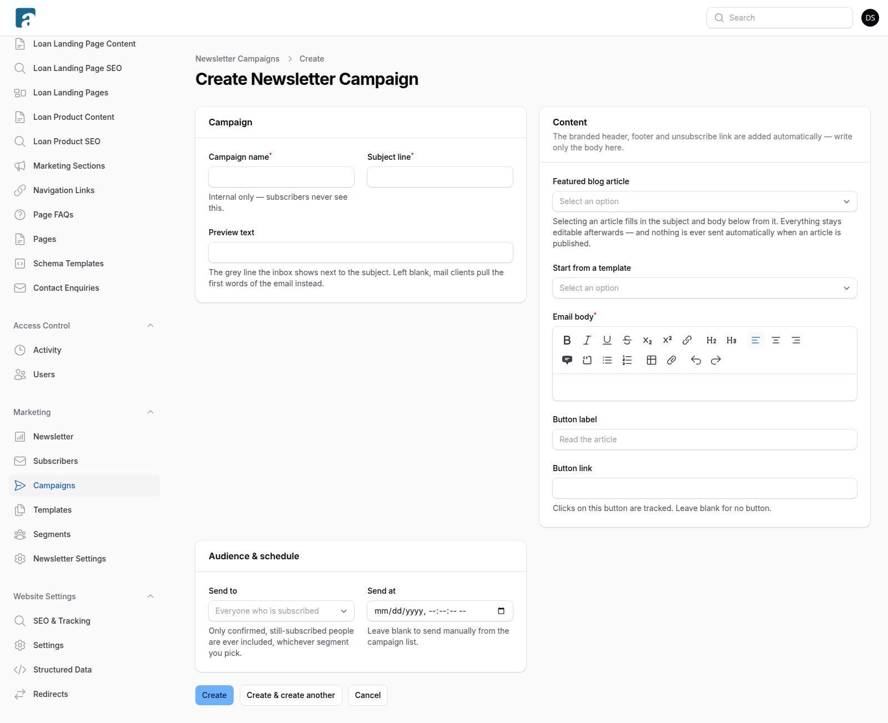
*Screenshot 35 — Composing a campaign*

**Section: Campaign**

| Field | Required? | What to Enter | Description |
| --- | --- | --- | --- |
| Campaign name | Yes | Up to 120 characters | **Internal only — subscribers never see this** |
| Subject line | Yes | Up to 150 characters | What appears in the inbox |
| Preview text | No | Up to 150 characters | The grey line beside the subject. Blank = mail clients use the first words of the email |

**Section: Content** — *the branded header, footer and unsubscribe link are added automatically; write only the body.*

| Field | Required? | What to Enter | Description |
| --- | --- | --- | --- |
| Featured blog article | No | Pick a published article | **Selecting one fills in the subject, name, preview text and body from that article, and sets the button to "Read the full article" pointing at it.** Everything stays editable afterwards |
| Start from a template | No | Pick an active template | Fills the body from the template — **only if the body is still empty**, so it never wipes work you have done |
| Email body | **Yes** | Rich text | The email itself |
| Button label | No | Up to 60 characters | e.g. `Read the article`. Leave blank for no button |
| Button link | No | A full URL | **Clicks on this button are tracked** |

**Section: Audience & schedule**

| Field | Required? | What to Enter | Description |
| --- | --- | --- | --- |
| Send to | No | A segment, or leave blank | Blank = everyone who is subscribed. **Only confirmed, still-subscribed people are ever included, whichever segment you pick** |
| Send at | No | Date and time, no earlier than now | Leave blank to send manually from the campaign list |

Click **Create**. **A new campaign is always saved as a Draft**, attributed to you. Creating it never sends anything.

> **📝 Note**
> Publishing an article **never** sends an email automatically. Every send is a deliberate action taken here.

#### Row actions

| Action | When it shows | What it does |
| --- | --- | --- |
| **Preview** | Always | Opens the finished email in a pop-up exactly as a subscriber would receive it. Close with **Close** |
| **Edit** | Only while Draft, Scheduled or Cancelled | Opens the form |
| **Send** / **Send now** | Only while Draft, Scheduled or Cancelled | See below |
| **Cancel** | Only while Scheduled or Sending | See below |
| **Delete** | **Only while Draft** | Permanently deletes the campaign |

#### Sending

Click **Send** (or **Send now** if it was scheduled). A confirmation box appears:

> **"Send this campaign?"** — *"This queues an email to N subscriber(s). It cannot be undone once sending starts."*

The N shown is the live audience count at that moment. Confirm and:
1. The campaign becomes **Scheduled** and is handed to the background queue.
2. A green *"Campaign queued for sending"* appears, with *"Emails are sent by the queue worker. Progress appears in the Sent to column."*
3. The status moves to **Sending**, then **Sent**. Refresh the list to watch the **Sent to** count climb.

> **⚠️ Warning**
> **A send cannot be undone.** Always use **Preview** first, and send a test to a segment of one before mailing the whole list.

#### Cancelling

**Cancel** is offered while a campaign is Scheduled or Sending. It confirms with:

> *"Emails already handed to the queue may still go out; this stops everything that has not been queued yet."*

So cancelling mid-send stops the remainder — it cannot recall what has already left.

#### Status workflow

```
Draft ──Send──► Scheduled ──► Sending ──► Sent
  │                 │            │
  │                 └──Cancel────┴──► Cancelled ──(can be edited and sent again)
  └── Delete (drafts only)
```

| Status | Colour | Editable? | Deletable? |
| --- | --- | --- | --- |
| **Draft** | Grey | Yes | **Yes** |
| **Scheduled** | Blue | Yes | No |
| **Sending** | Amber | **No** | No |
| **Sent** | Green | **No** | No |
| **Cancelled** | Red | Yes | No |

> **📝 Why Sent campaigns cannot be edited**
> A campaign that is sending or already sent is a historical record of what people actually received. Editing it would make your archive disagree with their inbox. If you open the edit screen for one anyway, you are simply returned to the list.

---

### 8.4 Templates

**Purpose.** Reusable email bodies to start new campaigns from.
**Open:** Sidebar → **Marketing → Templates**


*Screenshot 62 — Newsletter Templates*

| Field | Required? | What to Enter | Description |
| --- | --- | --- | --- |
| Name | Yes | Up to 120 characters | |
| Available when composing | No | On *(default)* / Off | Off retires a template **without breaking campaigns that already used it** |
| Description | No | Up to 200 characters | What this template is for, shown to whoever composes a campaign |
| Body | **Yes** | Rich text | The body only — the branded header, footer and unsubscribe link come from the email layout |

List: Name, Description, Available, Updated. Search: Name · Filter: Available · Row actions: Edit, Delete · Bulk: Delete. Deletion is permanent.

---

### 8.5 Segments

**Purpose.** Saved audience filters, so you can send to part of your list.
**Open:** Sidebar → **Marketing → Segments**

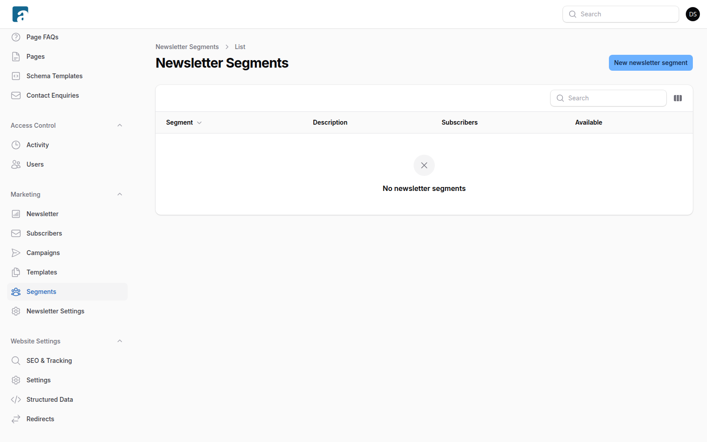
*Screenshot 63 — Newsletter Segments*

**Section: Segment**

| Field | Required? | What to Enter |
| --- | --- | --- |
| Name | Yes | Up to 120 characters, e.g. `Blog subscribers` |
| Available when composing | No | On *(default)* / Off |
| Description | No | Up to 200 characters |

**Section: Who this includes** — *leave everything blank to include every subscribed person. Filters combine: a subscriber must match **all** of them.*

| Field | Options | Description |
| --- | --- | --- |
| Signed up from | Homepage, Blog article, Blog listing, Footer, Website — pick several | Blank = anywhere |
| Interested in | Personal finance, Credit & CIBIL, Loans — pick several | Blank = any topic. **Includes people who never changed their preferences** — they are opted into everything by default |
| Subscribed on or after | A date | |
| Subscribed on or before | A date | |

**Section: Size.** A live line reading *"N subscriber(s) match this segment right now. The audience is re-evaluated at send time, so this number moves as people join and leave."*

> **📝 Note**
> There is deliberately **no subscriber-status filter here.** Every send is restricted to confirmed, still-subscribed people whatever segment you choose — offering "status" would wrongly imply a segment could mail an unsubscribed address.

List: Segment, Description, **Subscribers** (live count), Available. Row actions: Edit, Delete. Deletion is permanent.

---

### 8.6 Newsletter Settings

**Purpose.** How newsletter emails identify themselves, and whether confirmation is required.
**Open:** Sidebar → **Marketing → Newsletter Settings**

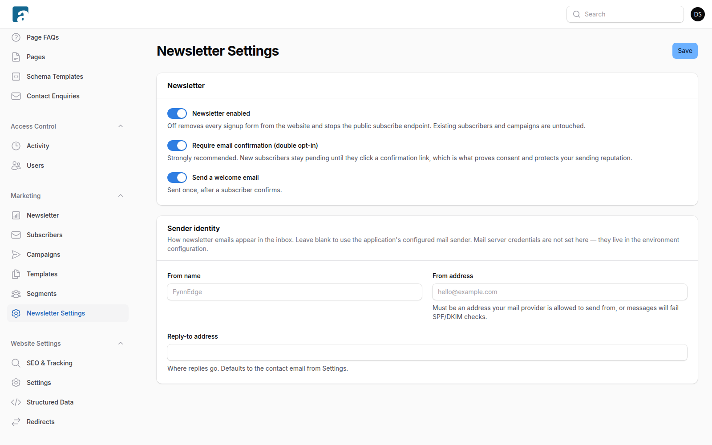
*Screenshot 64 — Newsletter Settings*

> **📝 Access**
> This page is **administrator-only** by default. Sender identity and double opt-in decide the deliverability of every email your domain sends, which is an administrator decision rather than a campaign one — so it is deliberately excluded from the Marketing role.

**Section: Newsletter**

| Field | What to Enter | Description |
| --- | --- | --- |
| Newsletter enabled | On / Off | The master switch for the whole newsletter |
| Require email confirmation (double opt-in) | On / Off | On = a new signup must click a confirmation link before they become Active |
| Send a welcome email | On / Off | Whether a welcome email goes out on confirmation |

**Section: Sender identity** — *"Leave blank to use the application's configured mail sender. Mail server credentials are not set here — they live in the environment configuration."*

| Field | What to Enter | Example |
| --- | --- | --- |
| From name | The name in the inbox | `FynnEdge` |
| From address | The sending email address | `newsletter@fynnedge.com` |
| Reply-to address | Where replies go | `support@fynnedge.com` |

Click **Save** at the top. A green *"Newsletter settings saved"* appears.

> **⚠️ Warning**
> Switching **double opt-in off** means new signups become Active without confirming. That raises the risk of invalid addresses and spam complaints, which harms deliverability for everyone on the domain. Change it only with a clear reason.

---

## 9. Website Settings

### 9.1 Settings

**Purpose.** The site's identity: branding, homepage headline, contact details, business profile, social links, and the colours and fonts of the public website.
**Open:** Sidebar → **Website Settings → Settings**

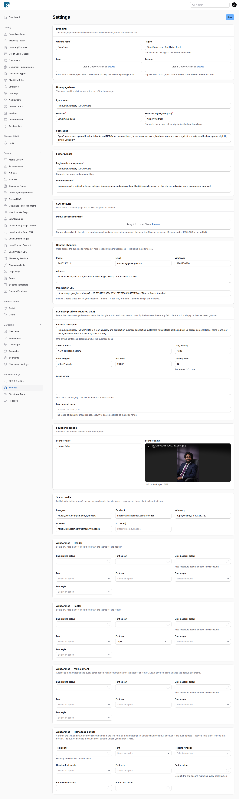
*Screenshot 36 — Settings*

This is a single long form with a **Save** button at the top. It saves everything at once.

**Section: Branding** — *the name, logo and favicon shown across the site header, footer and browser tab.*

| Field | Required? | What to Enter |
| --- | --- | --- |
| Website name | **Yes** | Up to 60 characters |
| Tagline | **Yes** | Up to 80 characters. Shown under the logo in the header and footer |
| Logo | No | PNG, SVG or WebP up to 2 MB. Blank keeps the default FynnEdge mark |
| Favicon | No | Square PNG or ICO up to 512 KB. Blank keeps the default icon |

**Section: Homepage hero** — *the main headline visitors see at the top of the homepage.*
Eyebrow text (up to 80 characters) · Headline · Headline (highlighted part) · Subheading.

**Section: Footer & legal**
Registered company name · Footer disclaimer.

> **⚠️ Warning — compliance**
> The footer disclaimer is a regulatory statement about eligibility results not guaranteeing approval. Do not shorten or remove it without approval.

**Section: SEO defaults** — *used when a specific page has no SEO image of its own.*
Default social share image.

**Section: Contact channels** — *used across the public site instead of hard-coded numbers and addresses, including the footer.*
Phone · Email · WhatsApp · Address · Map location URL.

**Section: Business profile (structured data)** — *feeds the sitewide Organization schema that Google and AI assistants read to identify the business. Leave any field blank and it is simply omitted — never guessed.*
Business description · Street address · City / locality · State / region · PIN code · Country code (default `IN`) · Areas served · Loan amount range.

**Section: Founder message** — *shown in the founder section of the About page.*
Founder name · Founder photo.

**Section: Social media** — *full links including `https://`, shown as icon links in the footer. Leave any blank to hide that icon.*
Instagram · Facebook · WhatsApp · LinkedIn · X (Twitter).

**Sections: Appearance** — four groups controlling the public site's look. **Leave any field blank to keep the default theme.**

| Group | Applies to | Fields |
| --- | --- | --- |
| Appearance — Header | The site header | Background colour, Font colour, Link & accent colour, Font, Font size, Font weight, Font style |
| Appearance — Footer | The site footer | The same seven |
| Appearance — Main content | The homepage and every page's main area (not header or footer) | The same seven |
| Appearance — Homepage banner | The sliding banner top-right of the homepage | Text colour, Font, Heading font size, Heading font weight, Font style, Button colour, Button hover colour, Button text colour |

> **📝 Note about the banner**
> Its text is **white by default** because it sits over a photograph. Leave a field blank to keep that. The button matches the site's other buttons unless you change it here.

Click **Save**. A green *"Settings saved"* appears and changes are live on the public site immediately.

> **⚠️ Warning**
> Colour choices affect the whole public website. Always open the site in another tab and check readability — especially the contrast between background and font colours — before you finish for the day.

---

### 9.2 SEO & Tracking

**Purpose.** Sitewide search-engine defaults, verification tags, analytics and advertising tags, crawler policy, and the cookie-consent banner.
**Open:** Sidebar → **Website Settings → SEO & Tracking**

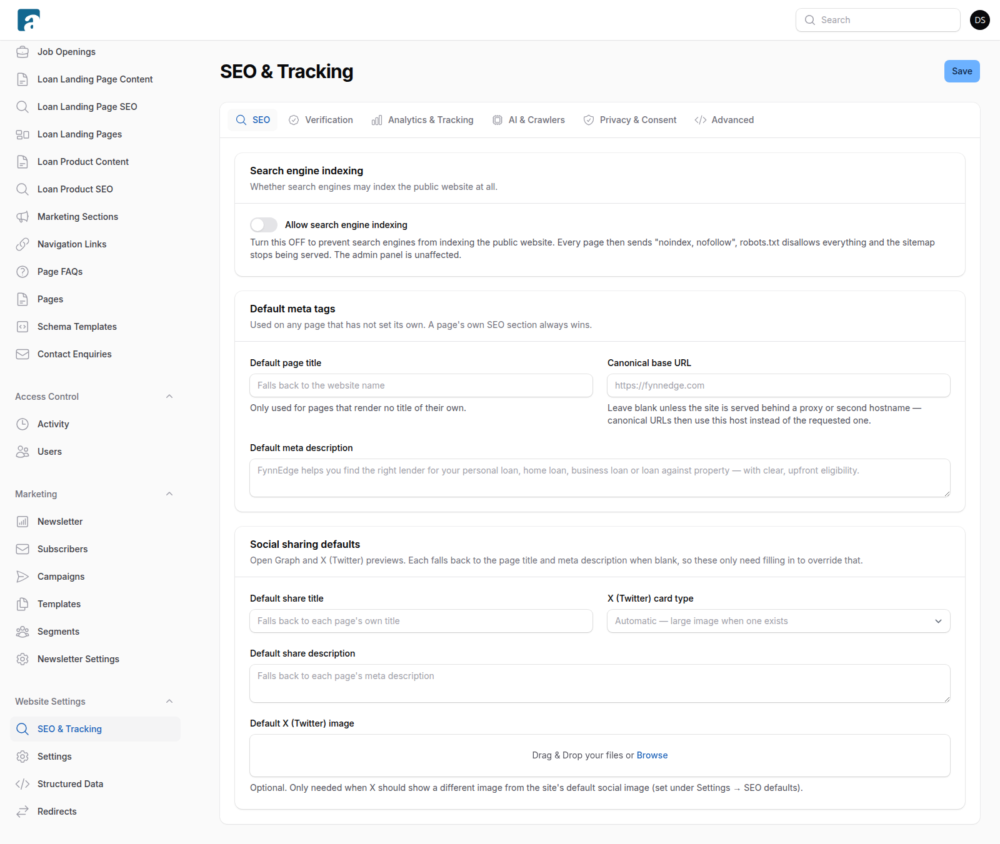
*Screenshot 37 — SEO & Tracking*

The page is organised into tabs, with a single **Save** button at the top that saves them all.

#### Tab 1 — SEO

*Search engine indexing:* **Allow search engine indexing** (on / off).

> **⚠️ Warning**
> Switching this **off removes the entire public website from Google and Bing**. It exists for a pre-launch site. Never switch it off on a live site.

*Default meta tags* — *used on any page that has not set its own; a page's own SEO section always wins.*
Default page title · Canonical base URL · Default meta description.

*Social sharing defaults* — Open Graph and X previews.
Default share title · X (Twitter) card type · Default share description · Default X (Twitter) image.

#### Tab 2 — Verification
*Site ownership verification.* Each field renders a single meta tag, and only when filled in. **Paste either the token or the whole tag the service gives you.** Includes Google, Bing and others, plus **Other verification tags** for anything else.

#### Tab 3 — Analytics & Tracking

*Google* — *injected into every public page automatically once enabled. **Never paste these snippets into the Advanced tab as well.***

| Field | What to Enter |
| --- | --- |
| Google Analytics enabled | On / Off |
| GA4 Measurement ID | e.g. `G-XXXXXXXXXX` |
| Google Tag Manager enabled | On / Off |
| GTM Container ID | e.g. `GTM-XXXXXXX` |
| Google Ads conversion ID | Your conversion ID |

*Other platforms* — *leave a field blank to load nothing for that platform. Each tag is built from its ID; there are no snippets to paste.*
Microsoft Clarity project ID · Meta (Facebook) Pixel ID · LinkedIn Insight partner ID.

#### Tab 4 — AI & Crawlers

*AI and answer engines.* **Allow AI and answer-engine crawlers** (on / off).

> **📝 Note**
> This is controlled **separately from Google and Bing** — a site can rank normally in search while opting out of AI training and answer synthesis. Turning it off never affects normal search crawling.

*Extra robots.txt directives.* Appended to the generated robots.txt. The admin panel, login, the application funnel, storage internals and signed previews are **already** disallowed — this is for anything else.

#### Tab 5 — Privacy & Consent

*Cookie consent banner:* Show the cookie consent banner · Require consent for analytics · Require consent for marketing.

> **💡 How consent is enforced**
> When the banner is on, the categories marked as requiring consent are **not rendered into the page at all** until the visitor accepts. The scripts are blocked on the server, not merely hidden after loading.

*Policy links* — shown in the banner; leave one blank to hide that link: Cookie policy URL · Privacy policy URL · Terms URL.

#### Tab 6 — Advanced

> **⚠️ This tab is only visible to super administrators.**

*Custom tracking scripts.* Raw HTML for tags with no dedicated field above — other verification tags, niche pixels, A/B testing tools. **Rendered exactly as written, so a broken tag here breaks every page on the site.** Gated by marketing consent when that is switched on.

*Custom CSS & JavaScript.* Injected **without** `<style>` / `<script>` wrappers of your own — write the CSS or JavaScript body only.

Click **Save**. A green *"SEO & tracking settings saved"* appears.

---

### 9.3 Structured Data

**Purpose.** Controls how the website describes itself to Google and AI assistants in JSON-LD.
**Open:** Sidebar → **Website Settings → Structured Data**

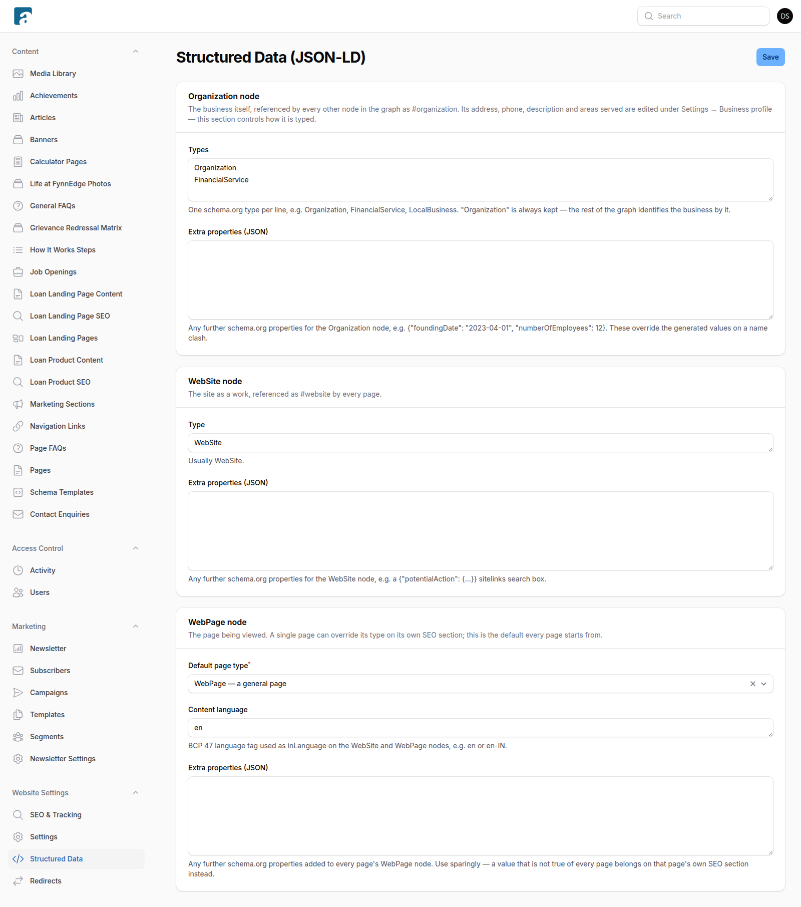
*Screenshot 38 — Structured Data*

> **📝 Access**
> Restricted by its own permission and, by default, granted to **super administrators only** — not to the Marketing or SEO roles. An administrator can grant it under **Roles**.

| Section | What it controls |
| --- | --- |
| **Organization node** | The business itself, referenced by every other node as `#organization`. Its **Types** and **Type** settings decide how it is classified. *Its address, phone, description and areas served are edited under **Settings → Business profile***, not here |
| **WebSite node** | The site as a work, referenced as `#website` by every page |
| **WebPage node** | The page being viewed: **Default page type** and **Content language**. Any single page can override its type in its own SEO section — this is the default every page starts from |
| **Extra properties (JSON)** | An advanced escape hatch for additional properties |

Click **Save**. A green *"Structured data settings saved"* appears.

---

### 9.4 Redirects

**Purpose.** Sends visitors and search engines from an old website address to a new one. Use it whenever you change a slug, so existing links and Google rankings do not break.
**Open:** Sidebar → **Website Settings → Redirects**

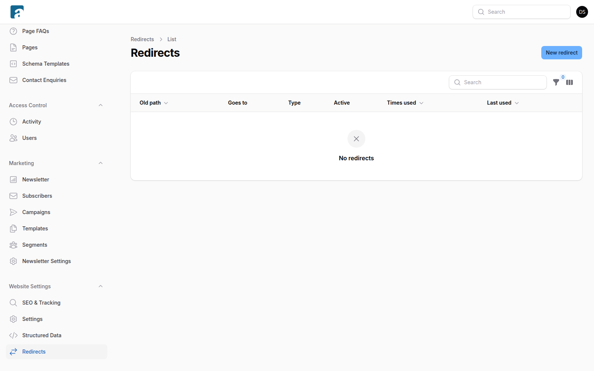
*Screenshot 39 — Redirects*

**List:** Old path (copyable), Goes to, Type, Active, **Times used**, **Last used** (or *Never*).
Search: Old path, Goes to · Filters: Active, Type · Sort: Old path (default), Times used, Last used · Row actions: Edit, Delete · Bulk: Delete.

**Form:**

| Field | Required? | What to Enter | Description |
| --- | --- | --- | --- |
| Old path | **Yes** | Path only, starting with `/`, up to 255 characters | e.g. `/old-loan-page`. **Trailing slashes and query strings are ignored when matching** |
| New URL or path | **Yes** | `/loans/personal-loan` or a full `https://…` URL | Where visitors should end up |
| Type | **Yes** | **301 — Permanent** *(default)* or **302 — Temporary** | 301 passes SEO ranking to the new URL; 302 keeps ranking on the old one |
| Active | No | On *(default)* / Off | Off keeps the row without redirecting |

> **💡 The query string is carried across automatically.** A visitor arriving at `/old-page?utm_source=email` lands on `/new-page?utm_source=email`.

**Validation messages you may see:**

| Message | What it means |
| --- | --- |
| *"A redirect for that path already exists."* | Another row already covers this path. `/a`, `a/` and `/A` all count as the same path |
| *"Enter a path starting with / or a complete URL including https://."* | The destination is malformed |
| *"The destination is the same as the old path — that would redirect to itself."* | The two fields match |
| *"That destination redirects back here, which would create a redirect loop."* | Your destination is the source of another active redirect that eventually leads back — the browser would bounce until it gave up |

**Delete:** permanent. Prefer switching **Active** off, so you keep the record and the usage history.

---

## 10. Access Control

### 10.1 Activity

**Purpose.** A single, searchable feed of every change any administrator has made anywhere in the panel. It reads the same history that each record's own **History** tab shows — this is that data across all records at once.
**Open:** Sidebar → **Access Control → Activity**

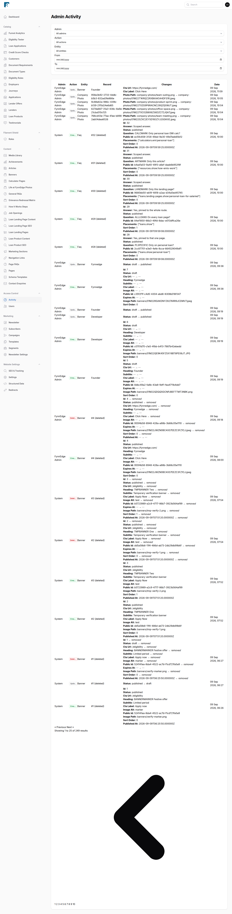
*Screenshot 43 — Admin Activity*

**Filters at the top:**

| Filter | Options |
| --- | --- |
| Admin | *All admins*, or any one user |
| Action | *All actions*, Created, Updated, Deleted |
| Entity | *All entities*, or any record type that actually appears in the log |
| Date from / Date to | A date range |

Your filter choices are kept in the web address, so you can bookmark or share a particular view.

**What each row shows:** the action (green *created*, grey *updated*, red *deleted*), which record it was (by its name/title, or its reference with *(deleted)* if the record is gone), who did it (or **System** for an automatic change), exactly which fields changed from what to what, and the date and time. 25 rows per page.

**What you cannot do:** nothing here is editable or deletable. That is the point — the log is the audit trail.

> **📝 Note**
> Sensitive fields are **never written to the log in the first place** — personal data, KYC details, credit and financial detail, passwords and tokens are stripped before a row is saved, not merely hidden from view.

---

### 10.2 Users

**Purpose.** The admin accounts that can sign in, and the roles each one has.
**Open:** Sidebar → **Access Control → Users**

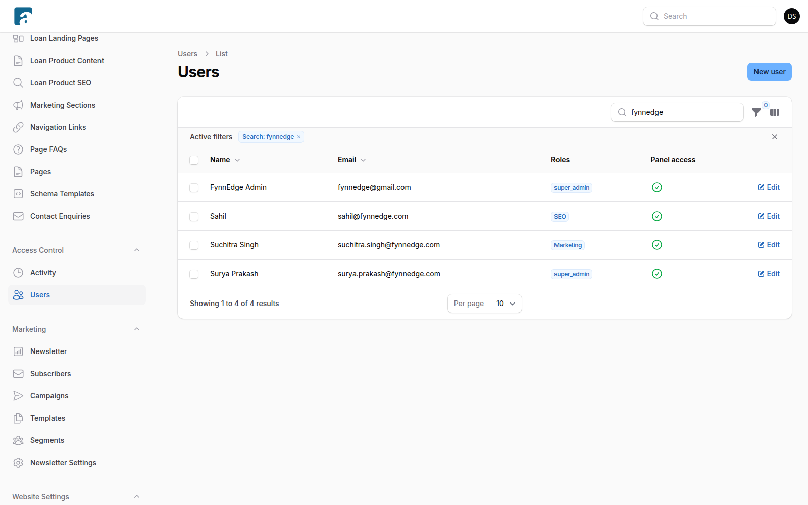
*Screenshot 40 — Users list. A search for "fynnedge" is applied here, which is why the **Active filters** bar appears above the table.*

**List:** Name, Email, **Roles** (badges, or *"No role assigned"*), **Panel access** (tick/cross), Created at.
Search: Name, Email · Filter: Roles · Sort: Name (default) · Row action: Edit · Bulk: Delete.

**Create / Add New**

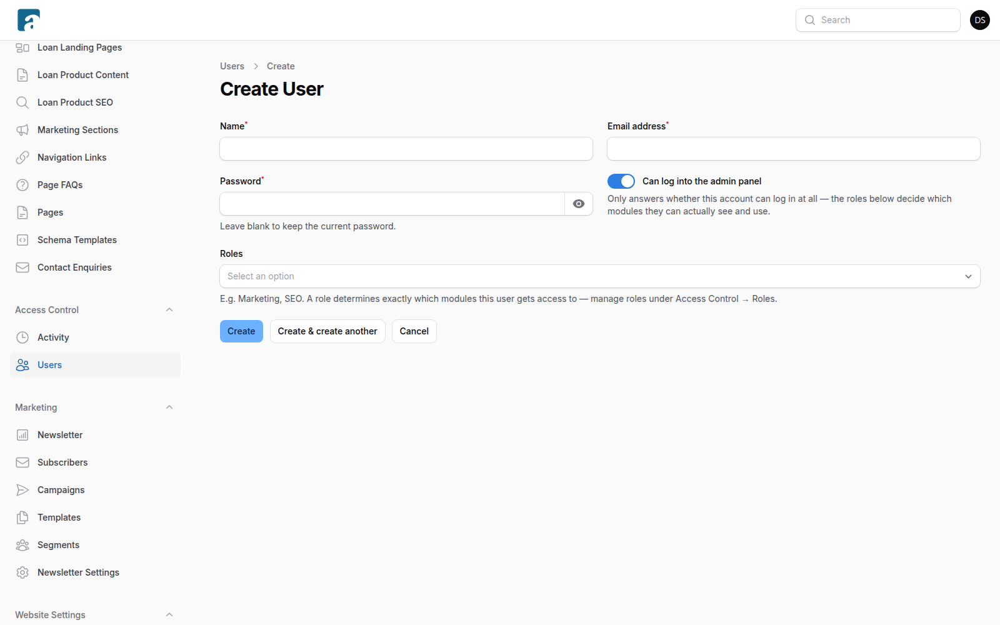
*Screenshot 42 — Creating a user*

| Field | Required? | What to Enter | Description |
| --- | --- | --- | --- |
| Name | **Yes** | Their full name | |
| Email address | **Yes** | A valid, **unique** email | Their sign-in username |
| Password | **Yes on create** | A strong password | **On Edit this becomes optional** — *"Leave blank to keep the current password."* Use the eye icon to reveal what you typed |
| Can log into the admin panel | No | On *(default)* / Off | **Only answers whether this account can sign in at all** — the roles below decide what they can actually see and use |
| Roles | No | Pick one or more | Which modules this person gets. Manage the roles themselves under **Roles** |

> **⚠️ Warning — two separate switches**
> A user with **Can log into the admin panel** on but **no role** can sign in and will see an almost empty panel. That is not a fault — it is an account waiting for a role. Always assign a role when you create someone.
> Conversely, switching **Can log into the admin panel** off locks the account out immediately, whatever roles it has. That is the correct way to suspend someone who has left.

**Edit.** Any field above. Leave **Password** blank to keep the existing one.

**Delete.** A **Delete** button at the top of the Edit screen, and a bulk delete on the list. It is **permanent — there is no trash for users.**

> **⚠️ Warning**
> Do not delete an account simply because someone has left. Switch **Can log into the admin panel** off instead — deleting removes the person's name from every future view of the activity log.

---

### 10.3 Roles

**Purpose.** A role is a named bundle of permissions. You give a role to a user, and they can do exactly what the role allows — nothing more.
**Open:** Sidebar → **Filament Shield → Roles**

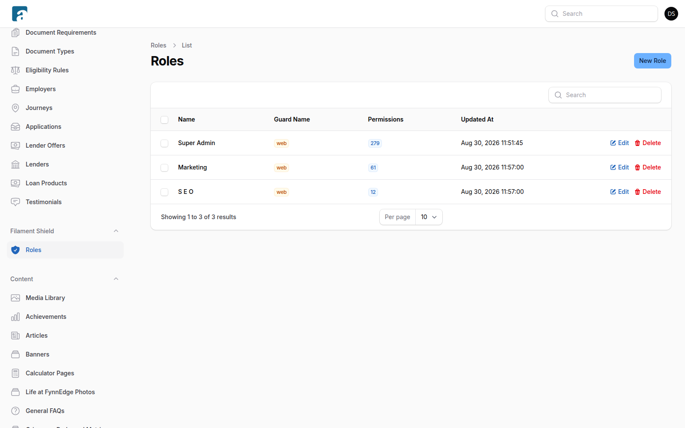
*Screenshot 41 — Roles list*

**Create or edit a role**


*Screenshot 49 — Editing the Marketing role*

Give the role a **Name**, then tick the permissions it should have. Permissions are grouped into tabs — **Resources**, **Pages** and **Widgets** — and within Resources, one block per module with tick boxes for each action:

| Permission | Lets the user… |
| --- | --- |
| **View Any** | See the module in the sidebar and open its list |
| **View** | Open a single record |
| **Create** | Add new records |
| **Update** | Change existing records |
| **Delete** / **Delete Any** | Remove one, or several at once |
| **Restore** / **Restore Any** | Bring back a trashed record |
| **Force Delete** / **Force Delete Any** | Destroy a trashed record permanently |
| **Replicate** | Duplicate a record |
| **Reorder** | Drag rows into a new order |

There is a select-all control per module and per tab.

> **💡 The minimum that makes a module usable**
> **View Any** alone shows the module and its list. Without **Update** the user can look but not change. Without **Create** there is no New button. Grant the smallest set that lets the person do their job.

> **⚠️ Warning**
> Editing a role changes what **every** user holding it can do, instantly. Check the Users list first to see who that is.

> **📝 A note for administrators**
> When a developer adds a brand-new module to the panel, its permissions do not exist until a one-off command is run. If a module you expect is missing from this screen, ask your developer to generate its permissions.

---

## 11. User Roles & Permissions

### 11.1 How access works — two independent layers

```
Layer 1 —  Can log into the admin panel?     (the switch on the user's account)
                    │  no  →  sign-in refused, whatever roles they hold
                    │  yes
                    ▼
Layer 2 —  Which roles does this user hold?  (assigned on the user's account)
                    │
                    ▼
           Only the modules those roles allow appear in the sidebar
```

**Layer 1** only answers "may this account sign in at all". It does **not** mean full access.
**Layer 2** decides everything else.

### 11.2 The roles that exist in this system

There are exactly **three** roles configured:

| Role | Permissions held | Intended for |
| --- | --- | --- |
| **super_admin** | **All of them (279)** | Administrators / owners |
| **Marketing** | 61 | The marketing and content team |
| **SEO** | 12 | The SEO specialist |

> **📝 Note**
> **Marketing** and **SEO** are a **working starting point, not a fixed structure.** You can rename them, change what they include, or create entirely new roles under **Filament Shield → Roles**. Roles such as "Caller", "Team Leader", "Manager", "Cluster" or "Account Team" **do not exist in this system** unless you create them yourself.

### 11.3 super_admin

**Can access:** Everything. Every module, every page, every action — the sidebar shown in [Section 4.1](#41-complete-menu-map) in full.

**Can create / edit / view / delete:** Everything the panel allows anyone to do, including the actions no other role has by default:

- Lenders, Lender Offers, Loan Products, Eligibility Rules, Journeys, Document Types and Document Requirements
- Loan Applications, Applications, Customers, Credit Score Checks
- Users, Roles and the Activity log
- Settings, SEO & Tracking, Structured Data, Redirects, Newsletter Settings, Media Library
- The **Advanced** tab of SEO & Tracking (custom scripts / CSS / JavaScript) — **visible to super administrators only**

**Cannot access:** nothing.

> **📝 How it works technically**
> super_admin is not a long tick-list — it is a bypass. Anyone holding it skips every permission check. Give it out sparingly.

### 11.4 Marketing

**Can access — full create, edit and delete:**
Articles · Banners · Testimonials · Life at FynnEdge Photos · Job Openings · General FAQs · Marketing Sections · Navigation Links · How It Works Steps · Calculator Pages · Achievements · Newsletter Campaigns · Newsletter Templates · Newsletter Segments

**Can access — view and edit only (no create, no delete):**
Loan Product Content · Loan Landing Page Content

**Can access — view only:**
Newsletter Subscribers · the Newsletter Dashboard

**Cannot access at all:**
Loan Products and Loan Landing Pages (the *full* editors) · Lenders · Lender Offers · Eligibility Rules · Journeys · Applications · Loan Applications · Customers · Credit Score Checks · Document Types · Document Requirements · Employers · Pages · Page FAQs · Redirects · Users · Roles · Activity · Settings · SEO & Tracking · Structured Data · Schema Templates · Media Library · Newsletter Settings · Funnel Analytics · Eligibility Tester

**Two deliberate exclusions worth knowing:**

| Excluded | Why |
| --- | --- |
| **Deleting a newsletter subscriber** | A subscriber row is both a consent record and an unsubscribe record. Deleting one is how an address that opted out silently becomes mailable again. Marketing gets read access only |
| **Newsletter Settings** | Sender identity and double opt-in decide the deliverability of every email your domain sends — an administrator decision, not a campaign one |

**Role-specific workflow.** Marketing edits loan-product marketing copy through **Loan Product Content**, never through the full Loan Products editor. That restricted door hides — and refuses to save — the name, slug, category and every EMI-calculator figure.

### 11.5 SEO

**Can access — view and edit only (no create, no delete):**
Articles · Pages · Loan Product SEO · Loan Landing Page SEO

**Cannot access anything else** — including Loan Products and Loan Landing Pages in full (which also carry calculator, financial and routing fields), Redirects, Structured Data, Schema Templates, SEO & Tracking, Users, Roles, and the whole Catalog group.

**Role-specific workflow.** SEO edits the SEO panel on a loan product or landing page through **Loan Product SEO** / **Loan Landing Page SEO** — the same records, with only the SEO section exposed.

> **📝 Two structured-data fields the SEO role does not see**
> On the shared SEO panel, **Page type (schema.org)** and **Schema template** are hidden unless the user also has the Structured Data permission — which by default only super administrators hold. Every other SEO field (title, description, canonical, robots, social images and titles, and Custom JSON-LD) is fully available to the SEO role.

> **📝 Redirects are not in the SEO role by default**
> Even though redirects are ordinarily SEO work, they are not granted here. If your SEO specialist needs them, an administrator can add the Redirect permissions to the SEO role under **Roles**.

### 11.6 Permissions granted to nobody by default

Some permissions exist but are held only by super_admin until an administrator deliberately assigns them:

| Permission | Why it is held back |
| --- | --- |
| **Structured Data** page and **Schema Templates** | They shape the JSON-LD every public page emits, including the types in the graph. Which role gets that is an administrator's decision, not a default |
| **Media Library** | It can permanently delete files from storage |
| **Activity** log | It is the audit trail |

### 11.7 Role comparison at a glance

| Module | super_admin | Marketing | SEO |
| --- | :--: | :--: | :--: |
| Loan Products (full) | Full | — | — |
| Loan Product Content | Full | View + Edit | — |
| Loan Product SEO | Full | — | View + Edit |
| Loan Landing Pages (full) | Full | — | — |
| Loan Landing Page Content | Full | View + Edit | — |
| Loan Landing Page SEO | Full | — | View + Edit |
| Lenders / Lender Offers | Full | — | — |
| Eligibility Rules / Tester | Full | — | — |
| Journeys / Applications | Full | — | — |
| Loan Applications | Full | — | — |
| Customers / Credit Score Checks | Full | — | — |
| Document Types / Requirements | Full | — | — |
| Employers | Full | — | — |
| Funnel Analytics | Full | — | — |
| Articles | Full | Full | View + Edit |
| Pages | Full | — | View + Edit |
| Page FAQs | Full | — | — |
| General FAQs | Full | Full | — |
| Banners / Testimonials / Photos | Full | Full | — |
| Marketing Sections / Nav Links | Full | Full | — |
| How It Works / Job Openings / Achievements | Full | Full | — |
| Calculator Pages | Full | Full | — |
| Contact Enquiries | Full | — | — |
| Newsletter Dashboard | Full | View | — |
| Campaigns / Templates / Segments | Full | Full | — |
| Newsletter Subscribers | Full | View only | — |
| Newsletter Settings | Full | — | — |
| Settings / SEO & Tracking | Full | — | — |
| Structured Data / Schema Templates | Full | — | — |
| Redirects | Full | — | — |
| Media Library | Full | — | — |
| Users / Roles / Activity | Full | — | — |

*"Full" = view, create, edit and delete as that module allows. "—" = the menu item does not appear at all.*

---

## 12. Complete Business Workflow

This is the end-to-end path a real customer takes, using only stages that exist in this system. Stages the **website performs automatically** are marked ⚙; stages **your team performs in the admin panel** are marked 👤.

```
        ┌──────────────────────── SETUP (done once, then maintained) ────────────────────────┐

  👤  Lender added                    Catalog → Lenders
            ↓
  👤  Employer categories defined     Lenders → (lender) → Employer categories
            ↓
  👤  Loan product created            Catalog → Loan Products
            ↓
  👤  Lender Offer created            Catalog → Lender Offers  (amounts, tenure, rate, fee)
            ↓
  👤  Eligibility rules written       Catalog → Eligibility Rules  (Draft)
            ↓
  👤  Rules tested                    Catalog → Eligibility Tester
            ↓
  👤  Rules published                 Publish → becomes Active, the old version is Archived
            ↓
  👤  Journey form built              Catalog → Journeys  (steps and questions)
            ↓
  👤  Documents required listed       Catalog → Document Requirements

        └────────────────────────────────────────────────────────────────────────────────────┘

        ┌──────────────────────────── A CUSTOMER COMES ALONG ─────────────────────────────────┐

  ⚙  Visitor lands on the website
            ↓
  ⚙  Visitor starts the journey        → a record appears in Catalog → Applications
     (status: In progress)                and in Catalog → Customers
            ↓
  ⚙  Visitor answers each step         → every answer is stored on the Responses tab
            ↓
  ⚙  Journey completed                 (status: Completed)
            ↓
  ⚙  Eligibility evaluated             Every active lender for that product is scored
     Each lender: Eligible / Not eligible, with a FOIR figure and pass/fail reasons
            ↓
  ⚙  Visitor picks a lender            → a LOAN APPLICATION is created
                                          (status: Lender selected)
            ↓
  ⚙  Required documents listed         From Document Requirements for that lender offer
     (status: Documents pending)
            ↓
  ⚙  Visitor uploads documents         (status: Documents submitted)
            ↓
  👤 Documents verified or rejected     Loan Applications → (record) → Documents tab
                                          → Verify, or Reject with a reason
            ↓
  ⚙  Visitor submits                   Only possible once EVERY required document is uploaded
     (status: Submitted)                 in the required quantity — otherwise they are told
                                         "Please upload every required document before submitting."

        └────────────────────────────────────────────────────────────────────────────────────┘

        ┌────────────────── WITH THE LENDER (recorded by hand for now) ───────────────────────┐

  👤  Under review          Loan Applications → Edit → Status
            ↓
  👤  Sanctioned            The lender has approved it
            ↓
  👤  Agreement pending     Waiting for the customer to sign
            ↓
  👤  Disbursal processing  The lender is releasing funds
            ↓
  👤  Disbursed             ✅ Money has reached the customer

     At any point: Rejected · Withdrawn · Cancelled

        └────────────────────────────────────────────────────────────────────────────────────┘
```

### 12.1 The separate enquiry path

Not every visitor completes a journey. Many just ask to be called back:

```
  ⚙  Visitor fills the Contact form, the homepage Quick Enquiry box,
     or a loan-page enquiry form
            ↓
  ⚙  A record appears in Content → Contact Enquiries  (status: New)
     A repeat enquiry from the same number about the same product
     bumps the count on the existing row instead of adding another
            ↓
  👤  Your team calls them            → set status to Contacted
            ↓
  👤  A call-back is arranged         → set status to Follow Up
            ↓
  👤  Outcome recorded                → Converted / Rejected / Closed
                                         (Handled at is stamped automatically)
```

### 12.2 A quick credit-score check

```
  ⚙  Visitor runs a free credit score check on the website
            ↓
  ⚙  A record appears in Catalog → Credit Score Checks
     (Pending → Completed with a score, or Failed)
            ↓
  👤  Read-only — used for support and to spot bureau failures
```

### 12.3 Stages this system does **not** have

To be explicit, so nobody looks for them: there is **no** underwriting workspace, **no** sanction-letter generation, **no** disbursement processing, **no** loan account ledger, and **no** commission, payout, incentive, cashback, subvention or docking calculation anywhere in this admin panel. The later application statuses are a record of what the lender did, entered by hand — not a process this system runs.

### 12.4 What the system calculates automatically

| Calculation | Where you see it | In plain language |
| --- | --- | --- |
| **FOIR** | Eligibility Tester, and behind every eligibility result | The share of the applicant's income that would go to loan repayments. The panel works out the EMI for the requested amount using **that lender's own starting rate and tenure**, adds any existing EMIs, and divides by total monthly income. **Different for each lender, by design** |
| **Eligibility** | Behind every application journey; visible in the Eligibility Tester | Every Mandatory rule is checked. Fail one and the applicant is Not eligible with that lender. Preferred and Warning rules never block |
| **EMI** | The public calculators | Worked out from the amount, rate and tenure set on the Loan Product |
| **Employer category** | Used inside eligibility rules | The applicant's employer name is matched against the Employers list, and that lender's grade for it is used |
| **Handled at** | Contact Enquiries | Stamped automatically when you set a status of Converted, Rejected or Closed |
| **Open rate** | Campaigns | Opened ÷ successfully sent, as a percentage. A **minimum**, since many mail clients block the tracking image |

---

## 13. Reports

This panel has **three** reporting screens. All are read-only, none has a download or export button.

### 13.1 Funnel Analytics

| | |
| --- | --- |
| **Purpose** | Where visitors drop out of the loan application process |
| **How to open** | Catalog → Funnel Analytics |
| **Filters** | Loan product (all, or one) · Range (7 / 30 / 90 days, or All time) |
| **How to generate** | Change a filter — the numbers refresh immediately. There is no Run button |
| **How to read it** | Six funnel stages with counts and conversion %. **Every % is against "Journeys started"**, not the row above. Then a per-product table, and — only when one product is selected — a per-step breakdown showing the exact question people abandon on |
| **Export** | None |

Full detail: [Section 6.1](#61-funnel-analytics).

### 13.2 Newsletter Dashboard

| | |
| --- | --- |
| **Purpose** | Newsletter list health and growth |
| **How to open** | Marketing → Newsletter |
| **Filters** | None — the periods are fixed (all-time totals, last 30 days, and 12 weeks of growth) |
| **How to read it** | Five statistic cards, a 12-week growth table, the top 10 signup pages, and the last five sent campaigns with open counts |
| **Export** | None |

Full detail: [Section 8.1](#81-newsletter-dashboard).

### 13.3 Admin Activity

| | |
| --- | --- |
| **Purpose** | The audit trail — who changed what, and when |
| **How to open** | Access Control → Activity |
| **Filters** | Admin · Action (Created / Updated / Deleted) · Entity · Date from / Date to |
| **How to generate** | Set the filters; results refresh immediately. Your filters are kept in the web address, so a view can be bookmarked or shared |
| **How to read it** | One row per change, with the before and after value of every field that changed |
| **Export** | None |

Full detail: [Section 10.1](#101-activity).

### 13.4 Getting numbers out of the list screens

There is **no CSV or Excel export anywhere in this panel** — not on Contact Enquiries, not on Subscribers, not on Applications. To work with a list outside the panel:

1. Open the list screen.
2. Apply the filters you want.
3. Set **Per page** to **All**.
4. Show any hidden columns you need with the column icon.
5. Select the table in your browser, copy, and paste into a spreadsheet.

> **📝 Note**
> If a proper export is important to your team, ask your developer — Contact Enquiries and Subscribers are the usual candidates.

---

## 14. Import / Export

### 14.1 Import: Lender Offers

**Where:** Catalog → **Lender Offers** → the **Import** button at the top-right.
**What it does:** creates or updates lender offers in bulk from a CSV file. **One row = one lender × one loan product.**

**How to import**

1. Go to **Catalog → Lender Offers**.
2. Click **Import**.
3. **Download the example CSV** offered in the dialog — it has the correct column headings.
4. Fill it in and save as CSV.
5. Upload it in the dialog.
6. **Map your columns:** the panel lists each expected column beside a dropdown of the headings found in your file. Matching names are matched for you; correct any that are wrong.
7. Click **Import**. It runs in the background — you can carry on working.
8. A notification tells you how many rows imported and how many failed.
9. If any row failed, a **failed-rows CSV** is offered for download, with the reason on each row. Fix those rows and import that file again.

**Columns**

| Column | Required? | Format | Notes |
| --- | --- | --- | --- |
| `lender_name` | **Yes** | Text, up to 255 | Matched to an existing lender by name. **Created only if genuinely new** |
| `lender_type` | No | `bank` or `nbfc` | Only used when creating a brand-new lender |
| `loan_product_slug` | **Yes** | Text, up to 255 | **Must already exist.** Matched strictly by slug |
| `status` | No | `active` or `inactive` | |
| `min_amount`, `max_amount` | No | Number | |
| `min_tenure_months`, `max_tenure_months` | No | Whole number | |
| `interest_rate_from`, `interest_rate_to` | No | Number | |
| `processing_fee_flat_amount_min`, `processing_fee_flat_amount_max` | No | Number | |
| `processing_fee_percent_min`, `processing_fee_percent_max` | No | Number | |
| `processing_fee_gst_extra` | No | yes/no, true/false, 1/0 | |
| `processing_fee_note` | No | Text, up to 255 | |
| `min_age`, `max_age` | No | Whole number | |
| `min_credit_score` | No | Whole number | |
| `min_monthly_income` | No | Number | |
| `min_employment_vintage_months` | No | Whole number | |
| `employment_types` | No | **Pipe-separated**, e.g. `salaried\|self-employed` | Unrecognised values are silently dropped |

**Example row**

```csv
lender_name,lender_type,loan_product_slug,status,min_amount,max_amount,interest_rate_from,employment_types
HDFC Bank,bank,personal-loan,active,50000,4000000,10.50,salaried|self-employed
```

**What happens after the import**

- **Existing offer** (same lender + same product) → **updated in place**. It is never duplicated.
- **No such offer** → created.
- **Lender not found** → created, using `lender_name` and `lender_type`.
- **Loan product not found** → **that row fails**, with *"No loan product found with slug 'X'."*

> **⚠️ Warning**
> An **existing lender's name, type, logo and branding are never overwritten** by an import — those stay under your control in the Lenders section. Only the offer figures are updated.
> Because a matching offer is **updated in place**, a mistake in your CSV silently overwrites live commercial terms. Import a two-row test file first and check the result.

---

### 14.2 Bulk upload: Employers

**Where:** Catalog → **Employers** → the **Bulk upload employers** button.
**What it does:** sets how each lender grades each employer, in bulk. **One row = one employer × one lender.**

**Columns — all three are required**

| Column | Format | Notes |
| --- | --- | --- |
| `employer_name` | Text, up to 255 | Matched by name; **created if genuinely new** |
| `lender_name` | Text, up to 255 | **Must already exist** |
| `category_key` | Text, up to 50 | Must be one of **that lender's own** category keys |

**Example**

```csv
employer_name,lender_name,category_key
Tata Consultancy Services,HDFC Bank,A
Infosys,HDFC Bank,A
Local Traders Pvt Ltd,HDFC Bank,C
```

**What happens after the upload**
Each row sets that employer's category for that lender. An existing rating is updated; a new one is created.

**Rows fail with a clear reason when:**

| Message | Fix |
| --- | --- |
| *"No lender found named 'X'."* | Create the lender first under Catalog → Lenders, or correct the spelling |
| *"No 'X' employer category is configured for [Lender]. Set it up under Lenders → [Lender] → Employer Categories first."* | Add that category to that lender first |

> **📝 Why categories are not auto-created**
> Categories are curated per lender and are used directly in eligibility rules. Silently creating one from a CSV typo would corrupt that lender's grading scale and change who qualifies.

---

### 14.3 Export

**There is no export function anywhere in this admin panel.** No CSV, Excel or PDF download exists on any list screen, report or record. See [Section 13.4](#134-getting-numbers-out-of-the-list-screens) for the copy-and-paste workaround.

---

## 15. Notifications, Confirmations & Error Messages

### 15.1 Where messages appear
Green (success) and red (failure) messages appear briefly in the **top-right corner**. Confirmation dialogs appear in the centre of the screen and must be answered before anything happens.

### 15.2 Success messages

| Message | After |
| --- | --- |
| **Saved** | Saving any record |
| **Created** | Creating any record |
| **Deleted** | Deleting a record |
| **Rule set published** | Publishing an eligibility rule set |
| **Campaign queued for sending** — *"Emails are sent by the queue worker. Progress appears in the Sent to column."* | Sending a campaign |
| **Campaign cancelled** | Cancelling a campaign |
| **Confirmation email queued** | Resending a subscriber confirmation |
| **Subscriber unsubscribed** | Unsubscribing someone |
| **Settings saved** | Saving Settings |
| **SEO & tracking settings saved** | Saving SEO & Tracking |
| **Structured data settings saved** | Saving Structured Data |
| **Newsletter settings saved** | Saving Newsletter Settings |
| **Unused file deleted** | Deleting a file from the Media Library |
| **Restored to the version from [date and time]** | Restoring a version from a History tab |
| **Your lender offer import has completed and N rows imported.** *(plus "N rows failed to import" if any did)* | A lender-offer import finishing |
| **Your employer rating import has completed and N rows imported.** *(plus failures if any)* | An employer upload finishing |

### 15.3 Failure messages

| Message | What it means | What to do |
| --- | --- | --- |
| **Could not publish** *(with a list of reasons)* | The rule set failed its pre-publish checks | Fix each reason listed — see [Section 6.8](#68-eligibility-rules) |
| **This file is still referenced — it was not deleted** | Something started using the file between you loading the page and clicking Delete | Reload the Media Library and check the **Used by** column |
| **The original record no longer exists** | You tried to restore a version of a record that has since been deleted | Nothing to do — the record is gone |
| **Could not restore — a previous value now conflicts with another record (e.g. a reused slug)** | The old value clashes with something created since | Free up the conflicting value, or make the change by hand instead |

### 15.4 Confirmation dialogs

| Where | What it says |
| --- | --- |
| **Publish** an eligibility rule set | *"This makes it the active rule set for this lender product and archives whichever version was active before."* |
| **Send** a campaign | *"Send this campaign? This queues an email to N subscriber(s). It cannot be undone once sending starts."* |
| **Cancel** a campaign | *"Emails already handed to the queue may still go out; this stops everything that has not been queued yet."* |
| **Unsubscribe** a subscriber | *"The record is kept — it is what stops this address being mailed again."* |
| **Restore this version** | *"This sets every field below back to its previous value and saves — creating a new History entry for the restore itself."* |
| **Resend confirmation** | A plain confirmation |
| Any **Delete** | A plain "are you sure" |

### 15.5 Validation messages on forms

Invalid fields turn red with the reason underneath, and nothing is saved. Beyond the standard "this field is required", these are the custom ones:

| Message | Where |
| --- | --- |
| *"This lender already has an offer for this loan product."* | Lender Offers |
| *"The button link must start with http://, https:// or /."* | Banners, Marketing Sections |
| *"The link must start with http://, https://, /, mailto: or tel:."* | Navigation Links |
| *"A redirect for that path already exists."* | Redirects |
| *"Enter a path starting with / or a complete URL including https://."* | Redirects |
| *"The destination is the same as the old path — that would redirect to itself."* | Redirects |
| *"That destination redirects back here, which would create a redirect loop."* | Redirects |
| *"The custom JSON-LD must be a valid JSON object or array."* | The SEO section on any record |
| *"The JSON-LD body must be a valid JSON object or array."* | Schema Templates |
| *"This rule set has no rules yet — add at least one before publishing."* | Publishing eligibility rules |
| *"Rule 'X' has no conditions — remove it or add at least one."* | Publishing eligibility rules |
| *"At least one mandatory rule is required, otherwise every applicant would be eligible by default."* | Publishing eligibility rules |
| *"The effective-from date must be before the effective-until date."* | Publishing eligibility rules |
| *"Please upload every required document before submitting."* | Shown to the **customer** on the website, not in the panel |

### 15.6 What the panel does not do

There are **no email alerts, no in-panel notification bell and no scheduled reports.** Nobody is emailed when a new enquiry or application arrives. Work the **Contact Enquiries** and **Loan Applications** lists as inboxes, sorted by newest first.

---

## 16. Common Problems / Troubleshooting

**Q: I cannot sign in. It says my details do not match.**
Check for typos and Caps Lock. Use **Forgot your password?** to reset. If it still fails, an administrator may have switched off *"Can log into the admin panel"* on your account — ask them to check.

**Q: I can sign in but the sidebar is almost empty.**
Your account has no role, or a role with very few permissions. Ask an administrator to assign the right role under **Access Control → Users**.

**Q: A menu item described in this guide is missing.**
Your role does not include it. That is by design. See [Section 11](#11-user-roles--permissions) for what each role sees.

**Q: I published something but it is not on the website.**
Work through this list:
1. Is **Status** set to **Published** (not Draft)?
2. Is **Published at** in the past? A future date schedules it for later.
3. Is **Expires at** blank or in the future? A past date has already hidden it.
4. For a loan product or landing page, is the **parent** published too?
5. Refresh the public page with Ctrl+F5 (Cmd+Shift+R on a Mac).

**Q: The EMI calculator is not showing on a loan product page.**
The calculator only appears when the **whole** EMI calculator section is filled in. Any single blank field among the amount, tenure and rate values hides it. Open **Loan Products → (product) → EMI calculator** and complete every field.

**Q: I changed "Who typically qualifies" on a lender offer, but eligibility results did not change.**
That is expected. Those fields are **display only** — they are shown to visitors as bullet points. Real matching is done by **Catalog → Eligibility Rules**. Change the rules, then republish.

**Q: A lender shows as "Not eligible" for everybody in the Eligibility Tester, with no reasons.**
That lender has no **Active** rule set. Go to **Catalog → Eligibility Rules**, find or create one for that lender offer, add at least one Mandatory rule with a condition, and **Publish**.

**Q: Publish is refused on my rule set.**
Read the red box — it lists exactly what is wrong. The usual cause is a rule with no conditions, or no rule set to Mandatory priority. See [Section 6.8](#68-eligibility-rules).

**Q: There is no Publish button on a journey.**
Journeys have no Publish action — set **Status** by hand on the Edit screen. Remember to set the previous version to **Archived** first, so two versions are not Active at once.

**Q: I cannot find a Create button on Applications / Loan Applications / Customers / Contact Enquiries / Credit Score Checks / Subscribers.**
There is none, by design. Those records only ever come from a real person using the public website.

**Q: The same person appears once but has enquired several times.**
Correct. A repeat enquiry from the same number about the same product **bumps the count** on the existing row instead of adding a new one. Switch on the **Enquiries** column to see the count.

**Q: I deleted something by mistake.**
If it was a Lender, Loan Product, Loan Landing Page, Article, Page, Testimonial or Marketing Section, open that list, set the **Trashed** filter to *Only trashed*, find it, and click **Restore**. **Everything else — Schema Templates included — cannot be recovered from inside the panel**; restore it from a backup, or recreate it. See [Section 5.2](#52-trash-and-restore-soft-delete).

**Q: I saved a wrong value over a good one.**
Open the record's **History** tab. If it is a content record (Article, FAQ, Testimonial, Banner, Photo, Marketing Section, Achievement) each *updated* row has a **Restore this version** button. On other records, History shows you the old value so you can retype it.

**Q: The customer cannot submit their application.**
Every required document must be uploaded, in the required quantity. Open the application's **Documents** tab and compare it with **Catalog → Document Requirements** for that lender offer. A requirement with "Minimum uploads" of 3 needs three files, not one.

**Q: I rejected a document by mistake.**
Click **Verify** on the same document — it clears the rejection and marks it verified.

**Q: A campaign says Sending but the count is not moving.**
Emails are sent by a background worker. Refresh the page after a minute. If it never moves, ask your developer to check that the queue worker is running.

**Q: The open rate looks far too low.**
Opens are counted by a tracking image and most mail clients block images. Treat the figure as a **minimum**. Button clicks, when you set a button link, are a more reliable signal.

**Q: I cannot edit a campaign.**
Campaigns that are **Sending** or **Sent** cannot be edited — they are a record of what people actually received. Duplicate the content into a new campaign instead.

**Q: A subscriber is stuck on "Pending confirmation".**
They have not clicked their confirmation link. Use **Resend confirmation** on their row, and ask them to check their spam folder.

**Q: Where do I export this list to Excel?**
There is no export anywhere in the panel. Set **Per page** to **All**, then select, copy and paste into a spreadsheet. See [Section 13.4](#134-getting-numbers-out-of-the-list-screens).

**Q: My import failed on some rows.**
Download the failed-rows CSV offered after the import. Each row carries its own reason. Fix those rows and import that file on its own.

**Q: I cannot delete a file in the Media Library.**
The **Delete** button only appears on files marked **Unused**. If it refused with *"This file is still referenced"*, something began using it between the page loading and your click — reload and check **Used by**.

**Q: A colour change made text unreadable on the website.**
Open **Website Settings → Settings**, find the relevant Appearance section, and **clear** the field to fall back to the default theme. Blank always means "use the default".

**Q: My changes were lost when I came back to the form.**
The panel does not save automatically. Always click **Save changes** (or **Save**). A very long idle period can also end your session — sign in again and redo the edit.

**Q: The page looks broken or a button does nothing.**
Refresh with Ctrl+F5 (Cmd+Shift+R). If it persists after a recent website update, ask your developer — a front-end rebuild may be needed.

---

## 17. Best Practices

### 17.1 Before you change anything live
1. **Draft first.** Every content section starts as **Draft** for a reason. Write it, read it back, then publish.
2. **Use Preview.** On Loan Products, Articles and Pages the **Preview** button shows you the real public page — drafts included — through a private 30-minute link.
3. **Test eligibility rules before publishing.** The **Eligibility Tester** exists precisely so a rule change never goes live untested.
4. **Import a two-row test file first.** A matching row is *updated in place*, so a bad CSV silently overwrites live commercial terms.

### 17.2 Prefer switching off to deleting

| Instead of deleting… | Do this |
| --- | --- |
| A lender | Set **Status = Inactive** |
| A lender offer | Set **Status = Inactive** |
| A page, article or product | Set **Status = Draft**, or set **Expires at** |
| A redirect | Switch **Active** off |
| A navigation link | Switch **Is active** off |
| A newsletter template or segment | Switch **Available when composing** off |
| A schema template | Switch **Active** off |
| A subscriber | Use **Unsubscribe** — never delete |
| A colleague who has left | Switch **Can log into the admin panel** off |

Most sections delete **permanently**. Only Lenders, Loan Products, Loan Landing Pages, Articles, Pages, Testimonials and Marketing Sections have a trash you can actually recover from inside the panel.

### 17.3 Keeping your data clean
- **Never change a Key or a Slug once it is in use.** Document type keys, journey field keys and slugs are referenced elsewhere — eligibility rules test field keys, and slugs are live web addresses. If a slug must change, add a **Redirect** from the old path the same day.
- **Write the "why" down.** Use the **Notes** field on eligibility rule sets, e.g. `FOIR relaxed from 50% to 55% per bank circular dated 01-09-2026`. Six months later that note is what tells you whether the rule is still current.
- **Version, do not overwrite.** Create a new rule set or journey version rather than editing the live one. Publishing the new one archives the old automatically, so you always have a way back.
- **Fill in alt text on every image.** It is what screen readers and search engines use.
- **Check "Used by" and "Pages using it"** before deleting a document type, schema template or media file.

### 17.4 Publishing content well
- Keep **SEO title** under 60 characters and **Meta description** under 160 — that is where search engines cut them off.
- Leave SEO fields blank when the automatic value is fine. Blank means "work it out from the content", which stays right as the content changes.
- Set a **social share image** of 1200 × 630 px on anything you expect to be shared.
- For **Banners**, keep faces, logos and text in the middle — the image is centre-cropped and the crop shape changes with screen size.
- Only publish **Achievements** figures the business has verified. They are public claims.
- Keep the **Grievance Redressal Matrix** and the **footer disclaimer** accurate — both are regulatory disclosures.

### 17.5 Handling personal data
- **Credit Score Checks, Customers and Contact Enquiries hold personal data** — PAN, date of birth, credit scores, phone numbers. Open them only for a genuine business reason and never share what you see.
- **Never delete a newsletter subscriber.** The row is the consent and unsubscribe record.
- Journey sessions carry a **Credit bureau consent** section. That is your consent evidence — do not delete the customer record that holds it.

### 17.6 Account security
- Give **super_admin** to as few people as possible. It bypasses every check.
- Give every other colleague the smallest role that lets them work. Start from **Marketing** or **SEO** and add only what is missing.
- Turn on **two-factor authentication** on your own account via **Profile**, and store the recovery codes somewhere safe.
- Never share an account. The **Activity** log is only useful when each change carries a real person's name.
- Review **Access Control → Users** quarterly and switch off anyone who has left.

### 17.7 Working the leads
- Sort **Contact Enquiries** by *Created at* (newest first — the default) and work down.
- Use the **Handled = No** filter to see everything still outstanding.
- Switch on the **Enquiries** column: anything above 1 is someone who has asked more than once and should be called first.
- Always set a status. **Converted / Rejected / Closed** stamps the handled time for you and takes the row out of your open work.

### 17.8 Newsletter discipline
- **Preview every campaign** before sending — the pop-up shows the finished email exactly as a subscriber receives it.
- Send to a **segment of one** (yourself) as a live test before mailing the whole list.
- Double-check the **Send to** audience. Blank means *everyone*.
- Keep **double opt-in** on. It protects the deliverability of every email your domain sends.
- Remember a send **cannot be undone**.

### 17.9 A safe weekly routine
1. **Contact Enquiries** — filter *Handled = No* and clear the backlog.
2. **Loan Applications** — check anything sitting in *Submitted* or *Under review* and update it from what the lender has told you.
3. **Documents** — verify or reject anything still marked *Uploaded*.
4. **Funnel Analytics** — look at last 7 days against last 30 for any sudden drop.
5. **Activity** — skim the week's changes.
6. **Media Library** — check for **Missing** files, which mean a record is pointing at a file that is gone.

---

## 18. Logging Out

1. Click your **avatar** in the top-right corner.
2. Click **Sign out**.

You can also use the **Sign out** button on the Welcome card of the Dashboard.

You are returned to the sign-in screen and your session on this browser ends.

> **📝 Note**
> Signing out here does not sign you out of other browsers or devices. On a shared or public computer, always sign out and close the browser window.

---

## Appendix A — Status Reference

Every status used anywhere in the panel, in one place.

### A.1 Publishing status — content records
*Used by: Loan Products, Loan Landing Pages, Articles, Pages, all FAQs, Banners, Testimonials, Marketing Sections, Achievements, Life at FynnEdge Photos, How It Works Steps, Job Openings, Grievance levels.*

| Status | Colour | Meaning |
| --- | --- | --- |
| **Draft** | Amber / grey | Not visible on the public website |
| **Published** | Green | Visible — subject to Published at and Expires at where those exist |

Sections that also have **Published at** and **Expires at**: Loan Products, Loan Landing Pages, Articles, Pages, FAQs, Page FAQs, Banners, Testimonials, Marketing Sections.
Sections with a simple on/off only: Achievements, Photos, How It Works Steps, Job Openings, Grievance levels.

### A.2 Enquiry status — Contact Enquiries

| Status | Colour | Meaning | Open or settled |
| --- | --- | --- | --- |
| **New** | Amber | Just arrived | Open |
| **Contacted** | Blue | You have spoken to them | Open |
| **Follow Up** | Dark blue | A call-back is arranged or needed | Open |
| **Converted** | Green | They went ahead | Settled |
| **Rejected** | Red | Not proceeding | Settled |
| **Closed** | Grey | Closed for another reason | Settled |

Setting any **settled** status stamps **Handled at** automatically if it was blank.

### A.3 Enquiry type — Contact Enquiries

| Type | Which form it came from |
| --- | --- |
| **Contact Form** | The full contact page form |
| **Quick Enquiry** | The homepage Quick Enquiry box (phone number only) |
| **Loan Enquiry** | An enquiry form on a loan or landing page |

### A.4 Application status — Loan Applications

| Status | Colour | Set by | Meaning |
| --- | --- | --- | --- |
| **Draft** | Grey | Website | Just begun |
| **Lender selected** | Grey | Website | The customer chose a lender |
| **Documents pending** | Grey | Website | Waiting for uploads |
| **Documents submitted** | Amber | Website | Everything required has been uploaded |
| **Submitted** | Amber | Website | The customer submitted it |
| **Under review** | Amber | **You** | The lender is assessing it |
| **Sanctioned** | Green | **You** | The lender approved it |
| **Agreement pending** | Green | **You** | Waiting for the customer to sign |
| **Disbursal processing** | Green | **You** | The lender is releasing funds |
| **Disbursed** | Green | **You** | ✅ Money has reached the customer |
| **Rejected** | Red | **You** | The lender declined |
| **Withdrawn** | Red | **You** | The customer withdrew |
| **Cancelled** | Red | **You** | Cancelled for another reason |

### A.5 Document status — the Documents tab

| Status | Colour | Meaning |
| --- | --- | --- |
| **Uploaded** | Amber | Waiting for your check |
| **Verified** | Green | You accepted it |
| **Rejected** | Red | You rejected it, with a reason. The customer must re-upload |

### A.6 Journey session status — Applications

| Status | Colour | Meaning |
| --- | --- | --- |
| **In progress** | Amber | Started but not finished |
| **Completed** | Green | Every step done |
| **Abandoned** | Grey | Left unfinished |

### A.7 Journey definition status — Journeys

| Status | Colour | Meaning |
| --- | --- | --- |
| **Draft** | Amber | Being built. Not used by visitors |
| **Active** | Green | The live form. Only one per product should be Active |
| **Archived** | Grey | Superseded |

### A.8 Eligibility rule set status — Eligibility Rules

| Status | Colour | Meaning |
| --- | --- | --- |
| **Draft** | Amber | Being built. Not used to evaluate anyone |
| **Active** | Green | Live. Only one per lender offer at a time. Set only by the **Publish** button |
| **Archived** | Grey | Superseded automatically when a newer version is published |

### A.9 Rule priority — within a rule set

| Priority | Colour | Effect on eligibility |
| --- | --- | --- |
| **Mandatory** | Red | **Fails the lender if not met** |
| **Preferred** | Green | Affects ranking only — never fails |
| **Warning** | Amber | Surfaces a caveat — never fails |

### A.10 Eligibility outcome

| Status | Meaning |
| --- | --- |
| **Eligible** | Every Mandatory rule passed |
| **Not eligible** | At least one Mandatory rule failed — **or** that lender has no Active rule set |
| **Conditional** | Eligible with caveats |

### A.11 Lender / Lender Offer status

| Status | Colour | Meaning |
| --- | --- | --- |
| **Active** | Green | Live: used in eligibility matching and shown publicly |
| **Inactive** | Grey | Paused: excluded from matching and hidden publicly, but the record and its rules are kept |

### A.12 Credit check status — Credit Score Checks

| Status | Colour | Meaning |
| --- | --- | --- |
| **Not requested** | Grey | No check was asked for |
| **Pending** | Amber | Waiting on the bureau |
| **Completed** | Green | A score came back |
| **Failed** | Red | The bureau could not complete it |

### A.13 Subscriber status — Newsletter Subscribers

| Status | Colour | Receives campaigns? |
| --- | --- | --- |
| **Pending confirmation** | Amber | No |
| **Active** | Green | **Yes** |
| **Unsubscribed** | Grey | No |
| **Bounced** | Red | No |

### A.14 Campaign status — Campaigns

| Status | Colour | Editable? | Deletable? |
| --- | --- | --- | --- |
| **Draft** | Grey | Yes | **Yes** |
| **Scheduled** | Blue | Yes | No |
| **Sending** | Amber | No | No |
| **Sent** | Green | No | No |
| **Cancelled** | Red | Yes | No |

### A.15 Recipient status — inside a campaign

| Status | Colour | Meaning |
| --- | --- | --- |
| **Queued** | Grey | Waiting to be sent |
| **Sent** | Green | Delivered to the mail server |
| **Failed** | Red | Sending failed |
| **Skipped** | Amber | Not sent — the person was no longer eligible to receive it |

### A.16 Media file status — Media Library

| Status | Meaning |
| --- | --- |
| **Used** | At least one record references this file |
| **Unused** | Nothing references it — safe to delete |
| **Missing** | A record points at a file that is no longer in storage |

---

## Appendix B — Screenshot Index

All screenshots were captured from this application running locally, signed in as an administrator, at 1600 px wide.

| # | File | Screen |
| --- | --- | --- |
| 1 | `01-login.png` | Sign-in screen |
| 2 | `02-dashboard.png` | Dashboard |
| 3 | `03-applications-list.png` | Loan Applications list |
| 4 | `04-loan-application-edit.png` | Loan Application detail (status, Documents, History) |
| 5 | `05-journey-sessions-list.png` | Applications (journey sessions) list |
| 6 | `06-journey-session-view.png` | Application detail with Responses |
| 7 | `07-customers-list.png` | Customers list |
| 8 | `08-credit-score-checks.png` | Credit Score Checks list |
| 9 | `09-funnel-analytics.png` | Funnel Analytics report |
| 10 | `10-eligibility-tester.png` | Eligibility Tester |
| 11 | `11-eligibility-rule-sets.png` | Eligibility Rules list |
| 12 | `12-eligibility-rule-set-edit.png` | Eligibility rule set with its Rules tab |
| 13 | `13-lenders-list.png` | Lenders list |
| 14 | `14-lender-edit.png` | Lender edit with Employer categories |
| 15 | `15-lender-products-list.png` | Lender Offers list |
| 16 | `16-lender-products-create.png` | Lender Offer form |
| 17 | `17-loan-products-list.png` | Loan Products list |
| 18 | `18-loan-product-edit.png` | Loan Product edit form |
| 19 | `19-employers-list.png` | Employers list |
| 20 | `20-document-types.png` | Document Types |
| 21 | `21-document-requirements.png` | Document Requirements |
| 22 | `22-contact-enquiries-list.png` | Contact Enquiries list |
| 23 | `23-contact-enquiry-edit.png` | Contact Enquiry detail |
| 24 | `24-articles-list.png` | Articles list |
| 25 | `25-article-edit.png` | Article edit form with the SEO section |
| 26 | `26-pages-list.png` | Pages list |
| 27 | `27-page-faqs.png` | Page FAQs |
| 28 | `28-banners.png` | Banners |
| 29 | `29-marketing-sections.png` | Marketing Sections |
| 30 | `30-testimonials.png` | Testimonials |
| 31 | `31-media-library.png` | Media Library (also shows the complete sidebar) |
| 32 | `32-newsletter-dashboard.png` | Newsletter Dashboard |
| 33 | `33-newsletter-campaigns.png` | Campaigns list |
| 34 | `34-newsletter-subscribers.png` | Subscribers list |
| 35 | `35-newsletter-campaign-create.png` | Campaign compose form |
| 36 | `36-settings.png` | Settings |
| 37 | `37-seo-analytics.png` | SEO & Tracking |
| 38 | `38-structured-data.png` | Structured Data |
| 39 | `39-redirects.png` | Redirects |
| 40 | `40-users-list.png` | Users list |
| 41 | `41-roles-list.png` | Roles list |
| 42 | `42-user-create.png` | Create user form |
| 43 | `43-admin-activity.png` | Admin Activity log |
| 44 | `44-journey-definitions.png` | Journeys list |
| 45 | `45-loan-product-content.png` | Loan Product Content (restricted view) |
| 46 | `46-loan-landing-pages.png` | Loan Landing Pages list |
| 47 | `47-achievements.png` | Achievements |
| 48 | `48-profile.png` | Profile / two-factor setup |
| 49 | `49-role-edit.png` | Editing the Marketing role's permissions |
| 50 | `50-employer-edit.png` | Employer edit with lender ratings |
| 51 | `51-journey-definition-edit.png` | Journey edit with its Steps tab |
| 52 | `52-page-edit.png` | Page edit with its FAQs tab |
| 53 | `53-loan-product-seo.png` | Loan Product SEO (restricted view) |
| 54 | `54-general-faqs.png` | General FAQs |
| 55 | `55-how-it-works-steps.png` | How It Works Steps |
| 56 | `56-job-openings.png` | Job Openings |
| 57 | `57-grievance-levels.png` | Grievance Redressal Matrix |
| 58 | `58-navigation-links.png` | Navigation Links |
| 59 | `59-calculator-pages.png` | Calculator Pages |
| 60 | `60-company-photos.png` | Life at FynnEdge Photos |
| 61 | `61-schema-templates.png` | Schema Templates |
| 62 | `62-newsletter-templates.png` | Newsletter Templates |
| 63 | `63-newsletter-segments.png` | Newsletter Segments |
| 64 | `64-newsletter-settings.png` | Newsletter Settings |
| 65 | `65-loan-landing-page-content.png` | Loan Landing Page Content (restricted view) |
| 66 | `66-banner-create.png` | Banner form |
| 67 | `67-testimonial-create.png` | Testimonial form |

---

## Appendix C — Coverage & Verification Notes

### C.1 Sections documented

**All 40 modules and all 9 standalone pages in the panel are covered.**

*Catalog (15):* Funnel Analytics · Eligibility Tester · Loan Applications · Credit Score Checks · Customers · Document Requirements · Document Types · Eligibility Rules · Employers · Journeys · Applications · Lender Offers · Lenders · Loan Products · Testimonials

*Content (21):* Media Library · Achievements · Articles · Banners · Calculator Pages · Life at FynnEdge Photos · General FAQs · Grievance Redressal Matrix · How It Works Steps · Job Openings · Loan Landing Page Content · Loan Landing Page SEO · Loan Landing Pages · Loan Product Content · Loan Product SEO · Marketing Sections · Navigation Links · Page FAQs · Pages · Schema Templates · Contact Enquiries

*Access Control (3):* Activity · Users · Roles

*Marketing (6):* Newsletter Dashboard · Subscribers · Campaigns · Templates · Segments · Newsletter Settings

*Website Settings (4):* SEO & Tracking · Settings · Structured Data · Redirects

*Also covered:* Dashboard · Sign-in, password reset and two-factor · Profile · Sign-out · the shared SEO panel · the shared History / version-restore tab · both bulk imports.

### C.2 How this document was verified

Every statement was taken from the application's own configuration and confirmed against the running system:

- **Field lists, labels, help text, defaults, required flags and validation messages** were read directly from each form definition.
- **Columns, searchable fields, filters, sort orders, row actions and bulk actions** were read from each table definition.
- **Statuses, colours and their meanings** were read from the status definitions in the code.
- **Role permissions** were confirmed by querying the live database: `super_admin` holds 279 permissions, `Marketing` 61, `SEO` 12.
- **Which resources the global search covers** was confirmed by querying the panel at runtime — seven resources, listed in [Section 4.2](#42-the-top-bar).
- **Which sections have a trash** and **which support scheduled publishing** were confirmed by inspecting the live database structure, not assumed from the forms. This turned up two asymmetries that are documented in [Section 5.2](#52-trash-and-restore-soft-delete): **Schema Templates** soft-delete but offer no Trashed filter to find a deleted one again, and **Marketing Sections** can be restored from the list but not from the record's own edit screen.
- **The sidebar structure and ordering** were read from an actual screenshot of the running panel.
- **All 67 screenshots** were captured from the live application signed in as an administrator.

### C.3 Deliberately not documented, because it does not exist

The following were checked for and are **absent** from this admin panel. They are listed so nobody searches for them:

| Not present | Note |
| --- | --- |
| Dashboard statistics, charts or date filters | The Dashboard has only the Welcome and Filament cards. Reporting is on its own pages |
| Any CSV / Excel / PDF **export** | Import exists (two importers); export does not |
| Email alerts or an in-panel notification bell | Messages appear only while you are using the panel |
| Scheduled or emailed reports | |
| Commission, payout, incentive, cashback, subvention or docking calculations | No such feature exists |
| An underwriting workspace, sanction-letter generation, disbursement processing or a loan ledger | The later application statuses are recorded by hand |
| Roles named Caller, Team Leader, Manager, Cluster, IT or Account Team | Only `super_admin`, `Marketing` and `SEO` exist. Others can be created under Roles |
| Enforced two-factor authentication | It is available and optional, not required for anyone |
| A "Loan Applications" Create button | Applications only come from real customers |

### C.4 Points needing confirmation from your team

These are correct as the software stands, but depend on decisions or infrastructure outside the panel:

1. **Public web address.** This guide uses `https://fynnedge.com/admin`. Confirm the live address with whoever hosts the site.
2. **Roles in practice.** `Marketing` and `SEO` are seeded as a working example. Confirm they match how your team is actually organised, and adjust under **Roles** if not.
3. **Newsletter sending depends on a background worker.** Campaigns move from *Sending* to *Sent* only while that worker is running on the server. Confirm with your developer that it is running in production.
4. **The credit bureau connection.** How Credit Score Checks behave in production depends on which bureau provider is configured on the server.
5. **The later loan-application statuses are manual.** The form itself says these are a stopgap "until a FYNN-ON sync exists". Agree internally who updates them and how often.
6. **Journeys have no Publish button.** Agree a house rule: archive the old version *before* activating the new one.
7. **Deletion is permanent in most sections.** Confirm that database backups are being taken, and how far back they go.

### C.5 Screenshots worth adding later

Every screen is captured. These would benefit from being retaken on the **production** system with real data, since the local system used here has limited sample data:

- Loan Applications list and detail (currently few records)
- Funnel Analytics (currently low volumes)
- The Documents tab on a Loan Application with real uploaded documents — **no screenshot of the Verify / Reject dialogs exists**, as no application in the local data has documents attached
- Credit Score Checks (currently empty)
- A sent campaign showing real recipient and open counts
- The **Import** dialog and its column-mapping step for both importers — these open as pop-up dialogs and were not captured

---

*End of document.*

**FynnEdge Advisory (OPC) Pvt Ltd — Admin Panel User Guide v1.0 — 12 September 2026**
